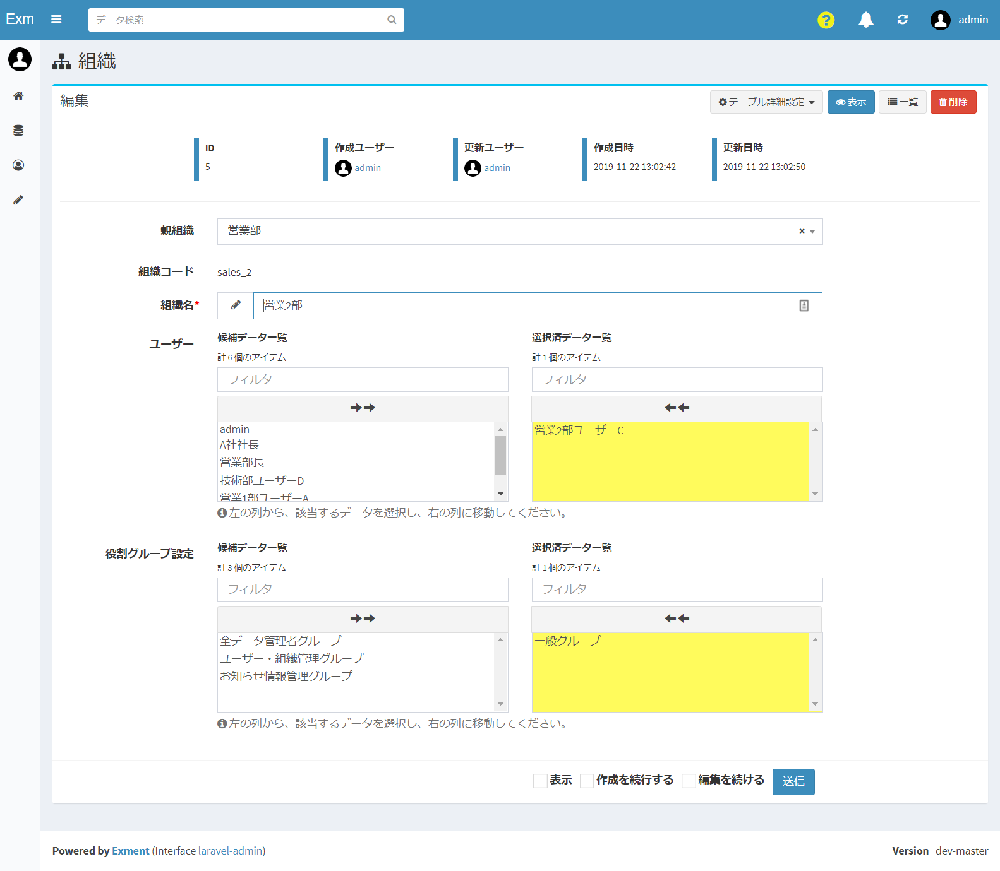
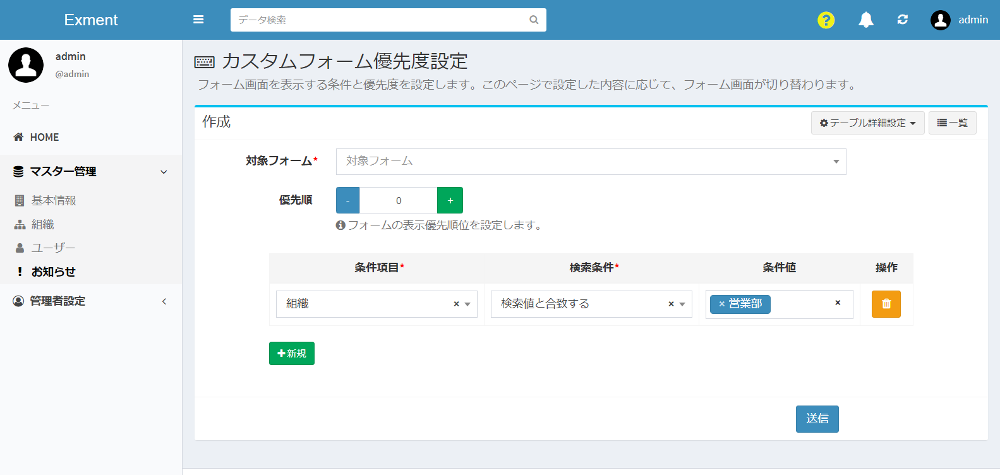
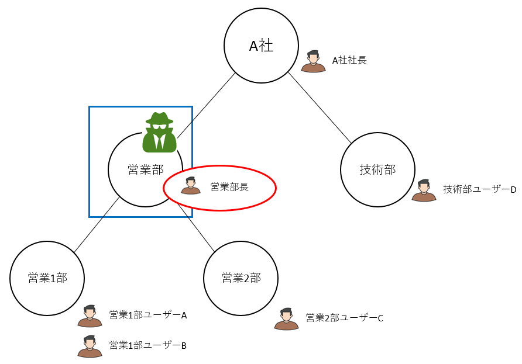
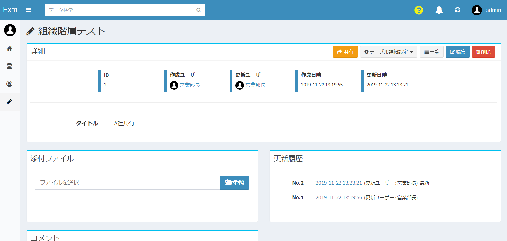
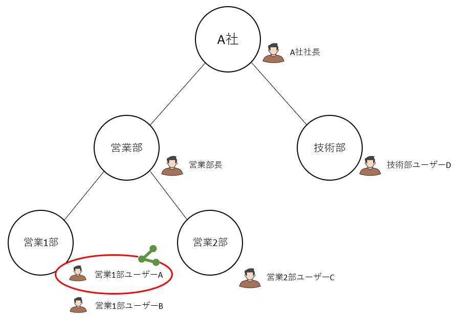
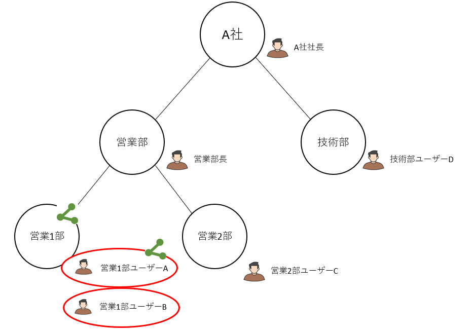

# Organization
Manage the organization information of Exment.

## Organization management
Describes how to manage organization information.

### List screen display
Click "Organization" from the left menu.  
Or access the following URL.  
This will display the user settings screen.  
http(s)://(URL of Exment)/admin/data/organization  
A list of organizations currently registered in the system is displayed.  
  
  
※By [setting](/config#Perform-hierarchical-display-on-the-department-list-page) "EXMENT_SHOW_ORGANIZATION_TREE = true", the hierarchy will be displayed.  

### Add new organization
- On the "Organization" list screen, click the "New" button at the top right of the page.  

- A new addition screen will be displayed. Enter necessary information.  
※ For the item "Parent organization", select the parent hierarchy of that organization.

### Save
After filling in the settings, click “Submit”.

### Edit
If you want to edit an organization, click the "Edit" link in the corresponding row.

### Delete
To delete an organization, click the "Delete" link in the corresponding row.

## Where the organization is used
There are multiple places to use the set organization.  
The following is a list of the setting locations.

#### Role group
- You can set an organization for a role group.

- This setting controls whether users belonging to the organization can access the page or not.  
In this image, the top is where the user has access and the bottom is where the user is inaccessible.

#### Switching multiple forms
You can set an organization for multiple form switching conditions.  
If the logged-in user belongs to that organization, the form will be used.

#### Workflow
You can set the organization in the work user settings of the workflow.  
If the logged-in user belongs to that organization, you can execute workflow actions.

#### Sharing custom data
You can set an organization to share custom data with.  
If the logged-in user belongs to that organization, custom data permissions will be assigned and the data will be editable and viewable.  

## About organization hierarchy
In Exment, you can set the following organizational hierarchy.

### (For advanced users) Type of hierarchy
When the organization is multi-level, there are the concepts of "organization to which the user belongs", "including parent-level organization", "including child-level organization", "including parent-child-level organization".
The scope of "users who belong to the organization" differs depending on each concept.
Here, as an example, we will explain the range of multiple hierarchies based on **" Sales Department ".**

#### Organization to which the user belongs

Only users who belong to the target organization itself.  
In the case of the example, only "Sales Manager" belongs to the Sales Department.

#### Include parent hierarchy organization

The target organization and its parent hierarchy.  
In the case of the example, "sales manager" who belongs to the sales department, and "company A president" who belongs to "parent company A" of the parent hierarchy correspond.

#### Include child hierarchy organizations

The target organization and its child hierarchy organizations.  
In the case of the example, "sales manager" who belongs to the sales department and "sales 1 user A" and "sales 2 user B" who belong to "sales 1 department" and "sales 2 department" of the child hierarchy are applicable To do.

#### Includes parent-child organization

The target organization and its parent-child hierarchy.  
In the case of the example, "Sales manager" belongs to the sales department, "President of company A" belongs to "Company A" of the parent hierarchy, and belongs to "Sales 1 department" and "Sales 2 department" of the child hierarchy , "Sales First Department User A" and "Sales Second Department User B".

<h4 id="kaisou_syurui">(Advanced) Setting the hierarchy type</h4>
When setting an organization, you can set how many multi-level organizations to include from "System Settings"> "Organization Settings".  
※ Multi-tier settings can only be set for "role groups" and "custom data sharing".  
In "Multiple form setting" and "Workflow", only the organization to which the user belongs is supported.  

### Data sharing settings
With Exment,[custom data sharing settings allow](/data_details#Data-sharing) other organizations to access your data.

#### Effective range when sharing custom data
- If you share data with an organization, users who belong to that organization can access it.  
- In addition, the above item "Setting of hierarchy type> Organization hierarchy setting (data)" determines whether users who belong to parent organization / child organization can access.  
- Other affiliated organizations cannot access.  

<h4 id="kyouyu_jidou">(For advanced users) Automatic sharing when saving data</h4>

When creating new custom data, sharing settings are automatically assigned to the created data.  
By default, sharing settings are assigned only to "logged-in users", but depending on the settings, sharing settings are also added to the organization to which the logged-in user belongs.  
This setting can be configured from “System Settings”> “Organization Settings”.  

This section describes each setting.

##### (1) Only login users
When creating new custom data, it will be shared only with the logged-in user.  
- **Example**：When “Sales First Department User A” creates new data, only user “Sales First Department User A” can access.  

##### (2) Login user and organization to which they belong
When creating new custom data, it is shared with the logged-in user and **the organization to which they belong**.  
- **Example**：When "Sales Department 1 User A" creates new data, it is shared with the user "Sales Department 1 User A" and the organization "Sales Department 1".  
→ As a result, the user "Sales Department 1 User B" belonging to the organization "Sales Department 1" can also access

