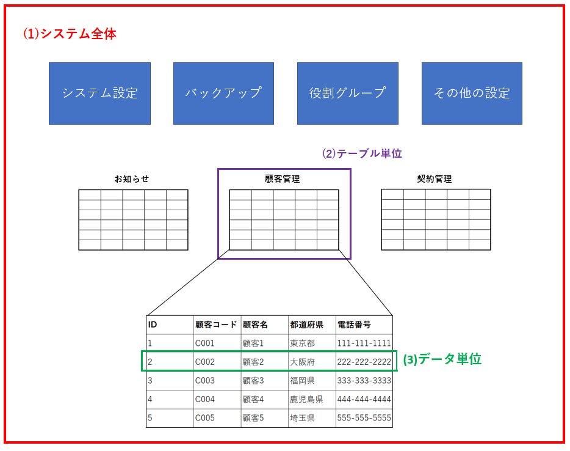
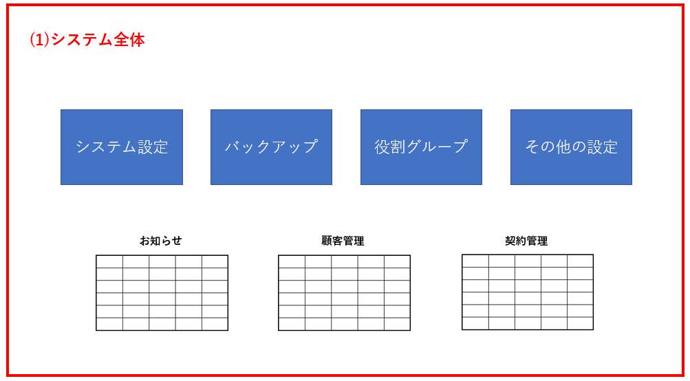
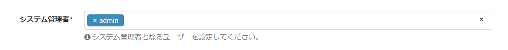
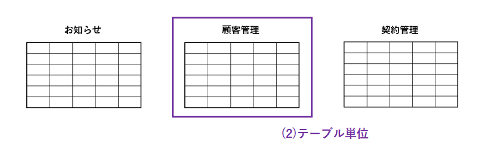
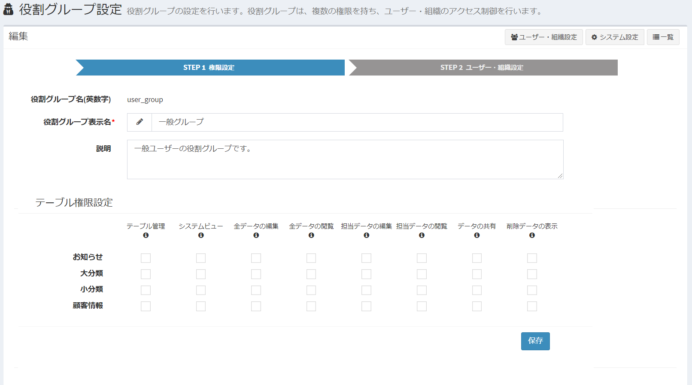
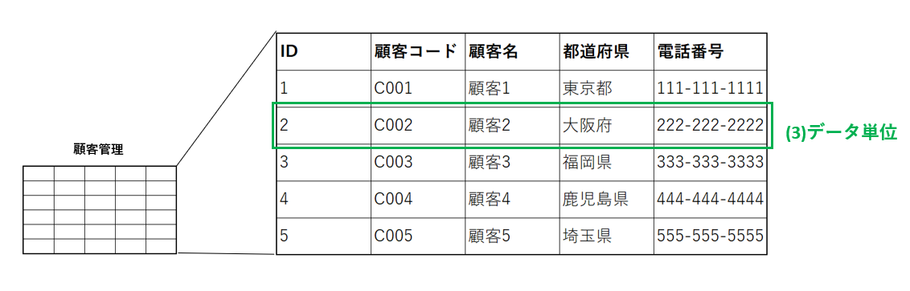
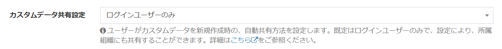

# Overview of roles and authorities
I will explain the outline of roles and authorities in Exment.  
This is an important idea in Exment so that only a specified user can act on a specific data or page.  

If you add a new user and that user logs in, most features will not be available by default.  
The system administrator needs to set the roles and privileges appropriately for the newly added user.  

## Whether to use authority
If you do not want to use the authority setting, switch the "Use authority" setting to No from [System Settings](/system_setting).  
If not used, all users can perform all operations.  

## Differences with and without authority (example)
You can limit the actions and screen displays that the user can perform depending on whether or not they have permission.

##### ■ Only authorized menus are displayed
→ Only authorized items are displayed in the menu of the logged-in user.

##### ■ Access error occurs
→ If you try to display an unauthorized page, an access error will occur.

##### ■ Items are not displayed in the data form options
→ If the target column is "Choice (select from the list of values ​​in other tables)", the choice will not be displayed unless you have permission for the referenced table.

## Authority management unit
There are three main units of authority management in Exment.

- Whole system
- Table unit
- Data unit

### Overall view

### (1) Whole system

You have the authority to operate the system settings of Exment.  
The following actions are examples of permissions that you can set on your system.

- Change the site name.
- Manage logged-in users.
- Create / edit / view all tables.

#### How to set permissions

##### System administrator settings
You can add or change "System Administrator" from [System Settings](/system_setting). A "system administrator" can perform all operations on the system.

##### Other system settings
Even users other than the system administrator can operate the entire system by assigning [Role Group](/role_group).  
To set the authority for operations related to the system, add or change "System authority" from [Role group](/role_group).

### (2) Table unit

It is the authority of the table created by Exment.  
Privileges are set for each table, and the actions that each user can perform vary depending on the privilege settings.  
A user who has no permissions on a table will not be able to access all pages in that table.  
  
The following actions are examples of permissions that can be set on a table.  

- Change the settings of the table, such as adding columns.
- All data in the table can be edited.
- You can browse all the data in the table and edit the data you are in charge of.
- You can browse the data in charge in the table.

#### How to set permissions

##### All user batch settings
Grant edit, view, and other permissions to all users, regardless of role or organization. All data in the table is covered. It can be changed from [Table Settings](/table).

##### Other table settings
If you want to grant different permissions for each user, you can use the [Role Group](/role_group).
To set the authority for operations related to tables, add or change "Table authority" from [Role group](/role_group).

### (3) Data unit

It is the authority for each data created by Exment.  
By granting authority to each data unit, it is possible to respond to detailed requests such as "I want to access only specific data, not all data".  
The following actions are examples of granting permissions.  

- Edit specific data.
- View specific data.

#### How to set permissions

##### Basic operation when new data is created
When a user saves data, they are automatically given permission to edit the data. (The user does not need to be aware of it)

##### When new data is created, add authority to the organization to which the data creator belongs
You can automatically add sharing settings not only to the user who created the data, but also to the organization to which the data creator belongs.

- Example: Data created by users in the sales department is automatically shared with all sales departments.

For the setting method, see [Organization settings](/organization).

##### Manually add permissions later (sharing)
You can share the created data with other users. The authority can be selected from view / edit.  
Select "Share" from [Data details screen](/data_details) and execute.

##### When creating / updating data, add authority to the user / organization set in the column
Exment allows you to add "User" and "Organization" as custom column settings.  
When new data is created / updated on the screen or API, the data can be automatically shared with the users / organizations set in this "User" and "Organization" columns.

- Example: A user added to the "Person in charge" column of the "Task Management" table is automatically given permission to edit the data when the data is saved.

For the setting method, see [Data automatic sharing setting](/table#Data-automatic-sharing-setting).

![Role / Authority] (img/table/table_extended_share1.png)

## Organization / user settings
An overview of Exment's organization and user settings.

#### Use of organization
If you do not want to use the organization settings, switch "Use organization" to No from [System settings](/system_setting).

#### Organizational hierarchy settings
Exment allows you to manage your organization hierarchically.

You can specify whether to include "parent and child", "parent", and "child" of the organization hierarchy when [Role group setting](/role_group) and data sharing are performed for the organization.
For the setting method, see [Organization settings](/organization).

#### About the acquisition range of user / organization information of another organization
When using Exment for purposes such as an in-house portal site, "which user is using it in the system" and "which organization / company is registered in the system" becomes a big problem. not.

However, assuming that Exment will be paid out to users outside the company for use, it may be a problem to be able to acquire and view user information between other companies.

  
By setting [here](/multiuser), it will be possible to restrict the acquisition and viewing of user information between other companies.

## Related page
- [System Settings](/system_setting)
- [Role group setting](/role_group)
- [Data details screen](/data_details)
- [Organization settings](/organization)
- [Settings for external portal site](/multiuser)