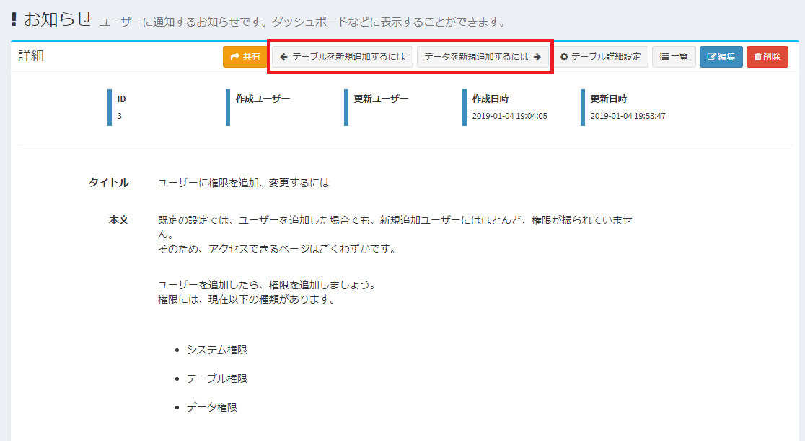
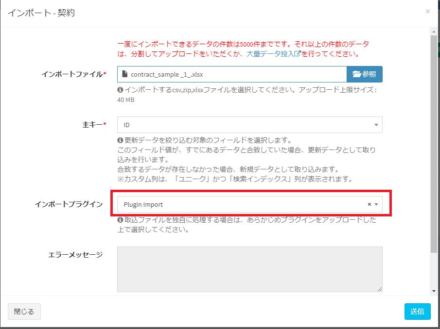

# Plugin

## What is a plugin
Exment has a function called "plugin".  
If the functions that Exment has as standard are insufficient for your business, you can add functions as an extension by uploading a program from the screen.  
There are currently the following types of plugins:  

- [button](#button)
- [event](#event)
- [page](#page)
- [dashboard](#dashboard)
- [view](#view)
- [batch](#batch)
- [API](#API)
- [validation](#validation)
- [script](#script)
- [style](#style)
- [import](#import)
- [export](#export)
- [document output](#document-output)
- [Docurain(PDF output)](#docurain)
- [trigger *not recommended](#trigger)

#### button
You can add a button to the Exment list screen or form screen and process it when you click it.
* Please refer to [here](/plugin_quickstart_button) for the implementation method.
  
The types of buttons are as follows.
##### Menu button on the list screen
Add a button at the top of the data list screen to trigger an event when clicked.

##### Menu button on the data details screen
Add a button at the top of the data details screen to trigger an event when clicked.

##### Menu button on the new data creation screen
Add a button at the top of the new data creation screen to raise an event when clicked.

##### Menu button on the data update screen
Add a button at the top of the data update screen to trigger an event when clicked.

#### event
It is executed when a specific operation is performed on the Exment screen, and processing such as updating the value can be performed.
* Please refer to [here](/plugin_quickstart_event) for the implementation method.
  
The specific operations include the following.

- ##### At the start of loading
At the beginning of the page load process, the process starts. (Not prior to all processing)

- ##### Immediately before saving
The process starts just before the data is saved.

- ##### After saving
After saving the data, the process will start.

- ##### Immediately before workflow execution
The process starts just before the workflow is executed.

- ##### After executing the workflow
After executing the workflow, the process will start.

- ##### Immediately before executing the notification
The process starts just before the notification is executed.

- ##### After executing the notification
After executing the notification, the process will start.

#### page
You can create a new screen in Exment.  
Use this if you want to use a page that is completely different from the existing features.  
※ Please refer to [here](/plugin_quickstart_page) for mounting method.

   

#### dashboard
You can create a new screen on the Exment dashboard.  
Use this if you want to use your own page as a dashboard item.  
※ Please refer to [here](/plugin_quickstart_dashboard) for mounting method.

   

#### View
You can create and add new designs and unique features to Exment's custom data list screen.
Please use it when you want to use a completely different function from the standard view, list, summary, and calendar view.
* Please refer to [here](/plugin_quickstart_view) for the implementation method.

#### batch
This can be used when you want to execute periodic processing automatically.  
It can also be used when you want to perform certain operations at once, such as updating the status in bulk.  
※ Please refer to [here](/plugin_quickstart_batch) for mounting method.

#### API
You can create a new API in Exment.
Please use it when you want to add a function that does not exist in [API Reference] (https://exment.net/reference/webapi.html).
* Please refer to [here](/plugin_quickstart_api) for the implementation method.

#### script
You can execute your own script (javascript).  
Currently supported are the data list screen, the data detail screen, the new data creation screen, and the update screen.  
※ Please refer to [here](/plugin_quickstart_script) for mounting method.

   

#### style
You can set your own style (style sheet / css) and change the design.  
※ Please refer to [here](/plugin_quickstart_style) for mounting method.

   

#### validation
This can be used when you want to implement your own custom table validation.  
Please use it to implement complicated checks and related checks between items.  
※ Please refer to [here](/plugin_quickstart_validate) for mounting method.

   

#### import
You can use this if you want to implement your own custom table import process.
Use it when importing files in the original format or implementing special conversion processing.  
※ Please refer to [here](/plugin_quickstart_import) for mounting method.

   

#### Export
It can be used if you want to implement your own custom data list export.
Please use it when exporting a file in the original format or when implementing a special conversion process.
The output format can be Excel or other formats.
* Please refer to [here](/plugin_quickstart_export) for the implementation method.

#### document output
You can create your own document materials such as quotes and reports.  
The template that is the basis of the document is in Excel format, and the output is also output in Excel format.  
※ At present, the output in PDF format has technical issues and we are studying the corresponding policy.  
※ Please refer to [here](/plugin_quickstart_document) for mounting method.

   

<h4 id="docurain"><a href="#/ja/plugin?id=docurain" data-id="Docurain(PDF output)" class="anchor">Docurain(PDF output)</a></h4>

PDF output is performed using the cloud form engine ** Docurain **, which can develop forms only with Excel and json.
The template that is the basis of the document is in Excel format and is output in PDF format.
* Please refer to [here](/plugin_quickstart_docurain) for the implementation method.

#### trigger
* Deprecated from v3.2.0.  
In the future, please implement by "button" or "event".

## Management method
### Page display
- Select "Plug-in" from the left menu.  
Or access the following URL.  
http(s)://(Exment URL)/admin/ plugin  
This will display the plugin screen.  
  

### Plugin upload
Click "Choose File" and select the created plugin zip file.  
Then click "Upload" and upload from the screen.
  
When completed, the plugin information will be displayed in the list at the bottom of the page.

### Plugin management
Change information such as enable / disable of plugin, trigger of plugin, and URI of page.  
Click the "Edit" link in the appropriate row.
  

This will bring up the plugin management page.
  

### Management items

##### Valid flag
Toggles the use of the plugin on the system.  
Enabled when set to YES. If NO, it is disabled and will not be executed on the system.  
※ When uploading plug-ins, the default is YES. However, if the plug-in type is "batch", it will be NO by default when uploading.

##### Target table
Specify a custom table on which to run the plugin.  
When the page of the set table is displayed, the plug-in is executed.

##### Enforcement trigger
Set whether to execute the plug-in when performing any operation.  
The plug-in is executed when you perform the operation of the set contents.  

##### Button heading
When displaying "Menu button of list screen" or "Menu button of form", set the headline to be displayed on the button.

##### Button icon
When displaying "Menu button of list screen" or "Menu button of form", set the icon to be displayed on the button.

##### Button class
When displaying "Menu button of list screen" or "Menu button of form", set the class to be added to the HTML of the button.

## Remove plugin
To delete a plug-in, click the "Delete" link in the corresponding row from the list screen.  
  
※  When "Delete" is executed, the plug-in file itself is deleted.
If you want to disable the plugin temporarily, set the "Enable Flag" to NO.

## Other
For information on how to develop plug-in, [plug-in development method](/plugin_quickstart.md), please refer to.