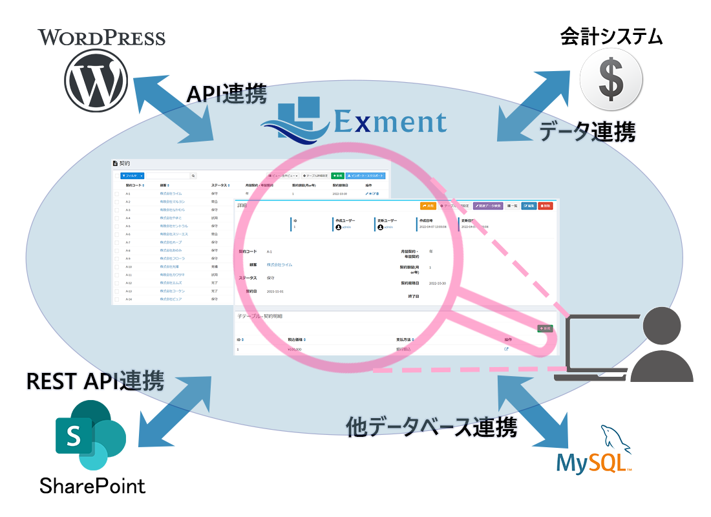
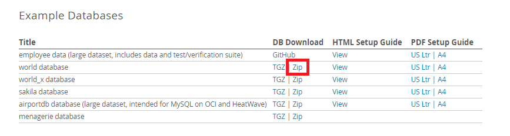

## Plugin (CRUD page)
Add your own CRUD page to Exment.  
**※ The plugin (CRUD) provides many features and functions. For details, please refer to the [Plugin reference](/plugin_reference_crud).**  

## What is CRUD
CRUD stands for Create, Read, Update, and Delete.  
By adding List to these, you can develop plugins specialized in CRUD + List.  
The screen structure is almost the same as the list, details, create, update, and delete screens for Exment custom data, so you can implement it with only the minimum required development.  
This allows you to manage external data (for example, other database engines, WordPress, SharePoint lists, third-party web databases, accounting systems, etc.) on Exment screens without importing the data into Exment.  
Also, compared with developing a [plugin (page)](/plugin_quickstart_page), you only need to develop the internal processing such as retrieving and adding data. Basically no UI development is required, so development man-hours are greatly reduced.

  

## Main features
- Manage external data (for example, other database engines, WordPress, SharePoint lists, third-party web databases, accounting systems, etc.) on Exment screens without importing the data into Exment
- Freely join, filter, and sort multiple Exment tables and display the result
- Control whether data list, show, create, edit, and delete can be executed, according to features and permissions
- The data list supports both "display all data in one list" and "paginated display in units of 20, 50, or 100 items", so that it can match the external service
- Supports multiple endpoints. A single plugin can define multiple endpoints, and each endpoint displays its own CRUD pages
- Authentication can be configured. Supports "key", "ID and password", or "OAuth authentication". You can control access so that the CRUD page can be accessed only when these settings exist and the user is authenticated

## How to create (minimum required)
As a sample, this section describes the steps to create a screen that "lists, shows, creates, updates, and deletes data in the MySQL database 'world', which is a different database from Exment's".  

### Preparation
Perform the following as preparation.
- Create an external database. This plugin uses the MySQL sample database "world". Download the zip from [the official website](https://dev.mysql.com/doc/index-other.html) and execute the unzipped SQL in your MySQL (or MariaDB) environment.
  

- Open config/database.php and add the following to connections.

```
        'world' => [
            'driver' => 'mysql',
            'url' => env('DATABASE_URL'),
            'host' => env('DB_HOST', '127.0.0.1'),
            'port' => env('DB_PORT', '3306'),
            'database' => env('DB_DATABASE_WORLD', 'world'),
            'username' => env('DB_USERNAME', 'forge'),
            'password' => env('DB_PASSWORD', ''),
            'unix_socket' => env('DB_SOCKET', ''),
            'charset' => 'utf8mb4',
            'collation' => 'utf8mb4_unicode_ci',
            'prefix' => '',
            'prefix_indexes' => true,
            'strict' => true,
            'engine' => null,
            'options' => extension_loaded('pdo_mysql') ? array_filter([
                PDO::MYSQL_ATTR_SSL_CA => env('MYSQL_ATTR_SSL_CA'),
            ]) : [],
        ],
```


### Create config.json
- Create the following config.json file.  

~~~ json

{
    "plugin_name": "MySQLWorld",
    "plugin_view_name" : "MySQL World Integration",
    "description": "Integrates Exment with the MySQL sample database \"World\".",
    "uuid":  "2641201a-ba35-2bd9-af59-9440643ca206",
    "author":  "(Your Name)",
    "version": "1.0.0",
    "uri":  "mysql_world",
    "plugin_type": "crud"
}

~~~

- plugin_name should be written in alphanumeric characters.
- uuid is a character string of 32 characters + hyphens, totaling 36 characters. It is used to make the plugin unique.  
Please create one from the following URL etc.  
https://www.famkruithof.net/uuid/uuidgen
- For uri, enter the URI used to access this plugin.  
(If not specified, it is generated from plugin_name.)  
- For plugin_type, enter crud.  

### Plugin file creation
Create the following PHP file. The file name should be "Plugin.php".  
**※ The example below is the minimum configuration. The plugin (CRUD) provides many other features and functions besides the ones below. For details, please refer to the [Plugin reference](/plugin_reference_crud).**  

~~~ php
<?php

// (1)
namespace App\Plugins\MySQLWorld;

use Encore\Admin\Widgets\Grid\Grid;
use Encore\Admin\Widgets\Form;
use Exceedone\Exment\Services\Plugin\PluginCrudBase;
use Illuminate\Support\Collection;
use Illuminate\Pagination\LengthAwarePaginator;

class Plugin extends PluginCrudBase
{
    /**
     * (2) Title
     * content title
     *
     * @var string
     */
    protected $title = 'World cities';

    /**
     * (3) Description
     * content description
     *
     * @var string
     */
    protected $description = 'Displays a list of cities in the world.';

    /**
     * (4) Icon
     * content icon
     *
     * @var string
     */
    protected $icon = 'fa-globe';

    /**
     * (5) Get field definitions
     * Get fields definitions
     *
     * @return array|Collection
     */
    public function getFieldDefinitions()
    {
        return [
            ['key' => 'ID', 'label' => 'ID', 'primary' => true, 'grid' => 1, 'show' => 1, 'edit' => 1],
            ['key' => 'Name', 'label' => 'City name', 'grid' => 2,'show' => 2, 'create' => 1, 'edit' => 2],
            ['key' => 'CountryCode', 'label' => 'Country code', 'grid' => 3, 'show' => 3, 'create' => 2,'edit' => 3],
            ['key' => 'Population', 'label' => 'Population', 'show' => 5, 'create' => 4,'edit' => 5],
        ];
    }

    /**
     * (6) Get data list (paginate)
     * Get data paginate
     *
     * @return LengthAwarePaginator
     */
    public function getPaginate(array $options = []) : ?LengthAwarePaginator
    {
        $query = \DB::connection('world')
            ->table('city');

        // If a free word search is specified
        $q = array_get($options, 'query');
        if(isset($q)){
            $query->where(function($query) use($q){
                $query
                    ->where('Name', 'LIKE', "%{$q}%")
                    ->orWhere('CountryCode', 'LIKE', "%{$q}%")
                ;
            });
        }

        return $query->paginate(array_get($options, 'per_page') ?? 20, ['*'], 'page', array_get($options, 'page'));
    }

    /**
     * (7) Get data details (single record)
     * read single data
     *
     * @return array|Collection
     */
    public function getData($id, array $options = [])
    {
        return \DB::connection('world')
            ->table('city')
            ->where('ID', $id)->first();
    }

    /**
     * (8) Set the form for create and edit
     * set form info
     *
     * @return Form|null
     */
    public function setForm(Form $form, bool $isCreate, array $options = []) : ?Form
    {
        if(!$isCreate){
            $form->display('ID');    
        }
        $form->text('Name');

        // Get country list
        $countries = \DB::connection('world')->table('country')->pluck('Name', 'Code');
        $form->select('CountryCode')->options($countries);
        
        $form->number('Population');

        return $form;
    }

    /**
     * (9) Execute create
     * post create value
     *
     * @return mixed
     */
    public function postCreate(array $posts, array $options = [])
    {
        // Save to your own database.
        $value = \DB::connection('world')
            ->table('city')
            ->insertGetId($posts);

        return $value;
    }

    /**
     * (10) Execute edit
     * edit posted value
     *
     * @return mixed
     */
    public function putEdit($id, array $posts, array $options = [])
    {
        // Save to your own database.
        \DB::connection('world')
            ->table('city')
            ->whereOrIn('ID', $id)
            ->update($posts);

        return $id;
    }

    /**
     * (11) Delete data
     * delete value
     *
     * @param $id string|array target ids. If multiple check, calls as array.
     * @return mixed
     */
    public function delete($id, array $options = [])
    {
        $ids = stringToArray($id);
        $value = \DB::connection('world')
            ->table('city')
            ->whereIn('ID', $ids)
            ->delete();
    }
}

~~~

- (1) The namespace should be **App\Plugins\\(Pascal case of plugin name)**. [Click here for details](/plugin_quickstart#plugin-name-namespace)  
Also, the class name should be "Plugin" and inherit PluginCrudBase.

- (2) The property title is the title displayed on each page.

- (3) The property description is the description displayed on each page.

- (4) The property icon is the icon displayed on each page.

- (5) The function getFieldDefinitions returns the column definitions as an associative array.  
    - Be sure to add exactly one key with "primary" => true. (Composite keys are not currently supported.)  
    - "key" is the item name, used when retrieving data and as the name of each HTML element. Enter alphanumeric characters.  
    - "label" is used as the item name on the list screen and other screens.  
    - Set "grid" for items displayed on the list screen. Enter an integer for the display order.
    - Set "show" for items displayed on the details screen. Enter an integer for the display order.
    - Set "create" for items displayed on the create screen. Enter an integer for the display order.
    - Set "edit" for items displayed on the edit screen. Enter an integer for the display order.

- (6) The function getPaginate retrieves the data list in paginated form.  
Return the retrieved data as a LengthAwarePaginator.  
Each element of the list should be an associative array, and the keys of that associative array should be the same as the keys set in getFieldDefinitions.  
※ When a search is performed on the screen, values are set in the argument $options. For details, please refer to the reference.

- (7) The function getData retrieves the data details (a single record).  
The details should be an associative array, and the keys of that associative array should be the same as the keys set in getFieldDefinitions.

- (8) The function setForm sets up the form for the create screen and the edit screen.  
Implement this function if you want to specify the form in your own way.  
※ If this function is not implemented, the items with "create" or "edit" set in the function getFieldDefinitions are displayed on the screen.

- (9) The function postCreate is called when Save is executed on the create screen. Register the newly created data here.  

- (10) The function putEdit is called when Save is executed on the edit screen. Register the edited data here.  

- (11) The function delete is called when Delete is executed on the screen. Delete the data here.  
※ Depending on the screen, an array may be set in the argument $id.


### Compress to zip
Compress the above two files into a zip with the minimum configuration.  
The zip file name should be "(plugin_name).zip".  
- MySQLWorld.zip
    - config.json
    - Plugin.php


## Sample plugins
The following samples are available.

| Name | Overview | Authentication | Sample link |
| ---- | ---- | ---- | ---- |
| MySQLWorld | Connects to a database other than Exment's and retrieves, adds, edits, and deletes data. | - | [Other MySQL integration](https://github.com/exment-git/plugin-sample/tree/main/crud/mysqlworld) |
| ShowLevels3Data | A sample that uses your own SQL so that items in three hierarchy levels can be listed and viewed at the same time. | - | [Display Exment data with your own SQL](https://github.com/exment-git/plugin-sample/tree/main/crud/show_levels3_data) |
| WordPress | Uses the REST API to list and show posts on the specified WordPress site. | - | [WordPress integration](https://github.com/exment-git/plugin-sample/tree/main/crud/wordpress) |
| WordPresses | Uses the REST API to list and show posts on multiple WordPress sites. Supports multiple endpoints, and the target site is switched with a button on the screen. | - | [WordPress integration for multiple sites](https://github.com/exment-git/plugin-sample/tree/main/crud/wordpresses) |
| WordPressPost | Uses the REST API to list and show posts on the specified WordPress site. Also adds, edits, and deletes posts using a preconfigured access key. | ID and password | [WordPress posts](https://github.com/exment-git/plugin-sample/tree/main/crud/wordpress_post) |
| OtherExment | Integrates with Exment on another server via the REST API and retrieves data. | OAuth | [REST API integration with another Exment](https://github.com/exment-git/plugin-sample/tree/main/crud/other_exment) |
