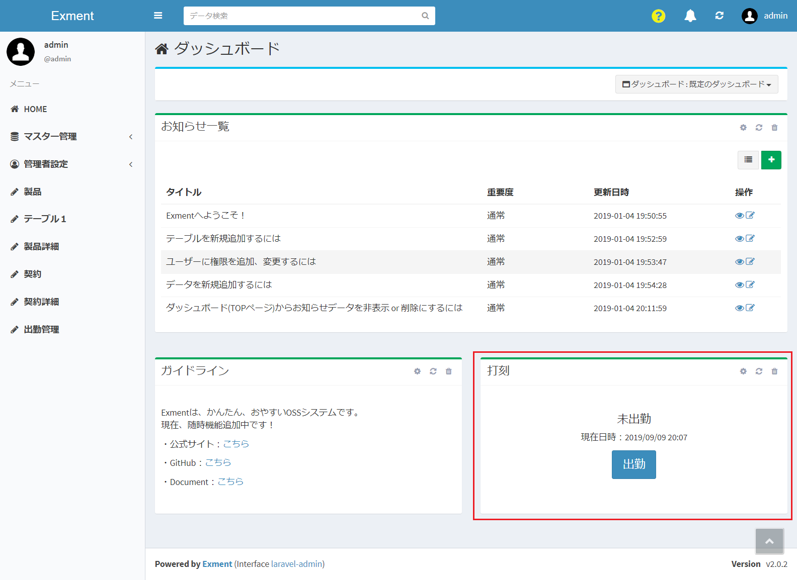
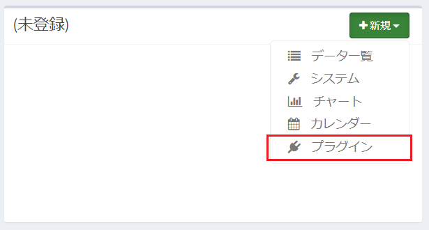
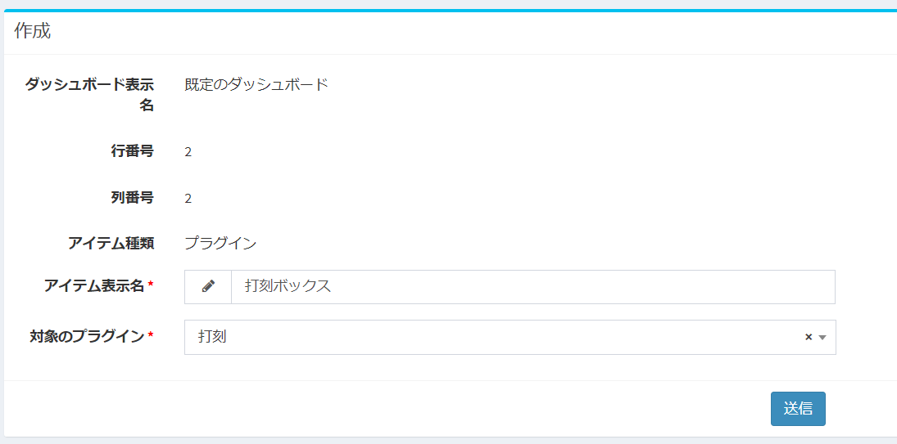
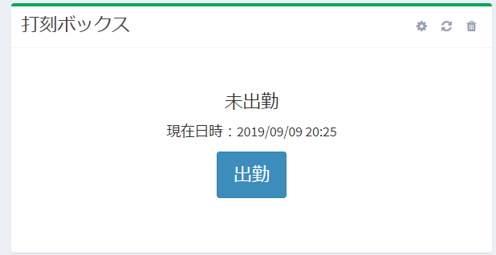

## Plugin (Dashboard)
You can create a new screen on the Exment dashboard.  
Use this if you want to use your own page as a dashboard item.  

## Introduction
Exment plugin pages are developed using the PHP framework [Laravel](http://laravel.jp/) and [laravel-admin](https://laravel-admin.org/docs/).  
When developing a page, it is recommended that people with knowledge of Laravel develop it.  

## How to make

### sample
Here, the following page is created as a sample.
- Create a table to manage user attendance.
- Display buttons for attendance, break start, and break end on the dashboard.
- By clicking the button, the time of the click is set in the data.
  
   

※  Please import [this](https://exment.net/downloads/sample/template/dakoku.zip) template in advance.  

- Sample plug-in [here](https://exment.net/downloads/sample/plugin/Dakoku.zip).  

### Create config.json
- Create the following config.json file.

~~~ json

{
    "plugin_name": "Dakoku",
    "plugin_view_name" : "Emboss",
    "description": "Plugin for stamping on the dashboard.",
    "uuid":  "691a24f2-2c7a-42c5-8cff-23c5277f6f22",
    "author":  "Kajitori",
    "version": "1.0.0",
    "plugin_type": "dashboard",
    "route": [
        {
            "uri": "post",
            "method": [
                "post"
            ],
            "function": "post"
        }
    ]
}

~~~

- plugin_name should be written in alphanumeric characters.
- uuid is a character string of 32 characters + hyphen, totaling 36 characters. Used to make the plugin unique.  
Please create from the following URL etc.  
https://www.famkruithof.net/uuid/uuidgen
- plugin_type should be written as dashboard.  
- route defines a list of URL endpoints to be executed, their HTTP methods, and methods in the controller.  
    - uri： uri for page display. The actual URL is "http (s): // (URL of Exment) / admin / plugins / (URL set on the plugin management screen) / (specified uri)".  
    - method：HTTP method. Please fill in with get, post, put, delete.
    - function：Method in Contoller to execute.
- Be sure to include a route whose uri is empty (""). Access this endpoint when screen transition from the menu to the plugin page.

### Plugin file creation

#### Create main logic
Create the following PHP file. File name should be "Plugin.php".

~~~ php
<?php

//(1)
namespace App\Plugins\Dakoku;

use Exceedone\Exment\Services\Plugin\PluginDashboardBase;
use Exceedone\Exment\Model\CustomTable;

class Plugin extends PluginDashboardBase
{
    /**
     *
     * @return Content|\Illuminate\Http\Response
     */
    public function body()
    {
        if(is_null(CustomTable::getEloquent('dakoku'))){
            return 'The stamping table is not installed. ';
        }
        
        $dakoku = $this->getDakoku();
        $status = $this->getStatus($dakoku);
        $params = $this->getStatusParams($status);

        // (3)
        return view('exment_dakoku::dakoku', [
            'dakoku' => $dakoku,
            'params' => $params,
            'action' => $this->getDashboardUri('post'),
        ]);
    }

    /**
     * Submit
     *
     * @return void
     */
    public function post()
    {
        $dakoku = $this->getDakoku();
        
        $now = \Carbon\Carbon::now();

        if(!isset($dakoku)){
            $dakoku = CustomTable::getEloquent('dakoku')->getValueModel();
            $dakoku->setValue('target_date', $now->toDateString());
        }

        $status = null;
        switch(request()->get('action')){
            // go to work
            case 'syukkin':
                $dakoku->setValue('syukkin_time', $now);
                $status = 1;
                break;
            // Start a break
            case 'kyuukei_start':
                $dakoku->setValue('kyuukei_start_time', $now);
                $status = 11;
                break;
            // end of break
            case 'kyuukei_end':
                $dakoku->setValue('kyuukei_end_time', $now);
                $status = 21;
                break;
            // leave
            case 'taikin':
                $dakoku->setValue('taikin_time', $now);
                $status = 99;
                break;
        }
        if(isset($status)){
            $dakoku->setValue('status', $status);
        }
        $dakoku->save();

        admin_toastr(trans('admin.save_succeeded'));
        return back();
    }

    /**
     * Get current attendance status
     *
     * @return void
     */
    protected function getDakoku(){
        $table = CustomTable::getEloquent('dakoku');
        if(!isset($table)){
            return null;
        }
        
        
        // Get the current time
        $now = \Carbon\Carbon::now();

        // If it is before the reference time, treat it as the previous day
        if($now->hour <= 4){
            $now = $now->addDay(-1);
        }

        // Get the corresponding stamp
        $query = getModelName('dakoku')::query();
        $query->where('value->target_date', $now->toDateString())
            ->where('created_user_id', \Exment::user()->base_user_id);

        $dakoku = $query->first();

        return $dakoku;
    }

    /**
     * Get status
     *
     * @param [type] $dakoku
     * @return int
     */
    protected function getStatus($dakoku){
        if(!isset($dakoku) || is_null($dakoku->getValue('syukkin_time'))){
            return 0;
        }

        return $dakoku->getValue('status');
    }

    protected function getStatusParams($status){
        switch($status){
            case 0:
                return 
                [
                    'status_text' => 'not working',
                    'buttons' => [
                        [
                        'button_text' => 'Attend',
                        'action_name' => 'syukkin',
                        ]
                    ]
                ];
            // go to work
            case 1:
                return  
                [
                    'status_text' => 'At work',
                    'buttons' => [
                        [
                            'button_text' => 'break',
                            'action_name' => 'kyuukei_start',
                        ], 
                        [
                            'button_text' => 'Exit',
                            'action_name' => 'taikin',
                        ], 
                    ]
                ];
        
            case 11:
                return 
                [
                    'status_text' => 'during break',
                    'buttons' => [
                        [
                            'button_text' => 'End break',
                            'action_name' => 'kyuukei_end',
                        ], 
                    ]
                ];
            case 21:
                return 
                [
                    'status_text' => 'At work',
                    'buttons' => [
                        [
                            'button_text' => 'End break',
                            'action_name' => 'kyuukei_syuryo',
                        ], 
                    ]
                ]; 
                
            case 99:
                return 
                [
                    'status_text' => 'Leave work',
                    'buttons' => [
                    ]
                ];
        }
    }
}
~~~
- (1) The namespace should be **App \ Plugins \ (plugin name)**.  
Also, the class name should be "Plugin" and inherit PluginDashboardBase.

- (2) The public method name in the class is the name described in function of config.json.

- (3) When using a view, add "exment_ (snake case for plug-in name) ::" as the prefix of the view name.

- (4) If you want to get the plugin endpoint, use the function "$ this-> getDashboardUri ('endpoint name')".  
※ If you want to get the URL full path, use admin_url ($ this-> getDashboardUri ('endpoint name')).

#### (Optional) About views
When separating views, save the blade file under the folder "resources / views".

#### (Optional) For css, js, and other static files
- Place the css file in the folder "public / css".
- Please place the js file in the folder "public / js".
- Other files (such as image files) should be placed in the folder "public / assets".

### Compress to zip
Compress the above two files into a zip with the minimum configuration.  
The zip file name should be "(plugin_name) .zip".  
- Dakoku.zip
    - config.json
    - Plugin.php
    - (Other required PHP files, image files, etc.)

### Other
- If you want to display the data details of a specific ID value, add the following description to the route of config.json.  
You can specify uri like "{id}".  

~~~ json

{
    "route": [
        {
            "uri": "show_details/{id}",
            "method": [
                "get"
            ],
            "function": "show_details"
        }
    ]
}

~~~

## Reflect on dashboard
If you want to reflect the plug-in uploaded this time on the dashboard, perform the following procedure.  

- Click New on the dashboard.  
If you upload a plug-in of type "Dashboard", "Plug-in" will be displayed as a choice.  
   

- Enter the display name and the target plugin and submit.
   

- The dashboard displays the selected items.
   

### Sample plugin
[Time stamp management](https://exment.net/downloads/sample/plugin/Dakoku.zip)  
※ Please import [this template](https://exment.net/downloads/sample/template/dakoku.zip).
