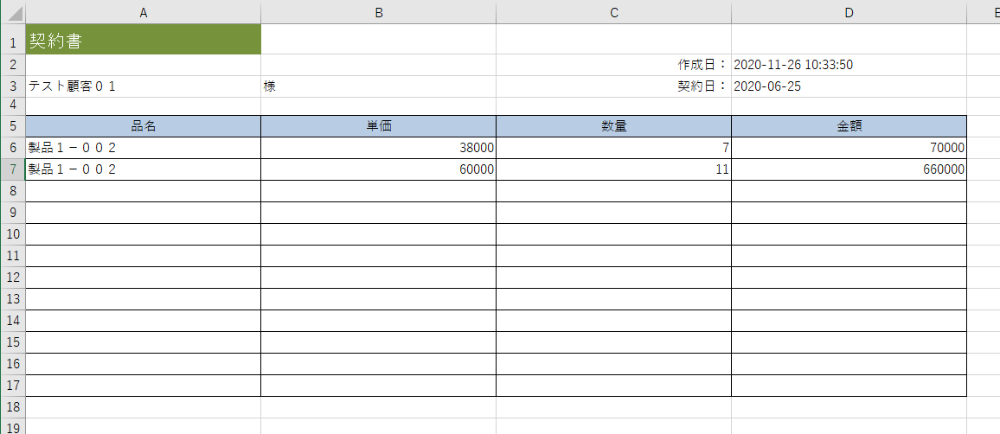

# Plugin (document output)
You can create your own document materials such as quotes and reports.  
The template that is the basis of the document is in Excel format, and the output is also output in Excel format.  
※ At present, the output in PDF format has technical issues and we are studying the corresponding policy.

   

## How to make

### Create config.json
- Create the following config.json file.  

~~~ json
{
    "plugin_name": "PluginDemoDocument",
    "uuid": "1e7881d0-324f-11e9-b56e-0800200c9a66",
    "plugin_view_name": "Plugin Document",
    "description": "Test to output documents.",
    "author": "(Your Name)",
    "version": "1.0.0",
    "plugin_type": "document",
    "filename": "Estimate _ $ {ymdhms}",
    "target_tables": "estimate",
    "label": "Estimate output",
    "icon": "fa-files-o",
    "button_class": "btn-success"
}
~~~

- plugin_name should be written in alphanumeric characters.
- uuid is a character string of 32 characters + hyphen, totaling 36 characters. Used to make the plugin unique.  
Please create from the following URL etc.  
https://www.famkruithof.net/uuid/uuidgen
- For plugin_type, enter document.
- file_name is the file name for output. You can use [parameter variables](/params).
- target_tables is the table to be output. If there is more than one, enter them separated by commas.  
※ Can be changed later on the plug-in setting screen.
- label is the label of the button for document output.  
※ Can be changed later on the plug-in setting screen.
- icon is the icon of the button for document output.  
※ Can be changed later on the plug-in setting screen.
- button_class is the button class for document output.  
※ Can be changed later on the plug-in setting screen.

### Create template Excel file
Create a template file that will be the basis of the document.  
The template file is in Excel format (xlsx). The output file is also in Excel format (xlsx).  
※ The file name of the template Excel file should be "document.xlsx".  
※ For the template file parameters, see "Template Excel File Parameters" below.  

#### Parameters
Parameter to be set in the Excel file of the template.  
By inputting a variable in a specific format into an Excel cell, the parameters registered in the system are output when the document is output.  

##### basic rule
- Fill in Excel cells with the rule of **$ {variable name}.**  
Example: "$ {year}" "$ {month}" "$ {value: estimate_code}"  
  

- Multiple parameters can be set in the same cell.

- Functions can be set in Excel.  
※ Some functions may not work properly. Be sure to check the operation.

- See the following pages for the parameter variables that can be set.  
[Parameter variables](/params)

##### List output method of child table data
Depending on the type of document, it is necessary to output data to the child table list of the target data.  
Example: "Estimate" to register the estimate date and customer information and "Estimate details" to register the list of products.  
  
to be quoted Describe the method to output the data list in this table.  

- Set the following parameters in the first row and first column of the output table.  
 **$ {Loop: (table name of child table): start}**  
Example: $ {loop: estimate_detail: start}
  

- Set the following parameters for each column of the items you want to output in the second row of the output table.  
 **$ {Loop-item: (table name of child table) :( column name of child table)}**  
Example: $ {loop-item: estimate_detail: product_detail_name}  
  

- Set the following parameters in the first column of the last row of the output table.  
 **$ {Loop: (table name of child table): end}**  
Example: $ {loop: estimate_detail: end}  
  

### Create PHP file (optional)
- Create the following PHP file. The name should be "Plugin.php".  

~~~ php
<?php
namespace App\Plugins\PluginDemoDocument; // (PluginDemoDocument:plugin name)

use Exceedone\Exment\Services\Plugin\PluginDocumentBase;
class Plugin extends PluginDocumentBase
{
    protected function executing(){
        // function to execute before document creation
        // Example:
        \Log::debug('Before estimation output');
        
    }

    protected function executed(){
        // Function to execute after document creation
        // Example:
        \Log::debug('After performing estimation output');
    }
}

~~~

- namespace should be **App \ Plugins (plugin name).**

- These functions are executed before executing document output and after executing document output.  
If you want to perform some processing before output, create this Plugin.php file and add processing.  
(Example: Add the estimated date and time, add the invoice number)  
**※ If there is no particular process you want to call before and after executing the document output, this Plugin.php file is not required.**

- The Plugin class inherits from the class PluginDocumentBase.  
PluginDocumentBase has properties such as the custom table $ custom_table and table value $ custom_value of the caller, and when the execute function is called, the value is assigned to the property.  
See the [plugin reference](plugin_reference.md) for details on the properties.  

### Compress to zip
Compress the above file into a zip with the minimum configuration.  
The zip file name should be "(plugin_name) .zip".  
- PluginDemoDocument.zip
    - config.json
    - document.xlsx
    - Plugin.php(optional)
    - (Other required PHP files, image files, etc.)

### Upload
Upload the plugin.  
※ Please refer to the [plug-in](/plugin) for how to upload.  

### Execute document output
If all settings are completed successfully, a button will be displayed on the data display screen.  
  
  
By clicking the button, a list will be displayed in "Attachments".  
 

### Sample plugin
[User information output](https://github.com/exment-git/plugin-sample/tree/main/document/document_demo_user)  
※ The "User information output" button is displayed on the user information screen.
### Product plugin
[Invoice PDF output](https://github.com/exment-git/plugin-product/tree/main/document/PluginInvoiceDocument)  
※ Output the invoice in EXCEL format using the template. Also convert the EXCEL file to PDF.