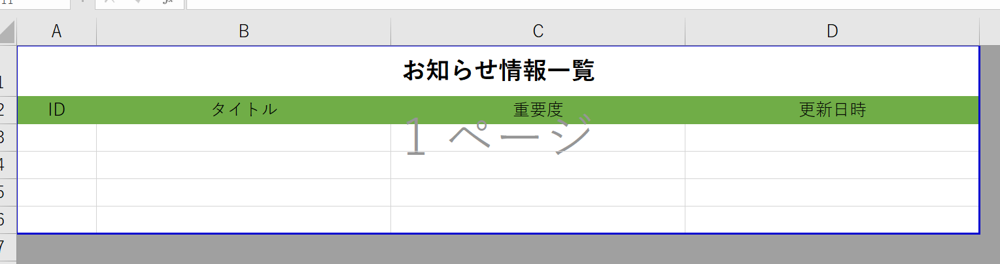

# Plugin (export)
It can be used if you want to implement your own custom data list export.  
Please use it when exporting a file in the original format or when implementing a special conversion process.

> This feature was added in v3.2.0.

## About output format
The output format is Excel and other formats are also available.  
※In the case of Excel format, the processing is more optimized.

## Creation method (normal)
Here, as an example, we will create a plug-in that outputs a list of notification information in csv format without a header.  
※As a prerequisite, knowledge of PHP and framework [Laravel] (http://laravel.jp/) is required.

### Create config.json
- Create the following config.json file.

~~~ json
{
    "plugin_name": "ExportTestCsv",
    "uuid": "1e7881d0-324f-11e9-b56e-0800200c9a33",
    "plugin_view_name": "ExportTestCsv",
    "description": "Export CSV test.",,
    "author": "Kajitori",
    "version": "0.0.1",
    "plugin_type": "export",
    "target_tables": "information",
    "label": "Notification information output",
    "icon": "fa-question",
    "export_description": "List output of notification information in original csv format."
}
~~~

- plugin_name: The plugin name. Please enter in half-width alphanumeric characters.
- uuid: A total of 36 characters, 32 strings + hyphens. Used to make the plugin unique.  
Please create from the following URL.  
https://www.famkruithof.net/uuid/uuidgen
- Plug-in_type: Enter export.
- target_tables: Enter the name of the table to be exported. If there are more than one, enter them separated by commas.
- label: The title to be displayed in the export dialog.
- icon: The icon to be displayed in the export dialog.
- export_description: The description to be displayed in the export dialog.

※Target_tables, label, icon, export_description can be changed later on the screen.

### PHP file creation
- Create a PHP file like the one below. Name it "Plugin.php".

~~~ php
<? php
namespace App \ Plugins \ ExportTestCsv;

use Exceedone \ Exment \ Services \ Plugin \ PluginExportBase;

class Plugin extends PluginExportBase
{
    / **
     * execute
     * /
    public function execute ()
    {
        // * Get a temporary tmp file with the method "$ this-> getTmpFullPath ()"
        // * After execution, the temporary tmp file will be deleted automatically.
        $ tmp = $ this-> getTmpFullPath ();

        ///// Original implementation process --- From here
        // open csv file
        $ fp = fopen ($ tmp,'w');

        // Get data list for all system columns / custom columns (array)
        $ data = $ this-> getData ();

        // Get data list in view format (array)
        // $ data = $ this-> getViewData ();

        // Get data list with Collection of CustomValue
        // $ data = $ this-> getRecords ();

        foreach ($ data as $ fields) {
            fputcsv ($ fp, $ fields);
        }

        fclose ($ fp);
        ///// Original implementation process --- So far

        // return the string string in $ tmp
        return $ tmp;
    }

    / **
     * Get download file name.
     * Get the file name
     *
     * @return string
     * /
    public function getFileName (): string {
        return "test.csv";
    }
}

~~~
- The namespace should be ** App \ Plugins \\ (Pascal case of plugin name) **. [Click here for details](/plugin_quickstart#plugin-name-namespace)

- The Plugin class must inherit from the class PluginExportBase.

### Compress to zip
Compress the above two files into a zip with the minimum configuration.
- ExportTestCsv.zip
    - config.json
    - Plugin.php

### upload
Upload the plugin.
※Please refer to [Plug-in](/plugin) for the upload method.

### How to execute the export
- On the target_tables screen registered on the plugin management screen, click the "Import / Export" button to display the selection field for the uploaded plugin.

- When you click the "Export" button of the registered plug-in, the export process will be executed with the contents of the execute function of Plugin.php.

## Creation method (Excel)
When outputting in Excel format, it is basically implemented by the same procedure, but it can be implemented more conveniently when creating a PHP file.
※Procedures other than "PHP file creation" are the same as the implementation in "Creation method (normal)".
※The library [PhpSpreadsheet] (https://github.com/PHPOffice/PhpSpreadsheet) for operating Excel with PHP is used.
  
Here, as an example, the procedure for exporting the notification information is described according to the sample template file below.

### PHP file creation
- Create a PHP file like the one below. Name it "Plugin.php".

~~~ php
<? php
namespace App \ Plugins \ ExportTestExcel;

// Change to PluginExportExcel
use Exceedone \ Exment \ Services \ Plugin \ PluginExportExcel;

// change extends to PluginExportExcel
class Plugin extends PluginExportExcel
{
    / **
     * execute
     * /
    public function execute () {
        // Load the template file and initialize PhpSpreadsheet
        $ spreadsheet = $ this-> initializeExcel ('template.xlsx');
        // * When creating a new file without using a template file
        // $ spreadsheet = $ this-> initializeExcel ();

        // Get data list for all system columns / custom columns (array)
        // $ data = $ this-> getData ();

        // Get data list in view format (array)
        // $ data = $ this-> getViewData ();

        // Get data list with Collection of CustomValue
        $ data = $ this-> getRecords ();

        ///// Original implementation process --- From here
        $ sheet = $ spreadsheet-> getActiveSheet ();
        $ column = 3;
        foreach ($ data as $ record) {

            // Loop and set the data
            $ sheet-> setCellValue ("A {$ column}", $ record-> id); // ID
            $ sheet-> setCellValue ("B {$ column}", $ record-> getValue ('title', true)); // Title
            $ sheet-> setCellValue ("C {$ column}", $ record-> getValue ('priority', true)); // Importance
            $ sheet-> setCellValue ("D {$ column}", $ record-> updated_at); // Updated date and time

            $ column ++;
        }
    
        // Frame setting
        $ laserRow = $ column --1;
        $ sheet-> getStyle ("A2: D {$ laserRow}")-> applyFromArray ([[
            'borders' => [
                'outside' => [
                    'borderStyle' => \ PhpOffice \ PhpSpreadsheet \ Style \ Border :: BORDER_THIN
                ],,
                'inside' => [
                    'borderStyle' => \ PhpOffice \ PhpSpreadsheet \ Style \ Border :: BORDER_HAIR
                ],,
            ],,
        ]);
        
        // Print range setting
        $ sheet-> ge
        tPageSetup ()-> setPrintArea ("A1: D {$ laserRow}");
         ///// Original implementation process --- So far

         // Save the created file in a tmp file and return the file path
         // (Save as a separate file from the template)
         return $ this-> getExcelResult ($ spreadsheet);
     }

     / **
      * Get download file name.
      *
      * @return string
      * /
     public function getFileName (): string {
         return "test.xlsx";
     }
}

~~~

### Compress to zip
Compress the file into a zip with the minimum configuration.
- ExportTestExcel.zip
     - config.json
     - Plugin.php
     - template.xlsx (if you include a template file)

## Sample plugin
- [Export CSV output](https://github.com/exment-git/plugin-sample/tree/main/export/ExportTestCsv)
- [Export Excel Output](https://github.com/exment-git/plugin-sample/tree/main/export/ExportTestExcel)