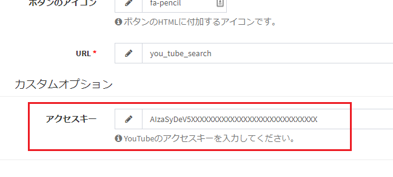

## Plugin (page)
You can create a new screen in Exment.  
Use this if you want to use a page that is completely different from the existing features.  

## Introduction
Exment plugin pages are developed using the PHP framework [Laravel](http://laravel.jp/) and [laravel-admin](https://laravel-admin.org/docs/).  
When developing a page, it is recommended that people with knowledge of Laravel develop it.

## How to make

### sample
Here, the following page is created as a sample.  
- Display a search bar to search data on YouTube.
- Perform YouTube search with the entered search value. Display the top 20 items.
- Register the video ID and title, description, link, number of plays, number of high ratings, and number of low ratings of the video for which the "Register" button was clicked in the table "YouTube".

   

※ You need a YouTube access key to execute. Please refer to [here](https://www.plusdesign.co.jp/blog/?p=7752) to get the key.  
  
※ Please import [this](https://exment.net/downloads/sample/template/YouTube.zip) template in advance.  

- Sample plug-in [here](https://github.com/exment-git/plugin-sample/tree/main/page/YouTubeSearch).

### Create config.json
- Create the following config.json file.  

~~~ json

{
    "plugin_name": "YouTubeSearch",
    "plugin_view_name" : "YouTube Search",
    "description": "Search YouTube and save data such as number of views.",
    "uuid":  "c6d8daa0-c255-11e9-bb97-0800200c9a66",
    "author":  "(Your Name)",
    "version": "1.0.0",
    "plugin_type": "page",
    "route": [
        {
            "uri": "",
            "method": [
                "get"
            ],
            "function": "index"
        },
        {
            "uri": "list",
            "method": [
                "get"
            ],
            "function": "list"
        },
        {
            "uri": "save",
            "method": [
                "post"
            ],
            "function": "save"
        }
    ]
}

~~~

- plugin_name should be written in alphanumeric characters.
- uuid is a character string of 32 characters + hyphen, totaling 36 characters. Used to make the plugin unique.  
Please create from the following URL etc.  
https://www.famkruithof.net/uuid/uuidgen
- For plugin_type, enter page.  
- route defines a list of URL endpoints to be executed, their HTTP methods, and methods in the controller.  
    - uri：uri for page display. The actual URL is "http(s):// (URL of Exment) / admin / plugins / (URL set on the plugin management screen) / (specified uri)".  
    - method：HTTP method. Please fill in with get, post, put, delete.
    - function：Method in Contoller to execute
    - Example: If the URL set on the plugin management screen is "youtube_search", the uri specified in config.json is "list", and the specified method is "get", "http(s):// (URL of Exment) / admin / plugins / youtube_search / list (method: GET) ".
- Be sure to include a route whose uri is empty (""). Access this endpoint when screen transition from the menu to the plugin page.

### Plugin file creation

#### Create main logic
Create the following PHP file. File name should be "Plugin.php".

~~~ php
<?php

// (1)
namespace App\Plugins\YouTubeSearch;

use Encore\Admin\Widgets\Box;
use Exceedone\Exment\Model\CustomTable;
use Exceedone\Exment\Services\Plugin\PluginPageBase;
use GuzzleHttp\Client;

class Plugin extends PluginPageBase
{
    // (3)
    protected $useCustomOption = true;

    /**
     * (2) Index
     *
     * @return void
     */
    public function index()
    {
        return $this->getIndexBox();
    }

    /**
     * (2) Displaying a list of youTube results
     *
     * @return void
     */
    public function list()
    {
        $html = $this->getIndexBox()->render();

        // string search
        $client = new Client([
            'base_uri' => 'https://www.googleapis.com/youtube/v3/',
        ]);

        $method = 'GET';
        $uri = "search?part=id&type=video&maxResults=20&key=" . $this->plugin->getCustomOption('access_key') 
            . "&q=" . urlencode(request()->get('youtube_search_query')); //Search
        $options = [];
        $response = $client->request($method, $uri, $options);

        $list = json_decode($response->getBody()->getContents(), true);
        $ids = collect(array_get($list, 'items', []))->map(function($l){
            return array_get($l, 'id.videoId');
        })->toArray();

        // search for details by id
        $client = new Client([
            'base_uri' => 'https://www.googleapis.com/youtube/v3/',
        ]);

        $method = 'GET';
        $uri = "videos?part=id,snippet,statistics&key=" . $this->plugin->getCustomOption('access_key') 
            . "&id=" . implode(',', $ids); //Search
        $options = [];
        $response = $client->request($method, $uri, $options);

        $list = json_decode($response->getBody()->getContents(), true);
        
        $html .= new Box("Youtube search results", view('exment_you_tube_search::list', [
            'items' => array_get($list, 'items', []),
            // (5)
            'item_action' => $this->plugin->getRouteUri('save'),
        ])->render());

        return $html;
    }

    /**
     * (2) Data storage
     *
     * @return void
     */
    public function save(){
        $request = request();
        $model = CustomTable::getEloquent('youtube')->getValueModel();
        $model->setValue('youtubeId', $request->get('youtubeId'));
        $model->setValue('description', $request->get('description'));
        $model->setValue('viewCount', $request->get('viewCount'));
        $model->setValue('likeCount', $request->get('likeCount'));
        $model->setValue('dislikeCount', $request->get('dislikeCount'));
        $model->setValue('url', $request->get('url'));
        $model->setValue('title', $request->get('title'));
        $model->setValue('publishedAt', $request->get('publishedAt'));
        $model->save();

        admin_toastr(trans('admin.save_succeeded'));
        return redirect()->back()->withInput();
    }

    /**
     * Get search box
     *
     * @return void
     */
    protected function getIndexBox(){
        // (3) Check YouTube access key
        $hasKey = !is_null($this->plugin->getCustomOption('access_key'));

        // (4)
        return new Box("Youtube search", view('exment_you_tube_search::index', [
            'action' => $this->plugin->getRouteUri('list'),
            'youtube_search_query' => request()->get('youtube_search_query'),
            'hasKey' => $hasKey,
        ]));
    }
    
    /**
     * (3) Option to be set on the plug-in edit screen. Enter access key
     *
     * @param [type] $form
     * @return void
     */
    public function setCustomOptionForm(&$form)
    {
        $form->text('access_key', 'access key')
            ->help('Please enter your YouTube access key.');
    }
}
~~~

- (1) The namespace should be **App \ Plugins \ (plugin name).**  
Also, the class name should be "Plugin" and inherit PluginPageBase.

- (2) The public method name in the class is the name described in function of config.json.

- (3) The function "public function setCustomOptionForm (& $ form)" is an item displayed on the plug-in setting screen.  
In this case, the access key required to execute the YouTube Data API can be set from the screen.  
  
※ To use custom settings, add "protected $ useCustomOption = true;"  
※ To get the set value, use the function "$ this-> plugin-> getCustomOption ('parameter name')".  

- (4) When using a view, add "exment_ (snake case for plug-in name) ::" as the prefix of the view name.

- (5) If you want to get the plugin endpoint, use the function "$ this-> getRouteUri ('endpoint name')".  
※ If you want to get the URL full path, use admin_url ($ this-> getRouteUri ('endpoint name')).

#### (Optional) About views
When separating views, save the blade file under the folder "resources / views".

#### (Optional) For css, js, and other static files
- Place the css file in the folder "public / css".
- Please place the js file in the folder "public / js".
- Other files (such as image files) should be placed in the folder "public / assets".

### Compress to zip
Compress the above two files into a zip with the minimum configuration.  
The zip file name should be "(plugin_name) .zip".  
- YouTubeSearch.zip
    - config.json
    - Plugin.php
    - (Other required PHP files, image files, etc.)

### Other
- If you want to display the data details of a specific ID value, add the following description to the route of config.json.  
You can specify uri like "{id}".  

~~~ json

{
    "route": [
        {
            "uri": "show_details/{id}",
            "method": [
                "get"
            ],
            "function": "show_details"
        }
    ]
}

~~~

### Sample plugin
[YouTube search](https://github.com/exment-git/plugin-sample/tree/main/page/YouTubeSearch)  
※ Please import [this](https://exment.net/downloads/sample/template/YouTube.zip) template beforehand.