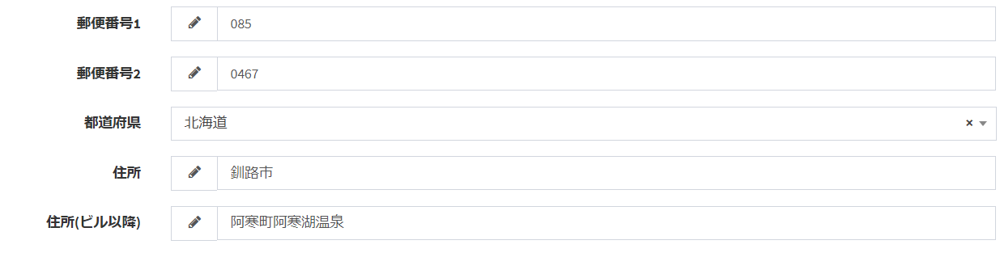

# Plugin (script)
You can execute your own script (javascript) on the screen of Exment.  
The trigger for executing the script has the following contents.  
- When displaying the data list: The trigger starts when the reading of the data list screen is completed.  
- When displaying the data details: The trigger starts when the reading of the data details screen is completed.  
- At the time of new data creation / edit display: When the reading of the new data creation / edit screen is completed, the trigger is activated.

## How to make
Here, as a sample, when you enter "Zip code 1" and "Zip code 2" on the "Basic information" data edit screen, the 7 prefectures of zip code are automatically set to "Prefecture" "Address" "Address (after building)" Create a script that sets.  
  

### Create config.json
- Create the following config.json file.  

~~~ json
{
    "plugin_name": "SetAddress",
    "uuid": "b5c0a5d2-2716-1937-98d0-b490c1ebc533",
    "plugin_view_name": "Address set",
    "description": "Set the address on the basic information screen.",
    "author": "(Your Name)",
    "version": "1.0.0",
    "plugin_type": "script",
    "cdns": []
}
~~~

- plugin_name should be written in alphanumeric characters.
- uuid is a character string of 32 characters + hyphen, totaling 36 characters. Used to make the plugin unique.  
Please create from the following URL etc.  
https://www.famkruithof.net/uuid/uuidgen
- For plugin_type, write script.
- (Optional) Enter cdns if you want to load related libraries on CDN. Enter the full path of http or https in the array.

### create js file
- Create the following js file. The name is one-byte alphanumeric characters and you can give it any name. In this sample, it is "script.js".  

~~~ js
// script.js
$(function () {
    $(window).off('exment:form_loaded', setAddressEvent).on('exment:form_loaded', setAddressEvent);

    function setAddressEvent(){
        $('.value_zip01,.value_zip02').off('change', setAddressKeyup).on('change', setAddressKeyup);
    }

    function setAddressKeyup(){
        const value_zip01 = $('.value_zip01').val();
        const value_zip02 = $('.value_zip02').val();

        if(!value_zip01 || !value_zip02){
            $('.value_addr01').val('');
            $('.value_addr02').val('');
            $('.value_pref').val('');
            return;
        }

        AjaxZip3.zip2addr('value[zip01]','value[zip02]','value[pref]','value[addr01]','value[addr02]');
    }
});
~~~

- Events are called as jquery.
- ※  Define the event in the part. The event names that are currently defined in Exment are as follows.
    - **exment:list_loaded** ・・・ The event is executed when the loading of the data list screen is completed.
    - **exment:show_loaded** ・・・ The event is executed when the loading of the data detail screen is completed.
    - **exment:form_loaded** ・・・ The event is executed when the loading of the new data creation / edit screen is completed.
- Place the created script in the "public" folder.  
If the extension is "js", multiple scripts can be placed. If you need related libraries, place them all in a folder.  
In this sample, the js file that customized [ajaxzip3](https://github.com/ajaxzip3/ajaxzip3.github.io) is also placed.  

### Compress to zip
Compress to zip.
The zip file name should be "(plugin_name) .zip".
- SetAddress.zip
    - config.json
    - public folder
        - script.js
        - ajaxzip3-source.js

### Plugin upload
Please upload the created zip file on the [plugin](/plugin) page.

### important point
- All the uploaded js files are read when the screen is **first loaded**.
Also, uploaded scripts are called out of order (basically by name) (but after jquery, bootstrap js).
Please implement in a way that does not depend on the reading order.

- In the data of each table, a class named "custom_value_ (table name)" is defined.
If you want to execute the script only on a specific table, set the refinement by the above class name.
※ Example: "User" screen: "custom_value_user", "Organization" screen: "custom_value_organization"

### Sample plugin
- [Address set script](https://exment.net/downloads/sample/plugin/SetAddress.zip)  

- [Full-width alphanumeric → half-width alphanumeric conversion script This script converts](https://exment.net/downloads/sample/plugin/ReplaceZenHan.zip)  
full-width alphanumeric characters to half-width alphanumeric characters.

- [Half-width kana to full-width kana conversion script This script converts](https://exment.net/downloads/sample/plugin/ReplaceKanaHanZen.zip)  
half-width kana to full-width kana.