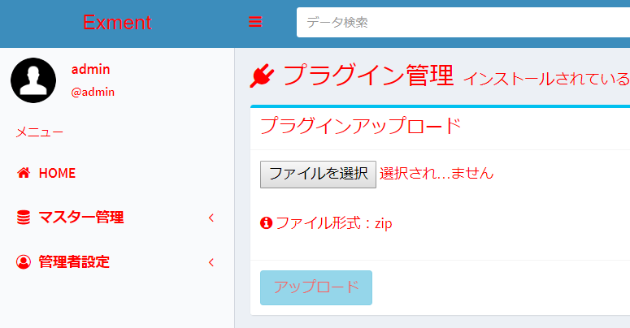

# Plugin (style)
You can load your own style sheet (css) on the screen of Exment and change the design.

## How to make
Here, as an example, create a style that makes the text color of the entire site red.
  

### Create config.json
- Create the following config.json file.  

~~~ json
{
    "plugin_name": "SetStyle",
    "uuid": "b5c0a5d2-2716-1937-98d0-b490c1ebc544",
    "plugin_view_name": "Style test",
    "description": "Style test",
    "author": "(Your Name)",
    "version": "1.0.0",
    "plugin_type": "style",
    "cdns": []
}
~~~

- plugin_name should be written in alphanumeric characters.  
uuid is a character string of 32 characters + hyphen, totaling 36 characters. Used to make the plugin unique.  
Please create from the following URL etc.  
https://www.famkruithof.net/uuid/uuidgen
- For plugin_type, enter style.  
- (Optional) Enter cdns if you want to load related libraries on CDN. Enter the full path of http or https in the array.  

### css file creation
- Create the following css file. The name is one-byte alphanumeric characters and you can give it any name. In this sample, it is "style.js".  

~~~ css
<!-- style.css -->
*{
    color:red !important;
}
~~~

- Please place the created style sheet in the "public" folder.  
Multiple style sheets can be placed if the extension is "css". If you need related libraries, place them all in a folder.

### Compress to zip
Compress to zip.  
The zip file name should be "(plugin_name) .zip".
- SetStyle.zip
    - config.json
    - public folder
        - style.css

### Plugin upload
Please upload the created zip file on the [plugin](/plugin) page.

### important point
- All uploaded css files will be **read when the screen is first loaded.**
Also, the uploaded css files are called out of order (basically in order of name) (but after the css of jquery, bootstrap, adminLTE).
Please implement in a way that does not depend on the reading order.

- In the data of each table, a class named "custom_value_ (table name)" is defined.  
If you want to execute the script only on a specific table, set the refinement by the above class name.  
※ Example: "User" screen: "custom_value_user", "Organization" screen: "custom_value_organization"

### Sample plugin
[Sample design](https://github.com/exment-git/plugin-sample/tree/main/style/SetStyle)