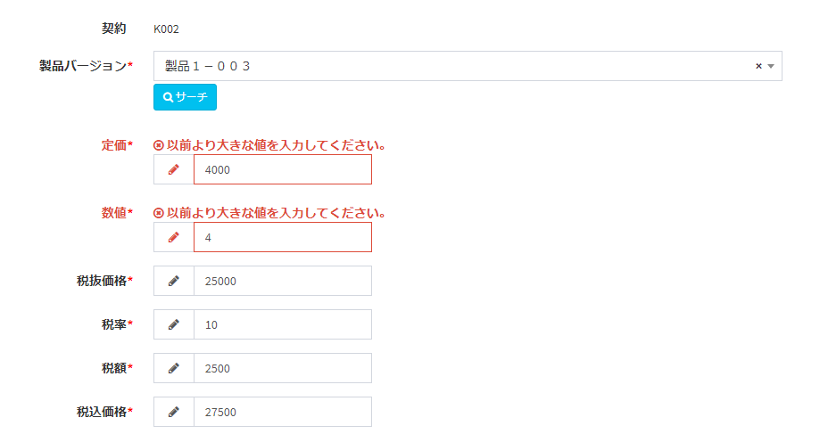

# Plugin (validation)
You can perform your own validation when saving a custom table and before deleting a custom value.  
Character type check and digit number check can be implemented by setting custom column, but if you want to implement more complicated check or related check between items, we recommend using this plugin.  

   

## How to make

### Create config.json
- Create the following config.json file.  

~~~ json
{
    "plugin_name": "PluginValidatorTest",
    "uuid": "63d80590-4aad-11e9-b475-0800200c9a66",
    "plugin_view_name": "Plugin Validator",
    "description": "Perform custom table validation",
    "author": "(Your Name)",
    "version": "1.0.0",
    "target_tables": "test_table",
    "plugin_type": "validator"
}
~~~

- plugin_name should be written in alphanumeric characters.  
- uuid is a character string of 32 characters + hyphen, totaling 36 characters. Used to make the plugin unique.  
Please create from the following URL etc.  
https://www.famkruithof.net/uuid/uuidgen
- For plugin_type, enter validator.  
- target_tables: Enter the name of the table to be validated.

### PHP file creation
- Create the following PHP file. The name should be "Plugin.php".  

~~~ php
<?php
namespace App\Plugins\PluginDemoValidator;

use Exceedone\Exment\Services\Plugin\PluginValidatorBase;
class Plugin extends PluginValidatorBase
{
    /**
     * Plugin Validator
     */
    public function validate()
    {
        // get input value
        $xpos = array_get($this->input_value, 'xpos');
        $ypos = array_get($this->input_value, 'ypos');

        if (isset($xpos) && isset($ypos)) {
            if (intval($xpos) > intval($ypos)) {
                // Set error message (key: column name, value: message)
                $this->messages['ypos'] = ' Please enter a value for Y greater than X.';;
                // return false (error occurred) as the return value
                return false;
            }
        }
        // return true (normal) as the return value
        return true;
    }

    public function validateDestroy($custom_value)
    {
    }
}
~~~
- namespace should be **App \ Plugins (plugin name).**

- Just before saving the "target table" set in the plugin management screen, the plugin is called and the validate function in Plugin.  
php is executed.  
If you return true in the validate function, the process will continue.  
If false is returned, the process is interrupted and the error message set in the property $ messages is displayed on the screen.  

- The Plugin class inherits from the class PluginValidatorBase.  
PluginValidatorBase has properties such as the custom table $ custom_table, the custom data value before the change $ original_value, and the screen input value $ input_value, which can be referenced in the validate function.  
See the [plugin reference](/plugin_reference.md) for details on properties.

### Compress to zip
Compress the above two files into a zip with the minimum configuration.  
The zip file name should be "(plugin_name) .zip".  
- PluginDemoTrigger.zip
    - config.json
    - Plugin.php

### Sample plugin
[Information order validate](https://github.com/exment-git/plugin-sample/tree/main/validation/PluginValidatorTest)  
- This is a sample that validate if the display order of the information table exceeds 100.  
