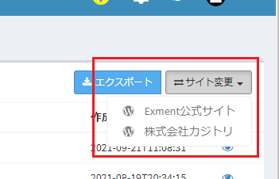
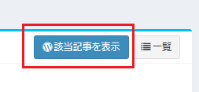

# Plugin reference (CRUD page)
It is a list of functions and properties unique to each plugin.  
※ For the reference of custom tables, custom columns, and custom data, please refer to [here](/func_reference).  
※ This reference is only for CRUD pages. For the reference of other plugin types, please refer to [here](/plugin_reference).  
※ This mainly describes items that plugin developers define. Items that are used by the system and that plugin developers should not change are omitted.  
※ Functions marked with "★" almost always need to be defined. Functions marked with "☆" need to be defined depending on the case.

## PluginCrudBase
An abstract class for plugins (CRUD pages). When developing a CRUD page plugin, inherit this class.  

- namespace Exceedone\Exment\Services\Plugin
- trait Exceedone\Exment\Services\Plugin\PluginBase
- trait Exceedone\Exment\Services\Plugin\PluginPageTrait

##### Property

| Name | Type | Description |
| ---- | ---- | ---- |
| title | string | Title displayed on each page |
| description | string | Description displayed on each page |
| icon | string | Icon displayed on each page |


### Function list

#### ★getFieldDefinitions
A function that returns the column definitions as an associative array.  
- Be sure to add exactly one key with "primary" => true. (Composite keys are not currently supported.)  
- "key" is the item name, used when retrieving data and as the name of each HTML element. Enter alphanumeric characters.  
- "label" is used as the item name on the list screen and other screens.  
- Set "grid" for items displayed on the list screen. Enter an integer for the display order.
- Set "show" for items displayed on the details screen. Enter an integer for the display order.
- Set "create" for items displayed on the create screen. Enter an integer for the display order.
- Set "edit" for items displayed on the edit screen. Enter an integer for the display order.


##### argument
None


##### Return value
| Type | Description |
| ---- | ---- |
| array | Array of column definitions |


##### Example
``` php
/**
     * (2) Get field definitions
     * Get fields definitions
     *
     * @return array|Collection
     */
    public function getFieldDefinitions()
    {
        return [
            ['key' => 'id', 'label' => 'ID', 'primary' => true, 'grid' => 1, 'show' => 1],
            ['key' => 'title', 'label' => 'Title', 'grid' => 2, 'show' => 2, 'create' => 1, 'edit' => 1],
            ['key' => 'date', 'label' => 'Created at', 'grid' => 3, 'show' => 3, 'create' => 2, 'edit' => 2],
            ['key' => 'content', 'label' => 'Content', 'show' => 4, 'create' => 3, 'edit' => 3],
        ];
    }
```

---


#### getAuthType
Returns the authentication type string for the CRUD page.  
※ Separately from the Exment login, you can set up authentication for accessing this CRUD page. Set the authentication type according to the type of service you want to access.


##### Authentication type
| Return string | Type | Description |
| ---- | ---- | ---- |
| (null) | No authentication | No CRUD page-specific authentication is performed. This is the default. |
| key | Access key | Set the access key on the plugin settings page. If the access key has not been entered, an error is displayed. |
| id_password | ID and password | Set the ID and password on the plugin settings page. If the ID and password have not been entered, an error is displayed. |
| oauth | OAuth | Configure OAuth on the login settings screen. When a user accesses the CRUD page, OAuth login is performed. The CRUD page can be accessed only if the OAuth login succeeds. The access token can also be used. |


##### argument
None

##### Return value
| Type | Description |
| ---- | ---- |
| ?string | String representing the authentication type |


##### Example
``` php
    /**
     * Get auth type.
     * Please set null or "key" or "id_password" or "oauth".
     *
     * @return string|null
     */
    public function getAuthType() : ?string
    {
        return 'oauth';
    }
```

---


#### enablePaginate
Specifies whether to display the data list in paginated form.  
If the target service supports pagination (total number of records, retrieving data by specifying a page number, retrieving data page by page), return true. If it is not supported, return false.

##### argument
None


##### Return value
| Type | Description |
| ---- | ---- |
| boolean | Whether pagination is supported. Default: true |


##### Example
``` php
     /**
     * Whether use paginate
     * Default: true
     *
     * @return bool
     */
    public function enablePaginate() : bool
    {
        return true;
    }
```

---


#### ★getPaginate
A function that retrieves the data list in paginated form.  
Return the retrieved data as \Illuminate\Pagination\LengthAwarePaginator.  
Each element of the list should be an associative array, and the keys of that associative array should be the same as the keys set in getFieldDefinitions.  
※ Implement this function when the function enablePaginate returns true.


##### argument
| Name | Type | Description |
| ---- | ---- | ---- |
| $options | array | Options used to display the list screen |
| $options['per_page'] | int | Number of items displayed per page |
| $options['page'] | int | Page number |
| $options['query'] | string | Search string when a search is performed |


##### Return value
| Type | Description |
| ---- | ---- |
| LengthAwarePaginator | Search result model |


##### Example
``` php
    /**
     * (3) Get data list (paginate)
     * Get data paginate
     *
     * @return LengthAwarePaginator
     */
    public function getPaginate(array $options = []) : ?LengthAwarePaginator
    {
        $client = new Client([
            'base_uri' => $this->getSiteUrl(),
        ]);

        $query = [
            'per_page' => $options['per_page'] ?? 20,
            'page' => $options['page'] ?? 20
        ];

        if(array_has($options, 'query')){
            $query['search'] = array_get($options, 'query');
        }

        $response = $client->get('wp-json/wp/v2/posts', ['query' => $query]);

        $json = json_decode((string)$response->getBody());

        $result = collect($json)->map(function($j){
            $j = json_decode(json_encode($j), true);
            return (object)[
                'id' => array_get($j, 'id'),
                'title' => array_get($j, 'title.rendered'),
                'content' => array_get($j, 'content.rendered'),
                'date' => array_get($j, 'date'),
            ];
        });
        
        return new LengthAwarePaginator(
            $result, 
            array_get($response->getHeaders(), 'X-WP-Total')[0], 
            $query['per_page'],
            $query['page'],
            [
                'path' => $this->getFullUrl(),
            ]
        );
    }
```


---

#### ☆getList
A function that retrieves the data list.  
Return the retrieved data as a Collection.  
Each element of the list should be an associative array, and the keys of that associative array should be the same as the keys set in getFieldDefinitions.  
※ Implement this function when the function enablePaginate returns false.


##### argument
| Name | Type | Description |
| ---- | ---- | ---- |
| $options | array | Options used to display the list screen |
| $options['query'] | string | Search string when a search is performed |


##### Return value
| Type | Description |
| ---- | ---- |
| \Illuminate\Support\Collection | List of results |


##### Example
``` php
    /**
     * (3) Get data list
     * Get data paginate
     *
     * @return Collection
     */
    public function getList(array $options = []) : Collection
    {
        $client = new Client([
            'base_uri' => $this->getSiteUrl(),
        ]);

        if(array_has($options, 'query')){
            $query['search'] = array_get($options, 'query');
        }

        $token = $this->getOauthAccessToken();
        $response = $client->get('v1.0/me/todo/lists', [
            'query' => $query, 
            'headers' => [
                'Authorization' => "Bearer $token",
                'Accept'        => 'application/json',
            ]
        ]);

        $json = json_decode((string)$response->getBody());

        $result = collect($json->value)->map(function($j){
            $j = json_decode(json_encode($j), true);
            return (object)[
                'id' => array_get($j, 'id'),
                'displayName' => array_get($j, 'displayName'),
            ];
        });

        return $result;
    }
```


---


#### getChunkCount
Returns the number of items retrieved at a time when retrieving the data list in paginated form.  

##### argument
None


##### Return value
| Type | Description |
| ---- | ---- |
| int | Number of items retrieved at a time. Default: 1000 |


##### Example
``` php
    /**
     * Get max chunk count.
     *
     * @return int
     */
    public function getChunkCount() : int
    {
        return 1000;
    }
```


---

#### ★getData
Retrieves and returns a single record with the specified ID.  
Each element of the data should be an associative array, and the keys of that associative array should be the same as the keys set in getFieldDefinitions.  

##### argument
| Name | Type | Description |
| ---- | ---- | ---- |
| $id | string | Key value of the data |
| $options | array | Currently unused. Reserved argument. |


##### Return value
| Type | Description |
| ---- | ---- |
| array or Collection | Retrieved data |


##### Example
``` php
    /**
     * (3) Get data details (single record)
     * read single data
     *
     * @return array|Collection
     */
    public function getData($id, array $options = [])
    {
        $client = new Client([
            'base_uri' => $this->getSiteUrl(),
        ]);
        $response = $client->request('GET', "wp-json/wp/v2/posts/{$id}");
        $json = json_decode((string)$response->getBody());
        
        $j = json_decode(json_encode($json), true);
        return (object)[
            'id' => array_get($j, 'id'),
            'title' => array_get($j, 'title.rendered'),
            'content' => array_get($j, 'content.rendered'),
            'date' => array_get($j, 'date'),
        ];
    }
```


---

#### ★postCreate
Creates new data.  
Return the key value of the created data as the return value.  

##### argument
| Name | Type | Description |
| ---- | ---- | ---- |
| $posts | array | Data entered by the user. Associative array. |
| $options | array | Currently unused. Reserved argument. |


##### Return value
| Type | Description |
| ---- | ---- |
| string | Return the key value of the created data |


##### Example
``` php
    /**
     * post create value
     *
     * @return mixed
     */
    public function postCreate(array $posts, array $options = [])
    {
        $client = new Client([
            'base_uri' => $this->getSiteUrl(),
        ]);

        // create Authorization header 
        $id_password = $this->getAuthIdPassword();
        $Authorization = "Basic " . base64_encode("{$id_password['id']}:{$id_password['password']}");

        $response = $client->request('POST', "wp-json/wp/v2/posts", [
            'headers' => [
                'Authorization' => $Authorization,
                //'Content-Type' => 'application/json',
            ],
            'form_params' => [
                'title' => array_get($posts, 'title'),
                'content' => array_get($posts, 'content'),
                'status' => 'publish',
            ],
        ]);
        $json = json_decode((string)$response->getBody());
        $j = json_decode(json_encode($json), true);
        return array_get($j, 'id');
    }

```


---

#### ★putEdit
Edits data.  
Return the key value of the edited data as the return value.  

##### argument
| Name | Type | Description |
| ---- | ---- | ---- |
| $id | string | Key value of the data to edit |
| $posts | array | Data entered by the user. Associative array. |
| $options | array | Currently unused. Reserved argument. |


##### Return value
| Type | Description |
| ---- | ---- |
| string | Return the key value of the updated data |


##### Example
``` php
    /**
     * edit posted value
     *
     * @return mixed
     */
    public function putEdit($id, array $posts, array $options = [])
    {
        $client = new Client([
            'base_uri' => $this->getSiteUrl(),
        ]);

        // create Authorization header 
        $id_password = $this->getAuthIdPassword();
        $Authorization = "Basic " . base64_encode("{$id_password['id']}:{$id_password['password']}");

        $response = $client->request('POST', "wp-json/wp/v2/posts/{$id}", [
            'headers' => [
                'Authorization' => $Authorization,
                //'Content-Type' => 'application/json',
            ],
            'form_params' => [
                'title' => array_get($posts, 'title'),
                'content' => array_get($posts, 'content'),
                'status' => 'publish',
            ],
        ]);
        $json = json_decode((string)$response->getBody());
        $j = json_decode(json_encode($json), true);
        return array_get($j, 'id');
    }

```


---

#### ★delete
Deletes data.  

##### argument
| Name | Type | Description |
| ---- | ---- | ---- |
| $id | string | Key value of the data to delete |
| $options | array | Currently unused. Reserved argument. |


##### Return value
None


##### Example
``` php
    /**
     * delete value
     *
     * @param $id string
     * @return mixed
     */
    public function delete($id, array $options = [])
    {
        $client = new Client([
            'base_uri' => $this->getSiteUrl(),
        ]);

        // create Authorization header 
        $id_password = $this->getAuthIdPassword();
        $Authorization = "Basic " . base64_encode("{$id_password['id']}:{$id_password['password']}");

        $response = $client->request('DELETE', "wp-json/wp/v2/posts/{$id}", [
            'headers' => [
                'Authorization' => $Authorization,
                //'Content-Type' => 'application/json',
            ],
        ]);
    }
```


---

#### enableCreate
Determines whether new data can be created, and returns a boolean.  
Return false if the linked service does not support creation, or if you do not want users to create data.

##### argument
| Name | Type | Description |
| ---- | ---- | ---- |
| $options | array | Currently unused. Reserved argument. |


##### Return value
| Type | Description |
| ---- | ---- |
| boolean | Return true if creation is possible. Default: true |

---


#### enableEditAll
Determines whether data can be edited, and returns a boolean.  
Return false if the linked service does not support editing, or if you do not want users to edit data.

##### argument
| Name | Type | Description |
| ---- | ---- | ---- |
| $options | array | Currently unused. Reserved argument. |


##### Return value
| Type | Description |
| ---- | ---- |
| boolean | Return true if editing is possible. Default: true |

---


#### enableEdit
Determines whether the specified data can be edited, and returns a boolean.  
Return false if the linked service does not support editing, or if you do not want users to edit data.

##### argument
| Name | Type | Description |
| ---- | ---- | ---- |
| $value | mixed | Value corresponding to the ID. |
| $options | array | Currently unused. Reserved argument. |


##### Return value
| Type | Description |
| ---- | ---- |
| boolean | Return true if editing is possible. Default: true |

---


#### enableDeleteAll
Determines whether data can be deleted, and returns a boolean.  
Return false if the linked service does not support deletion, or if you do not want users to delete data.

##### argument
| Name | Type | Description |
| ---- | ---- | ---- |
| $options | array | Currently unused. Reserved argument. |


##### Return value
| Type | Description |
| ---- | ---- |
| boolean | Return true if deletion is possible. Default: true |

---

#### enableDelete
Determines whether the specified data can be deleted, and returns a boolean.  
Return false if the linked service does not support deletion, or if you do not want users to delete data.

##### argument
| Name | Type | Description |
| ---- | ---- | ---- |
| $value | mixed | Value corresponding to the ID. |
| $options | array | Currently unused. Reserved argument. |


##### Return value
| Type | Description |
| ---- | ---- |
| boolean | Return true if deletion is possible. Default: true |

---


#### enableExport
Determines whether data export can be performed, and returns a boolean.  
Depending on the case, data export retrieves all data from the service. Therefore, be careful when a large amount of data may be retrieved.

##### argument
| Name | Type | Description |
| ---- | ---- | ---- |
| $options | array | Currently unused. Reserved argument. |


##### Return value
| Type | Description |
| ---- | ---- |
| boolean | Return true if data export is possible. Default: false |

---


#### enableFreewordSearch
Determines whether data search can be performed, and returns a boolean.  

##### argument
| Name | Type | Description |
| ---- | ---- | ---- |
| $options | array | Currently unused. Reserved argument. |


##### Return value
| Type | Description |
| ---- | ---- |
| boolean | Return true if data search is possible. Default: false |

---


#### callbackGridTool
Define this function when you want to display your own buttons at the top right of the GRID (data list) page, for example.

##### argument

| Name | Type | Description |
| ---- | ---- | ---- |
| $tools | \Encore\Admin\Widgets\Grid\Tools | Tools |


##### Return value
None


##### Example
``` php
    /**
     * Callback tools. If add event, definition.
     * ※ In this example: displays a WordPress list button and switches the WordPress site from which data is retrieved
     *
     * @param $tools
     * @return void
     */
    public function callbackGridTool($tools)
    {
        $menulist = [];

        foreach ($this->getSiteDefinitions() as $site) {
            $menulist[] = [
                'href' => admin_urls('plugins', $this->plugin->getOption('uri'), array_get($site, 'endpoint')),
                'label' => array_get($site, 'label'),
                'icon' => 'fa-wordpress',
            ];
        }
        $tools->prepend(view('exment::tools.menu-button', [
            'button_label' => 'Change site',
            'menulist' => $menulist,
        ])->render(), 'right');
    }

```

  

---


#### callbackShowTool
Define this function when you want to display your own buttons at the top right of the SHOW (data details) page, for example.

##### argument

| Name | Type | Description |
| ---- | ---- | ---- |
| $id | string | Key value |
| $box | \Encore\Admin\Widgets\Box | Box |


##### Return value
None


##### Example
``` php
    /**
     * Callback show page tools. If add event, definition.
     *
     * @param Box $box
     * @return void
     */
    public function callbackShowTool($id, Box $box)
    {
        $box->tools(view('exment::tools.button', [
            'href' => $this->getSiteUrl() . "?p={$id}",
            'label' => 'Show this post',
            'icon' => 'fa-wordpress',
            'btn_class' => 'btn-primary',
            'target' => '_blank',
        ])->render());
    }
```

  

---


#### callbackFormTool
Define this function when you want to display your own buttons at the top right of the CREATE (data creation) page or the EDIT (data edit) page, for example.

##### argument

| Name | Type | Description |
| ---- | ---- | ---- |
| $id | string | Key value |
| $box | \Encore\Admin\Widgets\Box | Box |


##### Return value
None


##### Example
``` php
    /**
     * Callback create or edit page tools. If add event, definition.
     *
     * @param Box $box
     * @return void
     */
    public function callbackFormTool($id, Box $box)
    {
        $box->tools(view('exment::tools.button', [
            'href' => $this->getSiteUrl() . "?p={$id}",
            'label' => 'Show this post',
            'icon' => 'fa-wordpress',
            'btn_class' => 'btn-primary',
            'target' => '_blank',
        ])->render());
    }
```

  

---


#### setForm
Define this function when you want to create your own data input form on the CREATE (data creation) page or the EDIT (data edit) page.  
※ The notation basically follows the way fields are added in [laravel-admin forms](https://laravel-admin.org/docs/en/model-form-fields). For the input methods, please refer to that page.  
※ If this function is not defined, the columns that have "edit" defined in the function getFieldDefinitions are displayed as single-line text fields.


##### argument
| Name | Type | Description |
| ---- | ---- | ---- |
| $form | \Encore\Admin\Widgets\Form | Input form |
| $isCreate | bool | true when creating new data |
| $options | array | Currently unused. Reserved argument. |


##### Return value
None


##### Example
``` php
    /**
     * set form info
     *
     * @return Form|null
     */
    public function setForm(Form $form, bool $isCreate, array $options = []) : ?Form
    {
        if(!$isCreate){
            $form->display('ID');    
        }
        $form->text('Name');

        // Get country list
        $countries = \DB::connection('world')->table('country') ->pluck('Name', 'Code');
        $form->select('CountryCode')->options($countries);
        
        $form->number('Population');

        return $form;
    }
```

---


#### validate
A function for defining validation before data is saved on the CREATE (data creation) page or the EDIT (data edit) page.

##### argument

| Name | Type | Description |
| ---- | ---- | ---- |
| $form | \Encore\Admin\Widgets\Form | Input form |
| $values | array | Values entered by the user |
| $isCreate | bool | true when creating new data |
| $id | string | Key value |


##### Return value
| Type | Description |
| ---- | ---- |
| One of the following<br/>array<br/>\Illuminate\Support\MessageBag<br/>\Exceedone\Exment\Validator\ExmentCustomValidator | Validation result |


##### Example
``` php
    // ※ Example 1. How to add validation to the form in the setForm function.
    // ※ For convenience, this example is shown under the validate function, but in this case, do not define the validate function.
    /**
     * set form info
     *
     * @return Form|null
     */
    public function setForm(Form $form, bool $isCreate, array $options = []) : ?Form
    {
        if(!$isCreate){
            $form->display('ID');    
        }
        $form->text('Name')
            ->rules(['max:10']); // Added

        // Get country list
        $countries = \DB::connection('world')->table('country')->pluck('Name', 'Code');
        $form->select('CountryCode')->options($countries);
        
        $form->number('Population')
            ->rules([new \Exceedone\Exment\Validator\NumberMinRule(10)]);  // Added

        return $form;
    }


    // ※ Example 2. How to use Laravel validation.
    /**
     * Validate form
     *
     * @param WidgetForm $form
     * @return array|MessageBag|ExmentCustomValidator
     */
    public function validate(WidgetForm $form, array $values, bool $isCreate, $id)
    {
        $validator = \Validator::make($values, 
        // Define the rules for each field
        [
            'Name' => 'max:10',
            'Population' => new \Exceedone\Exment\Validator\NumberMinRule(10),
        ], 
        // (Optional) To change the message for each rule
        [
            'max' => 'The length of :attribute must be 10 characters or less.',
            'min' => 'Please enter a value of 10 or more for :attribute.',
        ], 
        // (Optional) To change the name of each field
        [
            'Name' => 'Name',
            'Population' => 'Population (estimated)',
        ]);
        return $validator;
    }
    

    // ※ Example 3. How to validate individually.
    // If there are errors, return an array whose keys are the field names and whose values are the error messages.
    /**
     * Validate form
     *
     * @param WidgetForm $form
     * @return array|MessageBag|ExmentCustomValidator
     */
    public function validate(WidgetForm $form, array $values, bool $isCreate, $id)
    {
        $errors = [];

        // Check whether the length is 10 characters or less
        $Name = array_get($values, 'Name');
        if(!is_nullorempty($Name) && mb_strlen($Name) > 10){
            $errors['Name'] = 'The length of Name must be 10 characters or less.';
        }
        
        // Check whether the value is 10 or more
        $Population = array_get($values, 'Population');
        if(!is_nullorempty($Population) && intval($Population) < 10){
            $errors['Population'] = 'Please enter a value of 10 or more for Population (estimated).';
        }
        
        return $errors;
    }
```

---
