# Public form settings
Set up a public form that allows general users (users who are not logged in) to enter data.  
  
In order to use the normal [Data Form Screen](/data_form.md), it is necessary to prepare a user in advance and enter the ID and password to log in. The public form allows anyone to enter data without logging in.
This allows you to create questionnaires, inquiry forms, application forms, etc., share the URL, and make it widely available to the outside world.  

## About public form setting specifications

<span class="red bold">The data entered from the public form settings will be registered as the create user / update user by the user who registered the public form settings.</span>  
In addition, on the data entry screen, options of other tables may be dynamically acquired or searched, but the role / authority at that time is also treated as the user who registered the public form settings.  
  
Therefore, system administrators should avoid registering public forms.  
It is recommended to set a new user or role group by following the procedure of "<a href="#/publicform?id=role_user"> User or Role group for setting public form </a>" below. We will   
  
In addition, the following tables are not subject to public form settings.  
- Master tables such as "user" and "organization"
- Tables that are set to "Only one data can be registered" in the table settings


## Setting flow
Follow the steps below to set up the public form.

1. Execute the command. (When using Google reCAPTCHA)

2. Enable public form settings on the system settings page.

3. Make [Custom form settings](/form) and set information such as items and headings to be displayed on the form.

4. Register the user / role group for which you want to set the public form.

5. Log in as the above user, set the public form, and set various designs, confirmation screens, Google Analytics, etc.

6. When you activate the public form, the URL will be published.

## Setup steps

### 1. Command execution
Run only if you use Google reCAPTCHA on your public form.  
Execute the following command in the root folder of the project.  

```
composer require arcanedev/no-captcha=^10.1
```

### 2. System setting page
- Go to "STEP2 Advanced Settings" on the [System setting page](/system_setting) and set "Use Public Form" to YES.  
* The default is NO. This is to let you explicitly choose to use the public form.  

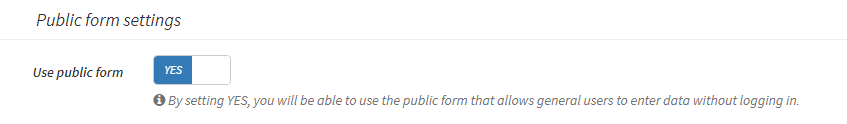

- If you want to use Google reCAPTCHA, please set the item of "Google reCAPTCHA" to V2 or V3.  
After selecting, the site key and secret key items of Google reCAPTCHA will be displayed, so set the value copied from [Google reCAPTCHA management page](http://www.google.com/recaptcha/admin).  
* After setting, select whether to use Google reCAPTCHA on each public form setting page.

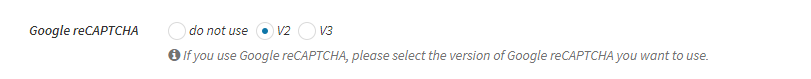


### 3. Custom form settings
- Make [Custom form settings](/form) and set information such as items and headings to be displayed on the form. This procedure is basically the same as normal form settings.  
* There is no problem even if this setting is performed by a user other than the public form setting user such as an administrator.  

<h3 id="role_user"><a href="#/publicform#role_user" data-id="role_user" class="anchor"><span>4. User or Role group to set public form</span></a></h3>
Register the user or role group for which you want to set the public form.  
The data submitted from the public form will be treated as registered / updated by this user.

- Create a new [Role Group](/role_group).
    - Add the "Publish Form Management" permission.
	- Add edit permission to the table for which you want to set the public form.
    - Also, add the view permission of the table accessed by the public form.  

- Ex：If you plan to set up a public form for the "Inquiry" table, and the inquiry table refers to all the data in the "Product" and "Category" tables：  
    - "Public form management" "Edit contact data" permission of "Inquiry" table
    - "View all data" permission in the "Product" and "Category" tables

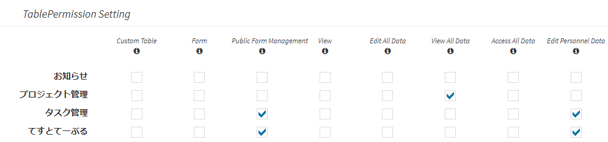

- Add a user to manage the public form.
    - For the role group, select the role group created above.

- Please log in as the user created above, display the public form setting screen, and register the public form.


### 5. Public form settings

- In the custom table list, check one of the tables you want to set, and click "Table Detail Setting" in the upper right.  
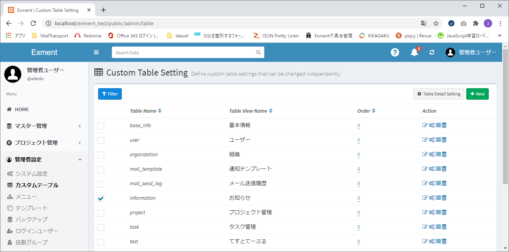
> * It is also possible to transition directly from the data list screen or data registration screen of the target custom table. In that case as well, click "Table Detail Setting" in the upper right.  

- On the displayed table advanced settings page, click the form settings icon.


- A "Public Form Settings" box has been added at the bottom of the form list screen.  
Click the "+ New" button in the upper right corner of this box.

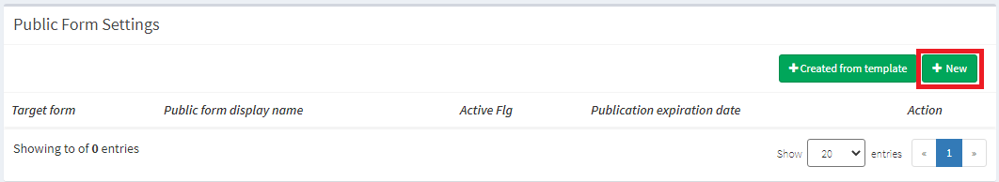

- Transit to the public form setting screen. Please set the required items.

#### Settings - Basic setting
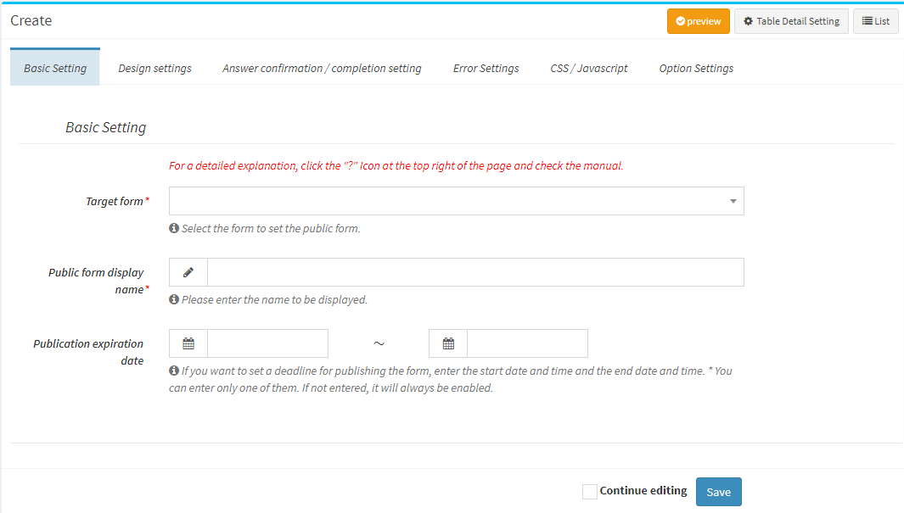

- ##### Target Form
Select the form you want to set as the public form. Select the form created in "Custom Form Settings" above.

- ##### Public form display name
Enter the display name to be displayed on the list page, etc.

- ##### Publication expiration date
If you want to set a deadline for publishing the form, enter the start date and time and the end date and time.  
※You can also enter only "Start date and time" or "End date and time". If neither is entered, it will always be valid.  
※If it is outside the publication expiration date, you will not be able to use this publication form.


#### Settings - Design settings
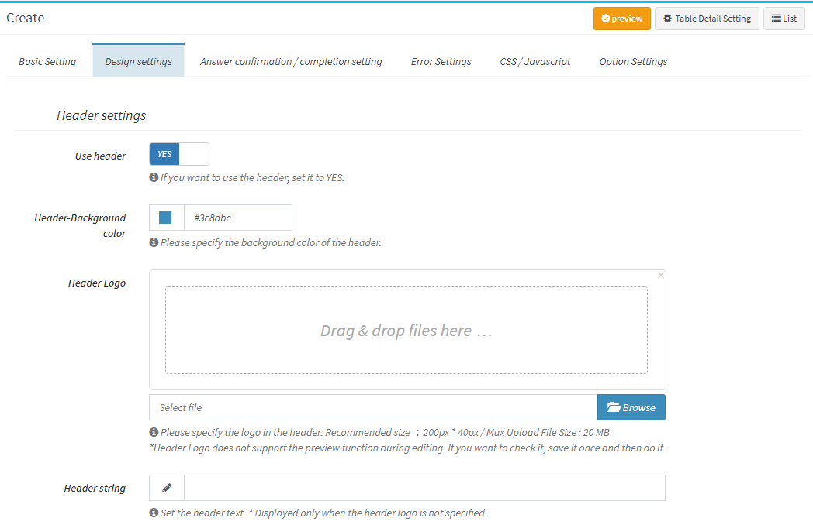

Set design elements such as whether to use the header / footer, logo image and wording, and background color of the form.  


#### Settings - Answer confirmation / Completion setting
Set whether to use the "answer confirmation screen" and "completion screen" that are displayed when the user completes the form, and set the title and wording.

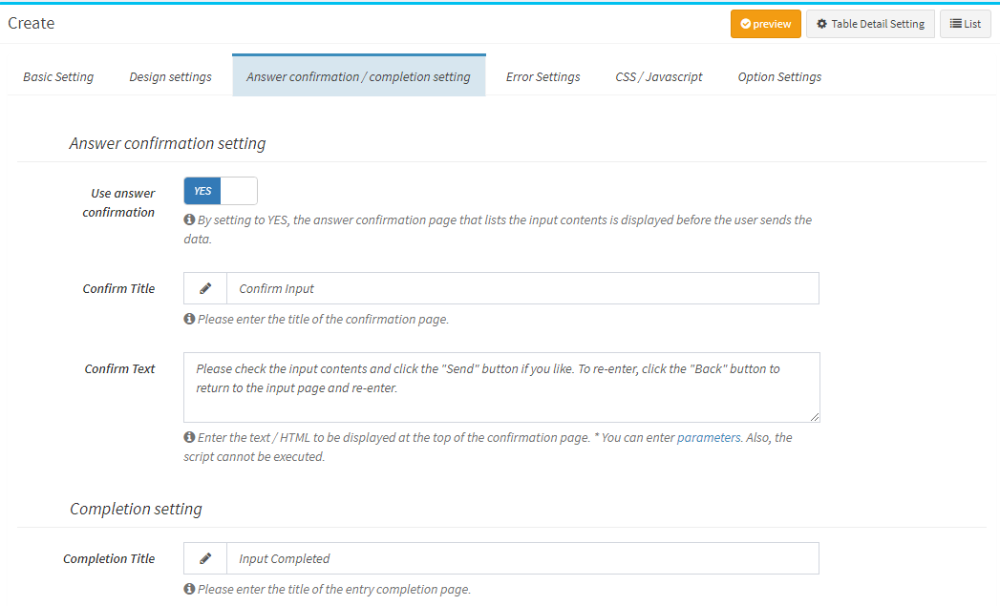

- ##### Use answer confirmation
If YES, the user screen transition will be as follows.

```
Input page → Confirmation Page → Completion Page (Data registration)
```

* If NO, the user's screen transition will be as follows.

```
Input page → Completion Page (Data registration)
```

- ##### Confirmation Title
Please enter the title of the answer confirmation page.

- ##### Confirmation Text
Enter the text / HTML to be displayed at the top of the confirmation page.  
* [Parameter](/params) can be used. The script cannot be executed.


- ##### Completion Title
Please enter the title of the completion page.

- ##### Completion Text
Enter the text / HTML to be displayed at the top of the completion page.  
* [Parameter](/params) can be used. The script cannot be executed.

- ##### Completion link URL
You can display the link on the completion page. If you want to transition to another screen after inputting, enter the URL of the transition destination.  
* If you do not enter the "completion link destination text", the entered URL will be displayed as the link text as it is.

- ##### Completion link Text
You can display the link on the completion page. If you want to move to another page after inputting, enter the wording to be displayed on the page as a link.  


#### Completion Notification (general user)
After registration is complete, you can send an email to the general user who entered the data.  
This is a notification for general users who are not logged in to the system, so the only notification method is email.  
In addition, the notification destination is only the e-mail address entered by the general user.  
* In order to use this function, the column type: Email column is required in the custom table.

- ##### Notify general users of completion
If set to YES, the completion notification will be enabled. 

- ##### Notification Template
Select the notification template to send to general users. You need to create a new template in [Notification Template Settings](/mail) in advance.  
* [Variables (parameters)](/params) can be used for notification. By using variables, registered data, system name, user input value, etc. can be added to the subject / body.  

- ##### Notification Target
Select a custom column that has the email address you want to be notified about.  
Ex: If there is a "Reply to email address" column in the input field, you can select this column as the notification target and a notification will be sent to that email address after the data entry is completed.  


#### Completion notification (administrator)
You can send a notification to the administrator after completing the data entry.  
* Although "Administrator" is entered, it is possible to notify the administrator, users registered in Exment, Slack, etc.

- ##### Notify administrator of completion
If set to YES, the completion notification will be enabled. 

- ##### Notification Template
Select a notification template to send to your administrator. You need to create a new template in [Notification Template Settings](/mail) in advance.  
* [Variables (parameters)](/params) can be used for notification. By using variables, registered data, system name, user input value, etc. can be added to the subject / body.  

- ##### Notification Target
Please select the notification target.  
* Please check [Notification Action Settings](/notify#Notification-action-settings) for the items to be notified and the setting method.


#### Settings - Error Settings
Controls when an error occurs.

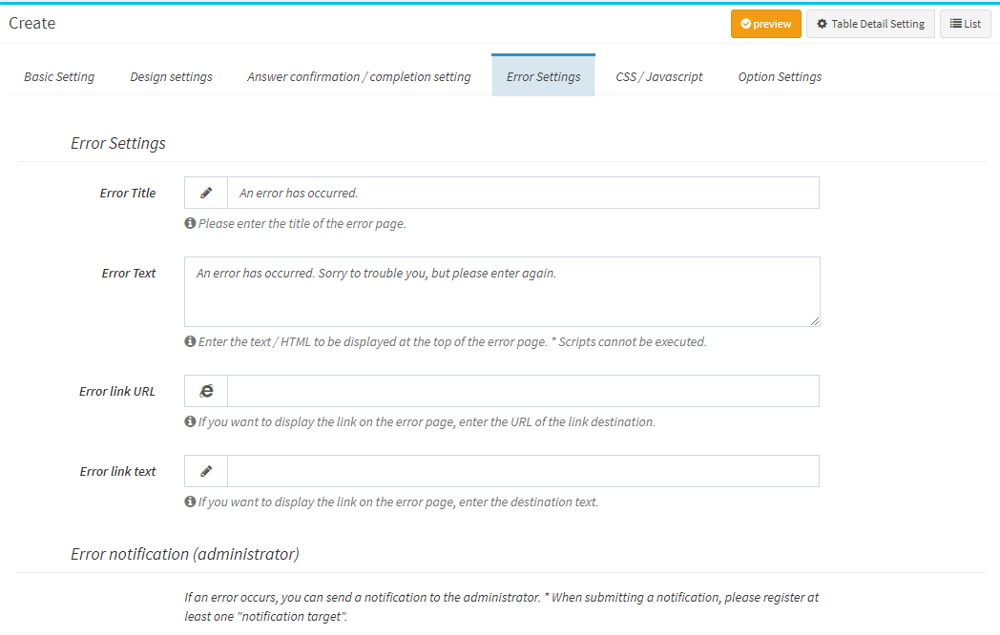


- ##### Error Title
Please enter the wording of the title of the error page.

- ##### Error Text
Enter the text / HTML to be displayed at the top of the error screen page.  

- ##### Error link URL
You can display a link on the error page. If you want to transition to another page when an error occurs, enter the URL of the transition destination.  
* If "Error link destination text" is not entered, the entered URL will be displayed as the link text as it is.

- ##### Error link Text
You can display a link on the error page. If you want to display a link to another page when an error occurs, enter the wording to be displayed on the page.  

#### Error Notification
You can notify the administrator when an error occurs.  
* Although "Administrator" is entered, it is possible to notify the administrator, users registered in Exment, Slack, etc.

- ##### Notify Error
If set to YES, the administrator will be notified when an error occurs.

- ##### Notification Template
Select the template to send to the administrator. You need to create a new template in [Notification Template Settings](/mail) in advance.  
* [Variables (parameters)](/params) can be used for notification. By using variables, registered data, system name, user input value, error content, etc. can be added to the subject / body.  

- ##### Notification Target
Please select the notification target.  
* Please check [Notification Action Settings](/notify#Notification-action-settings) for the items to be notified and the setting method.


#### CSS / Javascript
You can add your own CSS as well as Javascript.

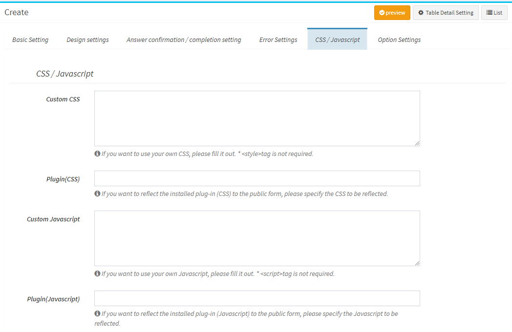

- ##### Custom CSS
Please enter the CSS you want to use directly.  
*&lt;style&gt; tag is not required. Please fill in only the contents of css.

- ##### Plugin (CSS)
If you want the installed plugin (CSS) to be reflected in the public form, please select the name of the plugin.

- ##### Custom Javascript
Please enter the Javascript you want to use directly.  
* &lt;script&gt; tag is not required. Please fill in only the contents of Javascript.  
* Javascipt is added in the following jquery.

``` javascript
<script data-exec-on-popstate>
    $(function () {
        (Added code)
    });
</script>
```

- ##### Plugin (Javascript)
If you want to reflect the installed plugin (Javascript) in the public form, please select the name of the plugin.


#### Settings - Option Setting
Set other options.

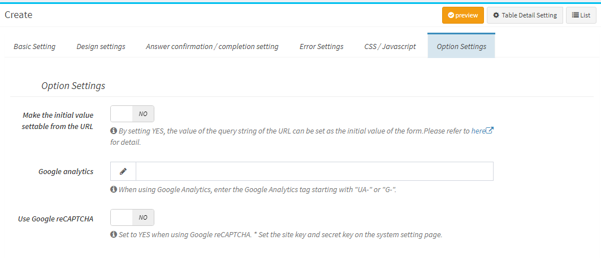

- ##### Make the initial value settable from the URL
By setting YES, the value of the query string of the URL can be set as the initial value of the form. For details, please see [here](#set-the-initial-value-from-the-URL).

- ##### Google Analytics
If you want to set Google Analytics on the form, please enter the Google Analytics tag starting with "UA-" or "G-".

- ##### Use Google reCAPTCHA
If you use Google reCAPTCHA, please set it to YES.  
* It is valid only when you have entered the Google reCaptcha key on the system setting page.


#### Preview
- You can display a preview of the public form based on the settings you have made.  
* You can preview even if you have not saved the form.  

- By clicking the "Preview" button at the top right of the screen, the preview screen of the public form will be displayed in a separate window.  
* A separate window will be displayed using javascript. Depending on your browser settings, pop-ups may be blocked. In that case, unblock and click the button again.

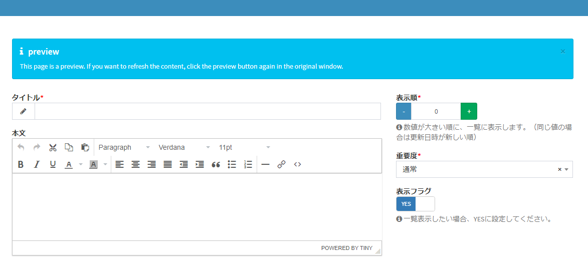

#### Activate Public Form
- The form must be "enabled" in order to be open to the general public. After saving once, open the edit screen again and click the "Activate" button at the top right of the page.  

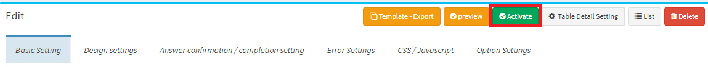

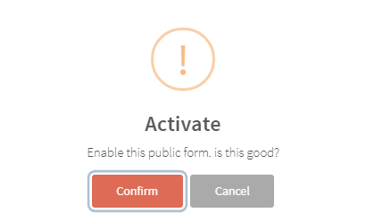


- If the form you publish contains references to other tables, the average user will read the data from those tables.  
The following confirmation message will be displayed, so please check carefully whether there is a problem with the table you are accessing.  

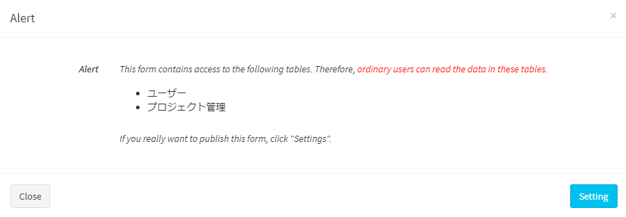

- "Access to other tables" mainly includes the following.
    - If the public form has items such as column types "choices (select from a list of values ​​in other tables)" and "user", data is displayed and searched as choice candidates.
    - When the public form is a child table of 1: n, the data of the parent table is displayed / searched as an option.


#### After Activation, Display URL etc.
- By activating the public form, the following items will be added to the basic settings.

- ##### Public Form URL
The URL of the public form is displayed. Please copy this URL and share it with general users by e-mail or your own webpage.  
* Click the item to copy the URL.

- ##### Execution User
The user who registered the public form. All data registration and browsing using this public form will be performed with the authority of the user.  
* Even if another user updates the public form settings, the execution user does not change. If you want to change it, please login as another user and create a new public form setting.


### 6. Use Public Form
- When you access the URL you copied above, you will see the public form.  
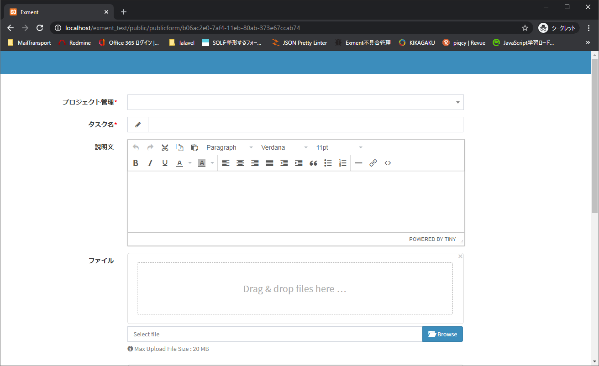

- If you haven't "enabled" the public form settings, it's out of validity, or the URL is incorrect, you'll see the following error.  

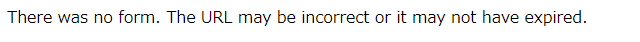

### 7. Use Template
By using the template, you can create a new public form by inheriting the settings of the public form that you have already created.
>The following items require manual settings.<br />"Header logo"<br />"Google analytics"<br />"Use Google reCAPTCHA"

#### Export
By clicking [Template - Export] displayed on the public form setting screen, the open public form will be exported as a template.

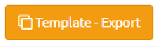

#### Created from template
Click [+ Created from template] in the public form settings of the custom form setting screen.

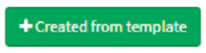

##### Target Form
When creating a public form using a template, select the target form.

##### Public Form Display Name
Enter the display name of the public form to be created.

##### Upload
Select the template you want to use to create the public form.

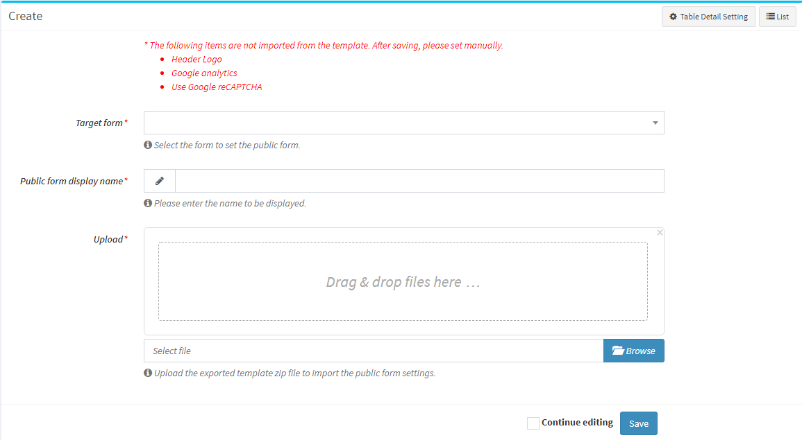


## Other Detailed Settings

### Set the initial value from the URL
- If the setting "Enable initial value to be set from URL" is set to YES, the initial value of the item can be entered in the URL for accessing the public form.  
If you know the initial value of the person with whom you share the URL, such as the company name or category, you can reduce the input burden by including it in the URL in advance.

#### Grant method
Set the query string as shown below.

```
http://(Public Form URL)?value.(Custom Column Name)=(Initial value)

When setting for multiple columns, connect the second and subsequent values ​​with &.
http://(Public Form URL)?value.(Custom Column Name)=(Initial value)&value.(Custom Column Name)=(Initial value)


# Example
http://localhost/publicform/c4f31330-7a75-11eb-a8b0-279816836d79?value.title=Hello

http://localhost/publicform/c4f31330-7a75-11eb-a8b0-279816836d79?value.client_name=Corp%20ABC&value.category=Install
```

- Ex：If you have the following form  

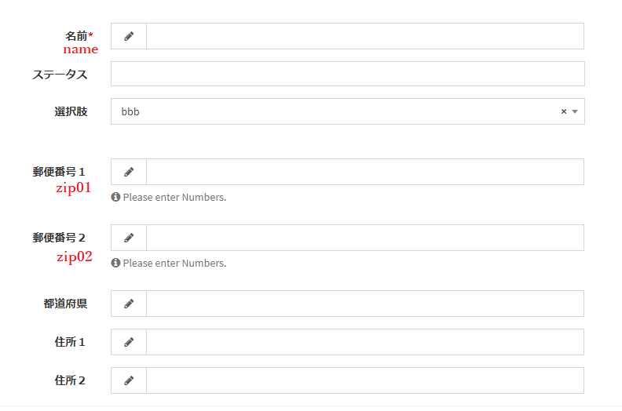

- By adding the following query string to the URL of this form, the initial value will be set when the form is opened.

```
http://localhost/publicform/ab3d55e4-1afc-d1de-ac1b-bc64c51d4d7d?value.name=Inquiries&value.zip01=123&value.zip02=0001
```

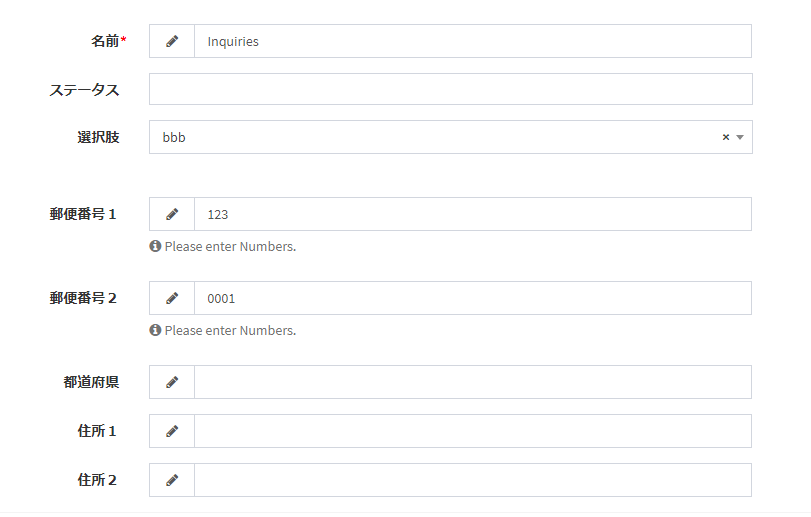


### Change "publicform" included in URL
- This is the procedure to change the character string of "publicform" included in the URL of the public form.  
* This character string is the same for all public forms. It cannot be changed for each form.

#### Change procedure

- To change it, execute [Change setting value](/config).

- Open the ".env" file in the Exment root directory.

- Add the following values.

~~~
### When changing "publicform" to another name
EXMENT_PUBLICFORM_ROUTE_PREFIX=afiewqbfwehghwb
# http://localhost/afiewqbfwehghwb/(UUID) becomes the URL of the public form
~~~

* Please note that all the information in this manual is based on the premise of "publicform".


### Specifications specific to public forms
In addition, it is a specification peculiar to the public form.  

- The "Search" button displayed in the custom columns "Select Table (select from the list of values ​​in other tables)", "User", "Organization", etc. is not displayed in the public form.  

- The notification of the execution trigger "New data creation" that can be registered in "Notification settings" of the detailed table settings is not executed in the public form.  
This is because there are individual "general user" and "administrator" notifications in the public form settings, and they should not be executed at the same time.  