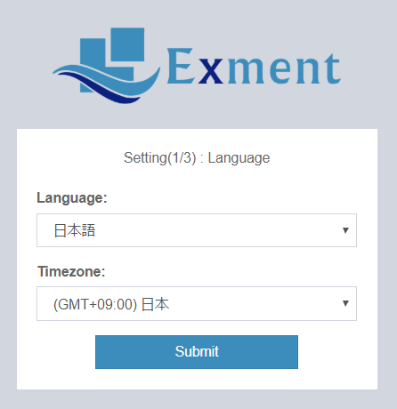
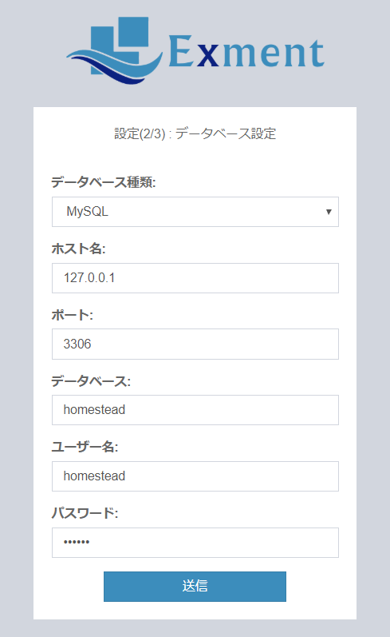
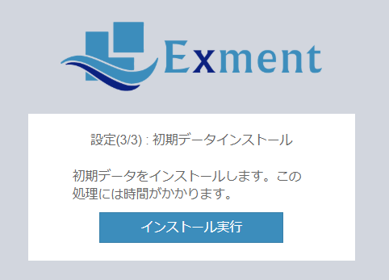

# Installation procedure
These are the steps required to start Exment.  
You can configure the settings on the screen and perform the installation.  

## important point
- **If you do not have a web server, [set up the server](/server) first.**  
(If you do not know if you have built a server, please check it once)
- If this installation method fails, see [Manual Installation](/quickstart_manual).
- If an error occurs during installation, see If an error occurs during [installation](/install_error).
- For other inquiries, please feel free to [contact us](https://exment.net/inquiry) for free.

## Server settings
Exment requires PHP7.1.3 or higher. Also, MySQL 5.7.8 or more and less than 8.0.0 or MariaDB 10.2.7 or more is required.  
XAMPP is recommended when building an environment with PHP, Apache, and MySQL as a development environment from the beginning.  
Please refer to [here](install_xampp) for server settings.  
※ If you already have an environment, this setting is not required.

## composer introduction
Exment requires the introduction of composer. Please refer here for the introduction method.  
※ Those who have already introduced are unnecessary.  
- [Official site](https://getcomposer.org/download/)
- [Windows version explanation site](https://weblabo.oscasierra.net/php-composer-windows-install/)
- [Linux version explanation site](https://weblabo.oscasierra.net/php-composer-centos-install/)
- [Commentary site for Mac](https://weblabo.oscasierra.net/php-composer-macos-homebrew-install/)

## Zip download / expansion
- Download the zip file from the following URL.
[Exment zip file](https://exment.net/downloads/en/exment.zip)  

- Extract the zip file to a PHP executable path.  
Example 1 (XAMPP Windows): C:\xampp\local\exment  
Example 2 (XAMPP Mac): /Applications/XAMPP/local/exment  
Example 3 (XServer): $HOME/domain.com.foobar/exment/

## Create database
- Create a database for Exment with MySQL.

## Installation of initial data
- Access the Exment page and make settings.  
Example 1 (XAMPP): http(s)://(your site URL)/admin

- Set the language and time zone.  
Change from the initial value as necessary.  
  

- Configure the database settings.  
Please change the following content according to your environment.  
~~~
Database type
Database host name
Database port number
Exment database name
Exment database user name
Exment database password
~~~  

  
  
- Click Install.  
  

## Setting completed
After completing the Quick Start, continue with the [initial settings](/first_setting.md).

## Other initial settings
With the above operations, you can start Exment, but you may need to configure additional settings to use some functions.  
Please check the link below.  
- [Change / delete "admin" included in URL](/quickstart_more.md#Change/delete-"admin"-included-in-URL)
- [Task schedule function](/quickstart_more.md#Task-schedule-function)
- [Server external communication off](/quickstart_more.md#Server-external-communication-off)
- [Change file upload limit size](/quickstart_more.md#Change-file-upload-limit-size)
