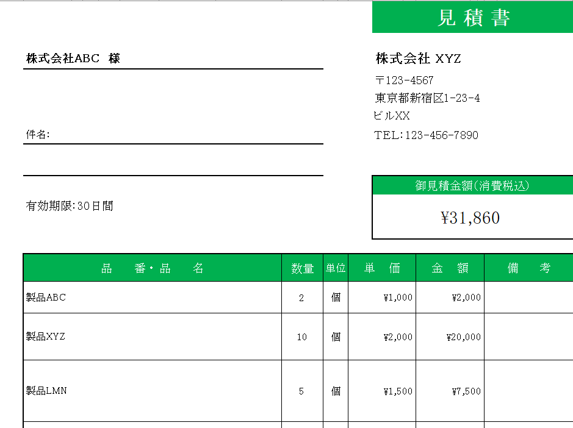
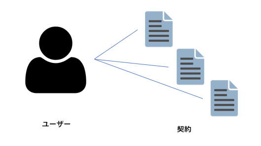
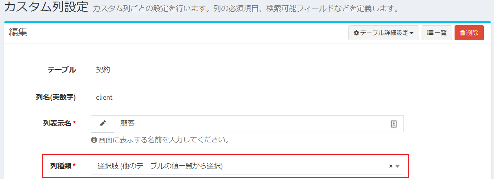
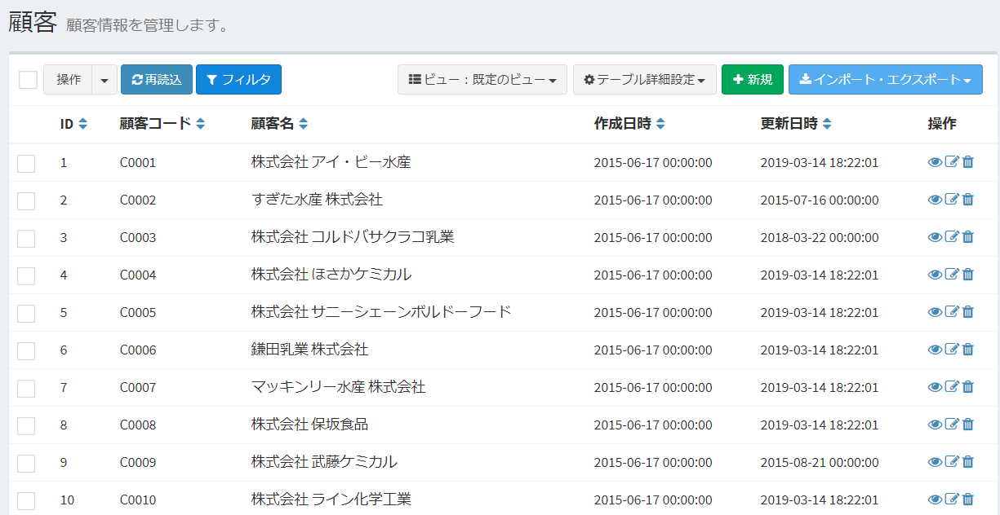
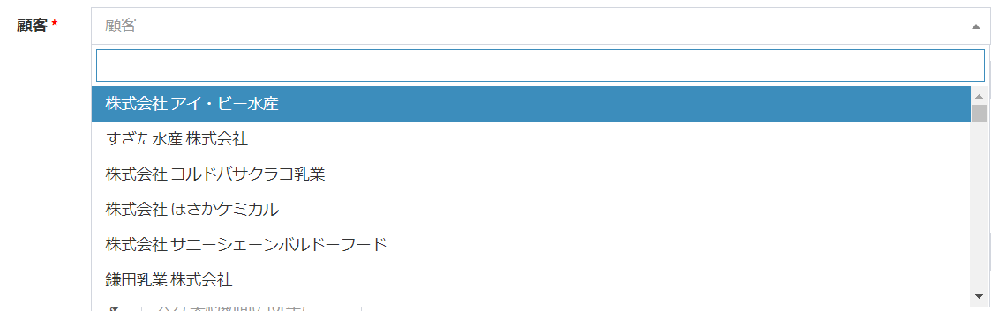
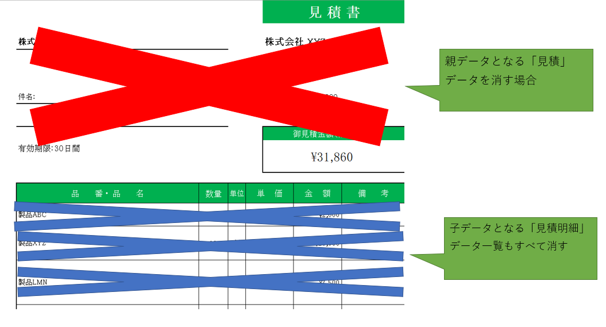
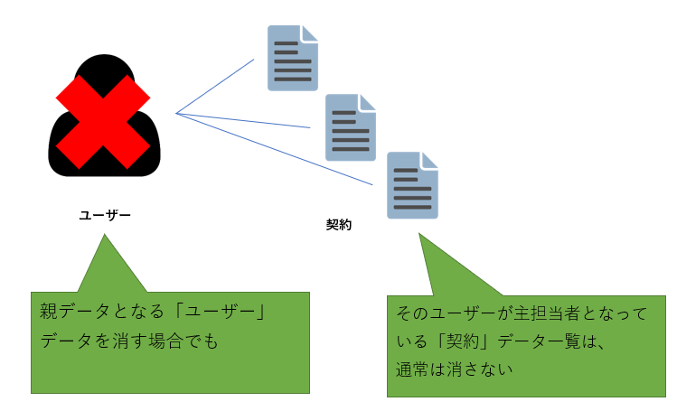

# Relation settings
Tables and tables can have data relevance.  
Example:  
- Quotation and its quotation detail information.
- Company organization and users who belong to that organization.

This section describes how to set the relevance of those tables.

## Concept of relation in Exment
Exment's concept of associations between tables is a bit complicated.  
You must understand the two types of "1. Relation type" and "2. Setting method".  
Please read the following before setting on the Exment screen.

### 1. Relationship types
In general, there are two types of relationships between data:  
##### One-to-many: Multiple data of child table are linked as data to one parent table data  
※Example  
- Quotations and their quote lines  
In the "Estimate" table, "Estimation date", "Customer information" and "Subject" are registered, and in "Estimation details", information on the product name, quantity and price to be quoted are registered as details.

- Contracts and their primary contact  
Users can be the primary contact for multiple contracts, so there is a one-to-many relationship between users and contracts.

##### Many-to-many: child table is a table (child table) that has multiple items of data linked to data of one table (parent table)  
Example: An organization and a user belonging to that organization A user may belong to multiple organizations (concurrent post, etc.), resulting in a many-to-many relationship.  

First, you need to consider which of the above patterns is the data you want to associate this time.  

### 2. “(1) Related table settings” and “(2) Custom column choices (select from a list of values ​​in other tables)”  
There are two types of data associations in Exment: "(1) Related table" and "(2) Choice (select from a list of values ​​in another table)."  
I will explain each setting method.

##### (1) Related table setting
This is the method introduced on this page.  
From the "Custom Table" page, click the "Relation Setting" button and register by operating.

##### (2) Custom column choices (select from a list of values ​​in another table)
It is a method to set in the [custom column](Related-table-screen/column) screen.  
As one of the column types that can be set in the custom column, you can have a column called “Choice (select from a list of values ​​in another table)”.  

By making this setting, you can select values ​​from other tables on the [data form screen](Related-table-screen/data_form).  
Example (customer is test data):  

### Determining the relation setting method
Setting up these relations is a very annoying and confusing question about where to do it.  
Consider using the following criteria to determine the relationship settings.

#### 1. When the relation type is "one-to-many"
In this case, use the following two criteria.  

1. **Parent data and child data are always a set, and whether they are confidential**  
For example, in the case of the "Estimate" table and the "Estimate details" table, the data of the estimate details always has the estimate data and is a set.  
In such a case, set the relation in "(1) Relation setting".  
On the other hand, the "Quote" table and the "Principal Contact" of the quote are related as a data reference, but the Quote and the Primary Contact are not always a set.  
In such a case, set the association in “(2) Custom column choices (select from a list of values in another table)”.  

2. **When deleting parent data, is it always correct to delete child data?**  
For example, in the case of the "Estimate" table and "Estimation details" table, when deleting the parent "Estimation" data, the child "Estimation details" It is normal to delete all data.  
In such a case, set the relation in "(1) Relation setting".  

On the other hand, in the case of the "quote" table and the "leader" of the quote, even if the data of "leader" is deleted, all the "quote" data that is the lead person is deleted. There is a problem.  
In such a case, set the association in “(2) Custom column choices (select from a list of values ​​in other tables)”.  

#### 1. When the relation type is "many to many"
In this case, basically make the settings in "(1) Relation settings".  
"(2) Custom column choices (select from a list of values ​​in other tables)" can be supported by "allowing multiple selections", but there are issues such as weak data search.  
Therefore, basically make the settings in "(1) Relation settings".  

These steps determine the strategy for setting up table associations.  
The following is an explanation of the procedure for performing "(1) Related table setting".  

## How to operate relation settings

### Page display
- On the custom table screen, check one for the table you want to change, and click "Related Table Setting" of "Page Move".

- This displays a list of related tables of the checked custom table.  

### Add new
- On the "Related Table Settings" screen, click the "New" button at the top right of the page.

- Select the child table to associate and the type of the relation, and click "Send".
  

### Edit
To edit a column, click the "Edit" link in the corresponding row.
  

### Delete
To delete a column, click the "Delete" link in the corresponding row.
  
