# Role group / Authority setting
> This function is a function used from v2.0.0 instead of "role / authority setting" in v1.X.

Exment uses a management method called "role group" to control the authority to operate the system.  
This is an important concept in Exment so that specific data or pages can be managed only by designated users.  

If you add a new user and the user logs in, the logged-in user cannot use most functions.  
The system administrator must assign role groups to newly added users appropriately.  

## Image of role group
You can control what each user wants to do depending on the department or job title of the user who uses Exment.  
For example, the following departments and positions can properly assign authority.  
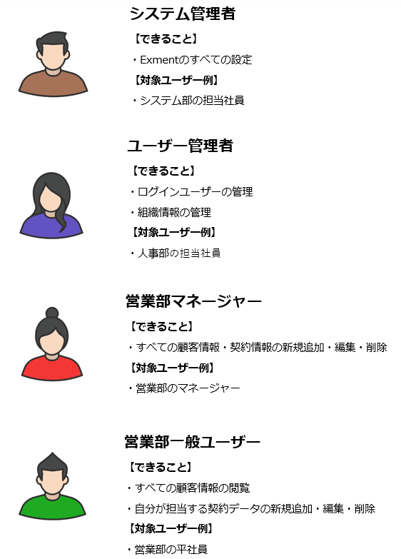

## List of initial role groups
A description of the role group, initially set during installation.

### All data manager group
This is a role group registered by the user that can edit and view data in all tables.

### User / organization management group
This is a role group that manages user / organization information and login user settings.  
You can also change users / organizations that belong to role groups.  

### Announcement information management group
This is a role group that can create, edit, and delete data in the "Information Information" that is initially installed in Exment.

### General group
A group to be registered by other users.  
※ In the case of the initial installation, no special permissions are set.

## Role group data structure
The role group has the following data structure.

### (1) Authority setting
Authority (permission) determines whether or not to perform a specific action in Exment.  
For example, you have the following permissions:
- Management of login users: Authority to grant login authority to each user and reset password.
- Edit all data: Permission to add, edit, and delete all data on a specific table.
- Viewing contact data: The permission settings that allow you to view the data for which you are the contact are linked to the role group.

### (2) Users and organizations
Set the user / organization that belongs to the role group.  
When the user who made this setting logs in, he can execute the operation of the set authority.

## Setting method

### Overall flow of settings
1. Perform the initial settings of the role group, such as setting the role group name.
1. Set the permissions that can be implemented in that role group.
1. Set the user / organization belonging to the role group.

※ Make system administrator settings on the <a href="https://exment.net/docs/#/system_setting">system setting page .</a>

### List
Click "Role group" in the menu.  
A list screen of the created role group settings is displayed.  

### Create new role group
How to create a new role group.

- Click the "New" button at the top right of the list screen.  
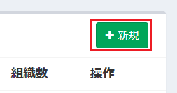

- The new role group creation screen is displayed. Enter the necessary information and click "Submit".  
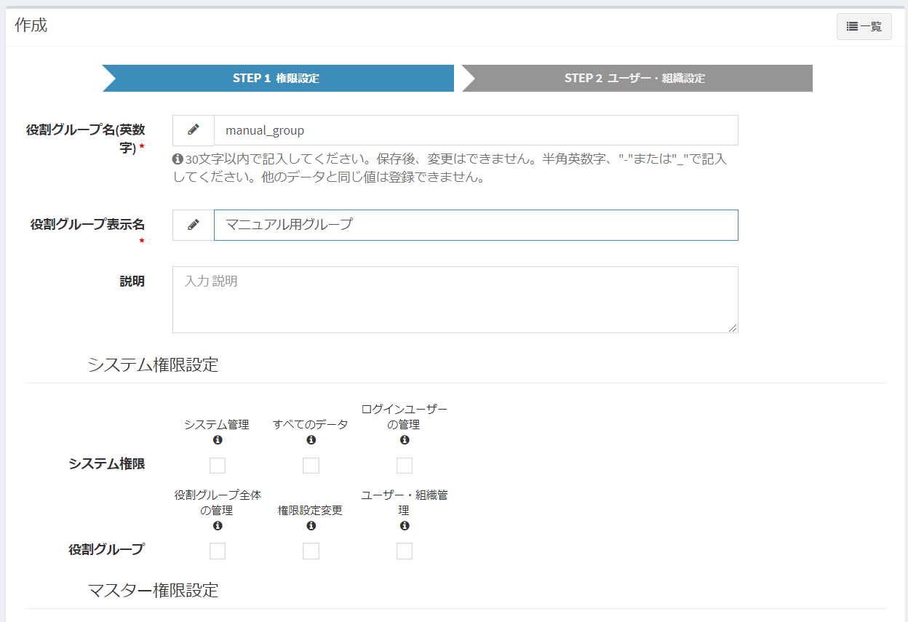

- After saving, the list screen is displayed again and the created role is created.  
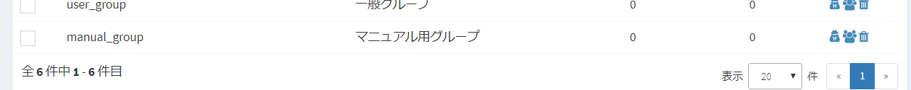

### How to change permission settings
How to change permission settings.

- On the role group list screen, click the row of the created role group.  
Alternatively, click on the permissions link.  
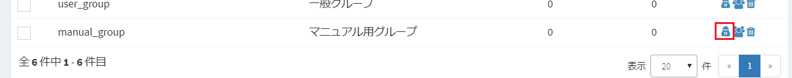

- The permission setting screen will be displayed. Set the permissions.  

### Type and list of permissions
Describes the types of permissions that can be set.  

#### System permissions
Authority that can determine the operation of the entire Exment.  

##### Authority list
- **All Data** : Role that can add, edit, and delete all data in all custom tables.  
- **Managing login users** : You can manage the users who log in to Exment. You can grant login authority and reset passwords.

#### Table permissions
Exment allows you to create tables to manage your data.  
Authority can be assigned for each table.  
For example, there are the following usage methods.  
- The user of the sales department can edit and browse all data in the table “sales activities”.
- The user of the technical department can edit and browse all data in the table “technical management”.
- Users of partner companies can view only the data for which they have authority in the table "Order Request".
  
##### Authority list
- **Table management** : You can modify the table definition and form for the specified custom table.  
In addition, it is the authority that can add, edit, and delete all data in the specified custom table.
- **Form** : You can add / edit / delete public form settings for the specified custom table.
- **Public Form Management** : You can add / edit / delete public form settings for the specified custom table.  
※ Displayed only when "Use public form" is set to YES in the system settings.  
※ The form itself cannot be added / edited / deleted.  
- **View** : Allows you to manage system views for specified custom tables.
- **Edit All Data** : Permission to add, edit, and delete all data in the specified custom table.
- **View All Data** : Permission to view all data in the specified custom table.
※ Data cannot be edited or deleted.
- **Edit responsible data** : This is the right to add, edit, and delete data in the specified custom table for which the logged-in user is the responsible person.
- **View assigned data** : This is the right to view the data set by the logged-in user as the assignee in the specified custom table.
※ Data cannot be edited or deleted.
- **Data sharing** : Permissions that allow you to share data that you have permission to edit with other users and organizations.
- **Data import**  
Permission to import data from a csv or Excel file into a specified custom table.  
- **Data export**  
Permission to export the data of the specified custom table to a file in csv format or Excel format.  
- **Show Trashed Data**  
Permission to redisplay the logically deleted data. ※ To restore data, you need edit permission for the data.  

### User / organization setting method
How to change the settings of users and organizations that belong to role groups.

- On the list screen, click the user link.  
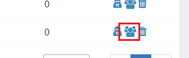  

Or, click the "User / Organization Settings" button at the top right of the permission setting screen.  
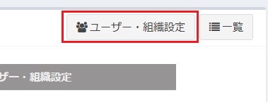  

- The user / organization setting screen is displayed. Register users and organizations that belong to this role group.  
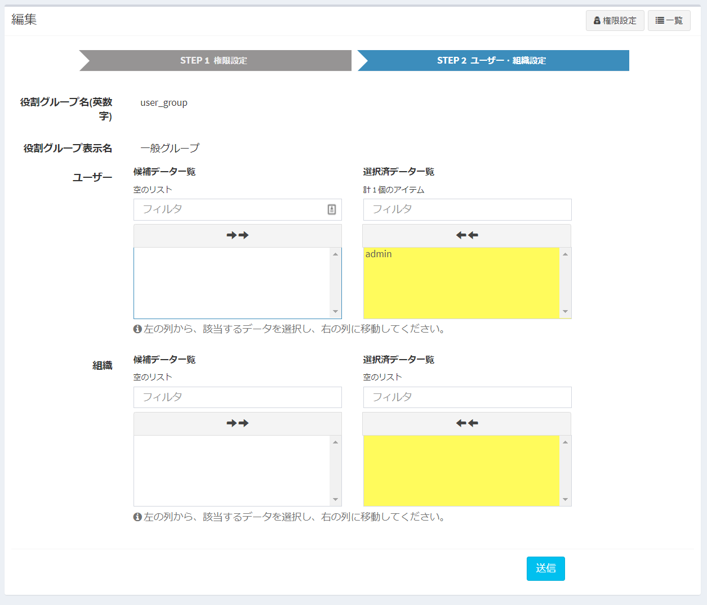

### Delete
- On the role group list screen, click the "Delete" link.  
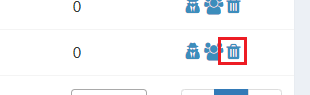

## Changes when setting permissions
When the authority is set, the display changes as follows.  

##### ■ Fewer items displayed in menu
→ This is because menus without authorization are not displayed.  

##### ■ Access error
→ If you try to display an unauthorized page by directly entering the URL, an access error will occur.  
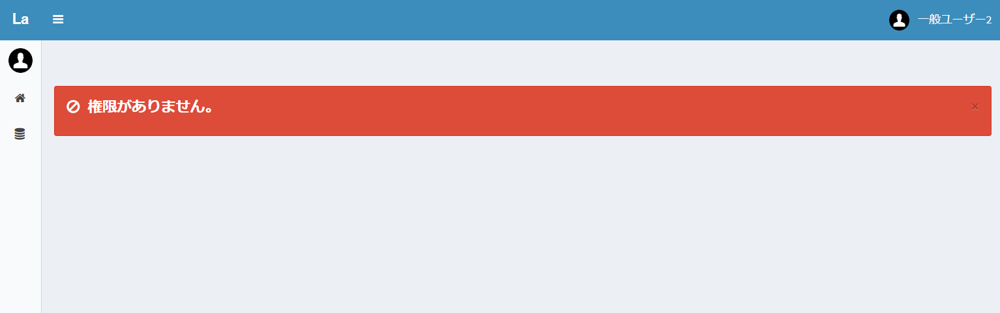

##### ■ Items are not displayed in the data form options
→ If "Choices (select from a list of values ​​in another table)" is selected in the custom column settings, and the appropriate authority has not been assigned to the referenced table, the option items will not be displayed You.  
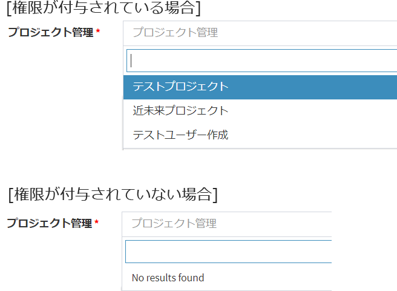
