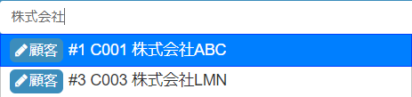
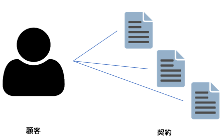
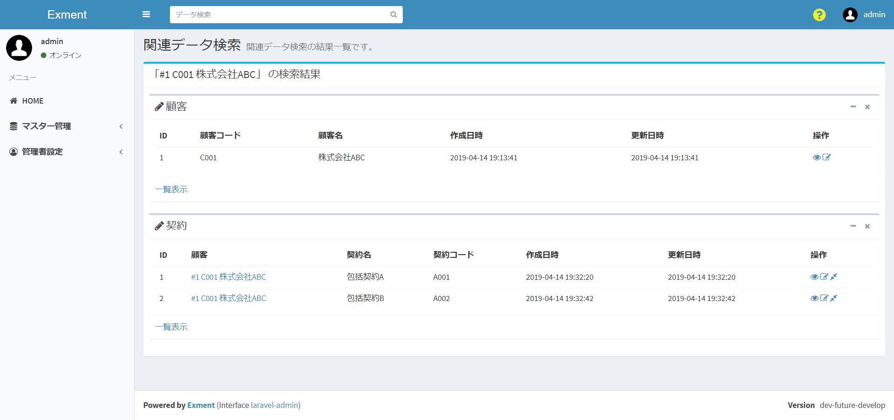

# Search
At the top of each page is a search bar.  
  
By entering words in this search bar, you can search for data registered in Exment.  
Search has two functions.  

## Word search
This is a normal search. The data that contains the word you entered (matches first) is displayed in the results.  

  
- The table to be searched is a table for which "Search" is set to YES in the custom table settings.
- The custom column to be searched is the column for which "Search index" is set to YES in the custom column settings.  
※ If there is no custom column with "Search index" set to YES, the table will not be displayed in the search results.  
- You can search only those tables that you have permission to view.
- **From v1.2.0, the default setting has been changed to match the beginning.** This is due to search performance.  
If you want to change to partial match, see "(Supplement) Switching data search to partial match" below.

Enter a word in the search bar and click the search button to execute the search.  
The list of tables to be searched is displayed first, and then search for matching data.  

In the search result data, the icons "View", "Edit", and "Search related data" are displayed.  

    
If you click the related data search icon, the following "related data search" will be executed.

## Related data search
Related data search is executed in the following patterns.

- When you enter a word in the search bar and select a suggestion.  
  

- When performing a word search and selecting the "Related Data Search" icon displayed in the results.  
  

Related data search is a function to search for data linked to that data.  
For example, if you have a "customer" table, you may want to display a list of "contract" data associated with that customer.  
  
In that case, by performing this "related data search", you can display a list of contract data associated with the customer.  

In the related data search, the data linked with the following conditions can be displayed in a list.  
- Data that selects the data selected in the search target in the "options" of the custom column (however, "search index" must be YES in the custom column settings).  

- Data in which the data selected as the search target is registered as the parent as 1: n or n: n in the relation settings.  
  
In the related data search, the selected data itself and related data of the above conditions are displayed in a list.  
In the example below, the data of the selected customer "ABC Corporation" and the contracts related to that customer are displayed in a list.  
  

## (Supplement) Switch data search to partial match
> From v2.1.7, the setting has been changed from the screen.  

From v1.2.0, word search of data was changed from partial match to prefix match.  
This is to improve search performance. We've found that broad match doesn't perform well for search performance.  

However, you can switch the search method to broad match.  
To change to a partial match, change the "Data search method" to a partial match from the menu "Admin Settings> System Settings".  

This setting allows the search to be a partial match.  
※ This setting may reduce search performance. Please note.