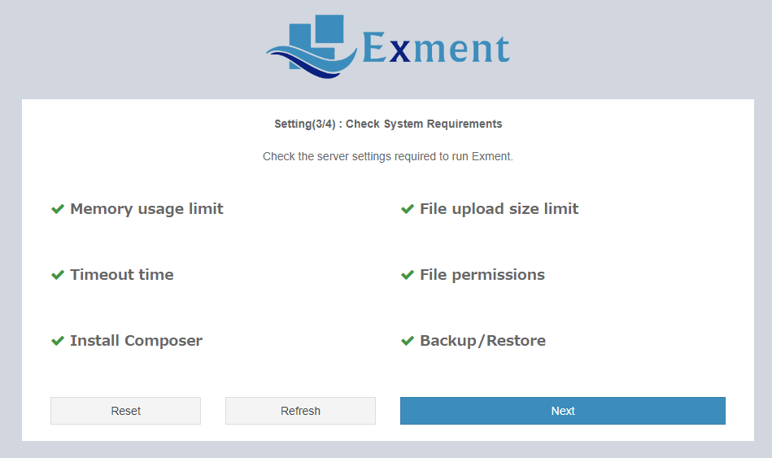
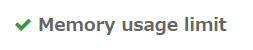
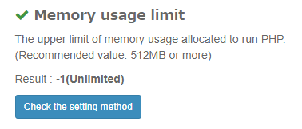
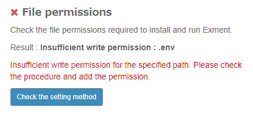

# Server settings
- To use Exment, first you need to set up the web server and database.
Follow the procedure below to make the settings depending on your environment.

- <span class="red bold">* Currently, we are very sorry, but we are not accepting individual inquiries regarding the installation procedure or server construction. If you would like individual support, please request paid support.</span>

- In addition, we do not currently have manuals for environments other than the following. Please note.

## Web server
This is the procedure for building a web server. Follow one of the steps below to build a web server.  
※XAMPP is recommended when building an environment with PHP, Apache, and MySQL from the beginning as a development environment.

- [XAMPP construction (development / verification environment) Windows](/install_xampp)  
→ First of all, if you want to install Extension on your personal computer (Windows version)

- [XAMPP construction (development / verification environment) Mac](/install_xampp_mac)  
→ First of all, if you want to install Extension on your PC (Mac version)

- [Rental server construction](/install_rental)  
→ If you want to publish the Exment and easily access it from other members or smartphones

- [Build on Linux](/install_centos_stream)  
→ Procedure for installing Extension on Linux (CentOS Stream)
 ※For those who built it on CentOS 8, please refer to [here](/install_linux)

- [Build on IIS](/install_iis)  
→ Procedure when building Exment on IIS

- [Build on AWS](/install_aws)  
→ Procedure when building Exment on AWS

- [Build with Docker](/install_docker)  
→ Procedure when building Exment with Docker

### File permission settings

Of the Exment project folders, the following folders and files require write permission for the user running the web server (apache, www-data, etc.).  

| type | File / folder name | Required functions |
| ---- | ---- | ---- |
| folder | storage | Full function |
| folder | bootstrap/cache | Full function |
| file | .env | Easy installation and restore |
| folder | config | Easy installation and restore |
| folder | app | Easy installation |
| folder | public | Easy installation |

<span class="small">* Easy installation authority is required only at the time of installation. If you want to set the permission more strictly, delete the write permission of the folder after executing the simple installation.</span>


## Introduced composer
Exment requires composer to be installed on the web server. composer is used to install the packages required for Exment and to update Exment.  
Please refer to the following URL for the installation method.  
- [Official site](https://getcomposer.org/download/)
- [Windows version commentary site](https://weblabo.oscasierra.net/php-composer-windows-install/)
- [Linux version commentary site](https://weblabo.oscasierra.net/php-composer-centos-install/)
- [Mac version commentary site](https://weblabo.oscasierra.net/php-composer-macos-homebrew-install/)


## Database
Exment's database engine requires one of the following:

- MySQL 5.7.8 or higher and less than 8.0.0
- MariaDB 10.2.7 and above
- SQL Server 13.0.0 or higher (Currently, automatic backup / restore is not supported)

### Database environment construction
- If you have not set up the database server yet, please build the database server.
Please check the link below for the construction method.  
\* Not required if already installed.

     - [MySQL](/install_mysql)
     - [SQL Server](/install_sqlserver)

### Create database

- Create a database for Exment with each database engine.

## Operating environment
### server
- PHP 8.0-8.1 (Since Exment 5.0.0, the PHP version has changed to 8.0-8.1)
- Laravel 9.X (Laravel version changed to 9.X from Exment 5.0.0)
- Database: One of the following
    - MySQL 5.7.8 or higher, less than 8.0.0
    - MariaDB 10.2.7 and above
    - SQL Server 13.0.0 or higher

### Operation check browser
- Google Chrome
- Microsoft Edge

### Recommended settings
- Maximum PHP memory allowance: 512MB
- Maximum file upload: 10MB
- Timeout time: 180 seconds

## Check system requirements
You can check system requirements and server settings from the screen or commands.

  


### Confirmation method
You can check the system requirements, etc. by the following methods.

- Installation page for [easy installation](/quickstart_easy)
- After installation, [system setting page](/system_setting)
- command. Details below

### Confirmation item details

#### Memory usage limit
The upper limit of memory usage allocated to run PHP.  
Please check [here](/additional_php_ini) for how to change the settings.

#### File upload size limit
The maximum file size for uploading files. The size you need depends on the requirements of the files you want to manage.  
Please check [here](/additional_php_ini) for how to change the settings.

#### Timeout time
The number of seconds to wait for processing and time out. If this time is short, it may exceed this time for time-consuming processes such as backup and import.   
Please check [here](/additional_php_ini) for how to change the settings.

#### File permissions
Check the file permissions required to run Exment.  
Please check [here](#file-permissions) for more information.


#### Composer installation
Check if the Composer used to update the Exment is installed on your web server.  
In addition, the "Update from screen" function added from v4.1.0 requires that this composer be installed normally.  
\* A warning may be displayed even though composer is actually installed. This is because the composer path is not passed by the user who runs the web server, or the authority is insufficient.  
If composer is successfully installed and can be run by the user who actually performs the update, ignore this warning.  
\* In order to pass through the composer, please verify [here](/troubleshooting#To-pass-the-composer-path) "To pass the composer path".


#### Backup / Restore
Confirm that the server settings for executing backup / restore are complete.   
\* If you made an error, please check [here](/troubleshooting) the "fail to backup and restore".  
\* If you are using SQL Server, you will always be warned. Manual backup or restore is required. Please check [here](/backup_sqlserver) for the procedure.  


### Result display
#### Normal
It is displayed with a green check.

  

Click the row to see the details.

  

#### Warning
A yellow warning mark is displayed. The setting method is recommended, or some points need to be noted in operation.

  

#### Error
A red cross mark is displayed. It is necessary to change the settings.

  


### Execute from command

You can also check the system requirements from the following command.

```
php artisan exment:checkrequire
```

[←Installation-Return to Overview](/quickstart)
