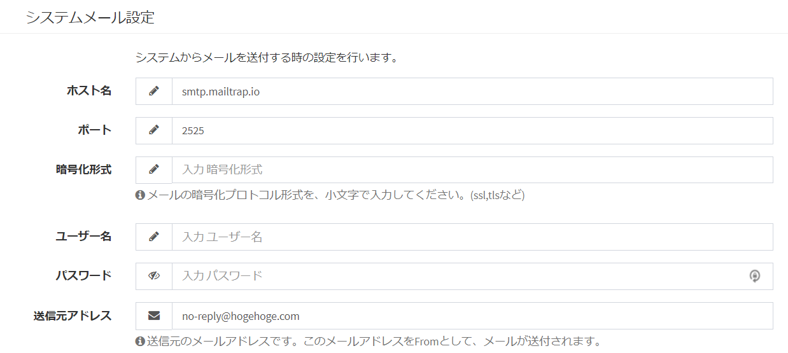
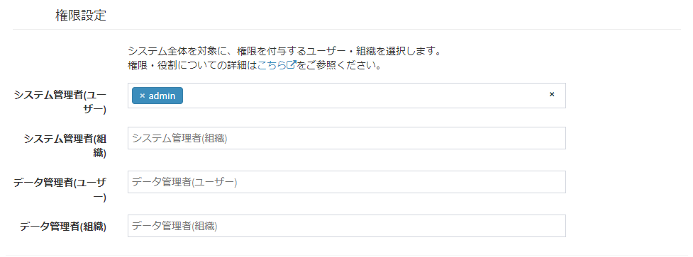

# System setting
Make settings for the entire Exment system, such as basic site information and granting permissions.

## Settings screen
Click "System Settings" in the menu.  
The system setting screen appears.  

  

## Site basic information
When managing information with Exment, set the basic information as a site.  

- As for the menu layout of Exment, there are two types of display formats, "standard" and "small icon".  
Please refer to the following image for the difference of display.
- Regarding the menu layout, the default display format is set in the [site menu layout](#site-menu-layout), but you can switch each time by clicking the red frame part of the image.

standard
  

Small icon
  

#### Site name ※ required
- The site name to be displayed at the top left of the page when the menu layout is standard.  
- The default value is "Exment". 

#### Site name (omitted) ※ Required
- The site name to be displayed on the upper left when the menu layout is a small icon.  
- The default value is "Exm".

#### Site logo
- The logo of the site displayed on the top left of the page when the menu layout is standard.
- Click the "Browse" button and select the image you want to use.
- Recommended size: 200px * 40px

※ When the site logo is set, the site logo is displayed instead of the site name in the upper left corner when the menu layout is standard.

#### Site logo (small)
- The logo of the site displayed at the top left of the page when the menu layout is a small icon.
- Click the "Browse" button and select the image you want to use.
- Recommended size: 40px * 40px

※ When the site logo (small) is set, when the menu layout is a small icon, the site logo (small) is displayed instead of the site name in the corresponding location on the upper left.

#### Site favicon (ico)
- It is an icon image used when browsing the site or bookmarking, as shown in the image below.
- Click the "Browse" button and select the image you want to use.
- Recommended size: 16px * 16px

  

#### Site skin
- It is the setting of the theme color of the site. Select the header and sidebar colors from the following combinations.
- Header (default is blue): blue / yellow / green / purple / red / white
- Sidebar (default is white): black / white

※ If you reload the web page after saving the settings, the settings will be reflected and displayed.

#### Site menu layout
- Select either "Standard" or "Small Icon" layout as the site menu.  
Please refer to the image at the top for each layout example.  

- The default value is "Standard".  

※ If you reload the web page after saving the settings, the settings will be reflected and displayed.

#### Number of displayed data list  
- This is the default number of data displayed on the data list page.  
Select "10", "20", "30", "50" or "100".  
- The default value is “20”.  

#### Number of search / dashboard displayed
- This is the default number of data displayed when performing [Keyword Search](/search.md?id=word-search) or in [Dashboard Data List](/dashboard.md?id=Data-List).  
Select "5", "10" or "20".
- The default value is "5".

#### Date and time display format
- The date display format can be set from three types.

#### Perform server external communication
- If the setting is YES, you can execute processing for external server communication (data reception only), such as notification of the latest version of Exment.
- The default value is "YES".

#### Use permission management
- If the setting is YES, you can set the [authority for the entire system](#authority-for-the-entire-system) and the [authority for each custom table](/table.md?id=authority).
- If this setting is YES, the specified privilege can be granted to the user.
- The default value is "YES".

#### Use organization management
- If the setting is YES, it is possible to grant authority specifying the organization when [using authority management](#using-authority-management).
- The default value is "YES".

#### System mail sender ※ required
- This is the e-mail address from which the e-mail will be sent when the e-mail is sent by the system set in Exment.  
The e-mail is sent with the specified e-mail address as From.

#### Upload size limit
- This is the upper limit of the file size that can be uploaded to Exment.
- To change the maximum file size, see [Changing the maximum file upload size](/quickstart_more.md?id=Changing-the-maximum-file-upload-size).

## System mail settings
Configure settings for sending e-mail from the system.  
When setting from the screen, enter the setting value by SMTP.  

  

※ Example of SMTP setting (for Xserver): Click [here](https://www.xserver.ne.jp/manual/man_mail_setting.php)  

※ Example of SMTP setting (for Sakura Internet): [Click here](https://help.sakura.ad.jp/hc/articles/206054132--%E3%83%A9%E3%82%A4%E3%83%88-%E3%82%B9%E3%82%BF%E3%83%B3%E3%83%80%E3%83%BC%E3%83%89-%E3%83%97%E3%83%AC%E3%83%9F%E3%82%A2%E3%83%A0-%E3%83%A1%E3%83%BC%E3%83%AB%E3%83%9C%E3%83%83%E3%82%AF%E3%82%B9-%E3%83%A1%E3%83%BC%E3%83%AB%E3%82%BD%E3%83%95%E3%83%88%E3%81%AE%E4%B8%80%E8%88%AC%E7%9A%84%E3%81%AA%E8%A8%AD%E5%AE%9A%E6%96%B9%E6%B3%95)  

#### Note
- When outgoing e-mail is spam, it often results in inadequate settings for the domain's "SPF record".  
Please register SPF record in domain setting.  
[Reference1](https://sendgrid.kke.co.jp/blog/?p=3509)  
[Reference2](https://salt.iajapan.org/wpmu/anti_spam/admin/operation/information/spf_i01/)  
SPF record settings are not supported by our company. Please note.  

#### Caution (for those who are familiar with the system)

- Originally, Laravel uses the setting value of the ".env" file as a parameter for sending mail, but from v1.3.6, the setting value of the .env file is not used, and the value registered in the "system setting" of the screen Is now used.
- However, in some cases, you may want to continue configuring the ".env" file. Especially with Laravel, you can send emails by sending methods other than SMTP.
- In that case, please write "EXMENT_MAIL_SETTING_ENV_FORCE = true" in the ".env" file. You will continue to use the settings entered in the ".env" file.

## Password policy
Set rules related to login password.  

  

#### Complex password
- If the setting is YES, it is necessary to set a password of at least 12 characters including three or more types of characters (uppercase alphabet, lowercase alphabet, lowercase numeral, singlebyte symbol).
- The default value is "NO".

#### Effective days
- If you log in for the first time after the specified number of days, you will be guided to the password change screen. After changing the password, perform the login process again.
- If the number of valid days is set to "0", the password will not expire.
- The default value is "0".

#### Number of password histories
- Restrict reuse of recently used passwords. An error will occur if the new password is the same as the password between the latest and the number of history records.
- If the number of history records is set to "0", it will not be compared.
- The default value is "0".

#### Note

- To display this setting, you need to add "EXMENT_PASSWORD_POLICY = true" to the ".env" file.
- "Complex password" and "Number of password histories" are applied when the user sets his / her own password on the user setting screen or password reset screen. Not applicable if set by the system administrator.

## Authority setting
If ["Use permission management"](#Use-permission-management) is set to "YES", set permissions for the entire system. Please refer to [Roles/Privileges](/permission.md) for more information on Exment permissions.  

  

#### System Administrator
- If you log in with the set user / organization, you can operate the entire system in Exment.
- The user who set the ID and password during the initial setup of Exment is set as the system administrator.
- Multiple users and organizations can be set.

#### Data controller
- When you log in with the set user / organization, you can add / edit / delete all data of all custom tables managed by Exment.
- Multiple users and organizations can be set.