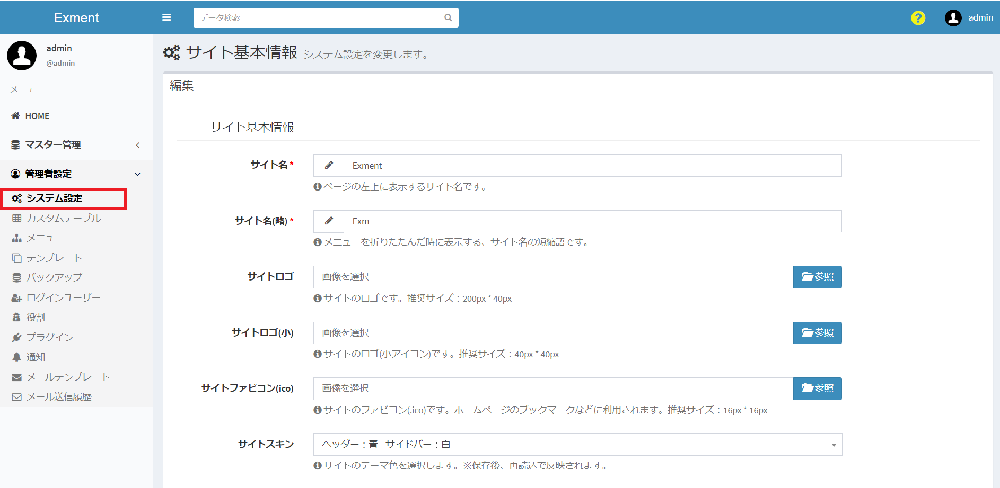
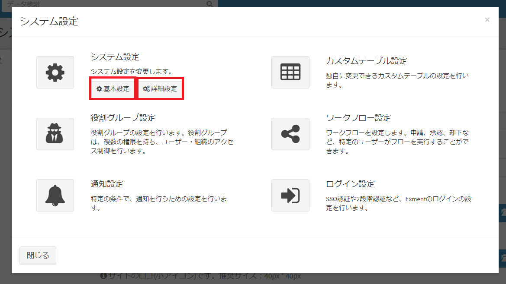
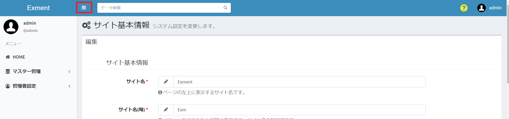
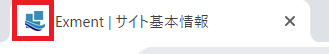
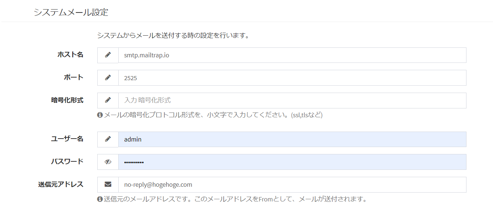
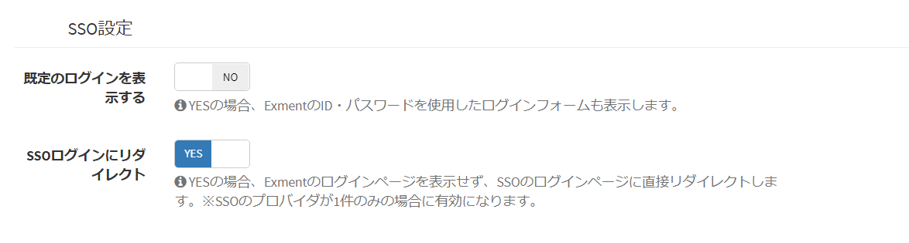

# System setting
Make settings for the entire Exment system, such as basic site information and granting permissions.

## Setting screen
Click "System Settings" in the menu.  
The system settings screen is displayed.  
The system settings are divided into [Basic settings] and [Detailed] settings".  
After clicking the button on the upper right, you can switch by selecting from the dialog.  




## Site basic information
When managing information with Exment, set the basic information as a site.  

- There are two types of display formats for Exment's menu layout: "standard" and "small icon".  
Please refer to the image below for the difference in display.  
- Regarding the menu layout, the default display format is set in [Site Menu Layout](#Site-Menu-Layout), but you can switch each time by clicking the red frame part of the image.  

standard


Small icon


#### Site name ※Required
- The site name displayed at the top left of the page when the menu layout is standard.
- The initial value is "Exment".

#### Site name (omitted) ※Required
- The site name displayed in the upper left when the menu layout is a small icon.
- The initial value is "Exm".

#### Site logo
- This is the site logo that is displayed at the top left of the page when the menu layout is standard.
- Click the [Browse] button and select the image you want to use.
- Recommended size: 200px * 40px

※If you set the site logo, when the menu layout is standard, the site logo will be displayed in the upper left corner instead of the site name.

#### Site logo (small)
- This is the site logo displayed at the top left of the page when the menu layout is a small icon.
- Click the [Browse] button and select the image you want to use.
- Recommended size: 40px * 40px

※If the site logo (small) is set, when the menu layout is a small icon, the site logo (small) will be displayed instead of the site name in the corresponding part on the upper left.

#### Site favicon (ico)
- As shown in the image below, it is an icon image used when browsing the site or bookmarking.
- Click the [Browse] button and select the image you want to use.
- Recommended size: 16px * 16px



#### Site skin
- Site theme color settings.  
Choose a header and sidebar color from the following combinations.
- Header (default setting is blue): Blue / Yellow / Green / Purple / Red / White
- Sidebar (default setting is white): Black / White

※If you reload the WEB page after saving the settings, the settings will be reflected and displayed.


#### Site menu layout
- Select either the "Standard" or "Small Icon" layout as the site menu.
Please refer to the image above for each layout example.
- The initial value is "Standard".

※If you reload the WEB page after saving the settings, the settings will be reflected and displayed.

#### Use API 
- You can use the API by setting it to "YES".  
Note: Before setting this to YES, you will need to create a Laravel key with the command below.

````bash
$ php artisan passport:keys
````
- The default value is "NO". 

#### Communicate outside the server
- If the setting is YES, you can execute processing that performs external server communication (data reception only), such as notification of the latest version of Exment.
- The initial value is "YES".

#### Use privilege management
- If the setting is YES, you can set [Permissions for the entire system] (#Permission settings) and [Permissions for each custom table](/table.md?id=Permission).
- If this setting is YES, it is possible to grant the specified authority to the user.
- The initial value is "YES".

#### Use organizational management
- If the setting is YES, it is possible to grant the authority specified by the organization in [Use authority management](#Use-authority-management).
- The initial value is "YES".

#### System Administrator
- You can set the user who will be the system monitor.
- The user who made the initial settings when installing Exment is registered as the initial value.

#### Number of data list displayed
- The default number of data displayed on the data list page.  
  Select one of "10", "20", "30", "50", and "100".
- The initial value is "20".

#### Number of search / dashboard displays
- Default number of data displayed when [Keyword search](/search.md?id=word-search) is performed or [Dashboard data list](/dashboard.md?id=datalist) is.
Select one of "5", "10", and "20".
- The initial value is "5".

#### Date and time display format
- You can set the date display format from 3 types.

#### Data search method
- Set the search method of registered data to either "starting match" or "partial matching".
- The initial value is "prefix match".

#### Hide filter in data list
- Checked items are hidden by the filter on the data list screen.

#### Maximum upload size
- The maximum file size that can be uploaded to Exment.
- To change the upper limit of file size, refer to [Change upper limit of file upload size](/quickstart_more.md?id=Change-upper-limit-of-file-upload-size).

## Organization settings
Set whether to include the organization in the range of each setting.


#### Organizational hierarchy setting (role group)
- When you set the organization in "User / Organization Settings" of the role group, set the range to include the organization of the parent-child hierarchy.
- The initial value is set to "Include parent-child hierarchy of affiliated organization".

#### Organizational hierarchy setting (data)
- When you set the organization in the sharing setting of each custom data, set the range to include the organization of the parent-child hierarchy.
- The initial value is set in "Organization hierarchy setting (data)".

#### Custom data sharing settings
- When a user creates new data, set whether the target range to be automatically shared is only the user or the organization to which the user belongs.
- The initial value is "Login user only".

## System mail settings
Make settings for sending emails from the system.  
When setting from the screen, enter the setting value by SMTP.  
Please check [here](/mailsend_setting) for details.  



#### Note
- If the sent mail becomes junk mail, it is often due to the setting of "SPF record" of the domain. Register your SPF record in your domain settings.  

[Reference 1](https://sendgrid.kke.co.jp/blog/?p=3509)  
[Reference 2](https://salt.iajapan.org/wpmu/anti_spam/admin/operation/information/spf_i01/)  

Please note that SPF record settings are not supported by us. Please note.

#### Attention (for those who are familiar with the system)

- <span class = "small"> Originally, in Laravel, the setting value of ".env" file is used as a parameter of mail transmission, but from v1.3.6, the setting value of .env file is not used and the screen The value registered in "System Settings" of is now used. </span>
- <span class = "small"> However, in some cases you may want to continue setting the ".env" file. Especially with Laravel, you can also send emails using a sending method other than SMTP. </span>
- <span class = "small"> In that case, enter "EXMENT_MAIL_SETTING_ENV_FORCE = true" in the ".env" file. You will continue to use the settings you entered in the ".env" file. </span>


## Password policy
Set rules related to login passwords.


#### Complex password
- If the setting is YES, you need to set a password of 12 characters or more including 3 or more character types (half-width uppercase letters, half-width lowercase letters, half-width numbers, half-width symbols).
- The initial value is "NO".

#### Effective days
- If you log in for the first time after the specified number of days, you will be directed to the password change screen.  
Please change your password and then log in again.  
- If you set the number of valid days to "0", the password will never expire.  
- The initial value is "0".

#### Number of password history records
- Restrict the reuse of recently used passwords.  
If the new password is compared with the password for the latest to the number of history records and they are the same, an error will occur.
- If the number of history records is set to "0", it will not be compared.
- The initial value is "0".

#### Note

- <span class = "small"> To display this setting field, you need to add "EXMENT_PASSWORD_POLICY = true" to the ".env" file.</span>
- <span class = "small"> "Complex password" and "Password history" are applied when the user sets the password by himself / herself on the user setting screen or password reset screen. Not applicable if set by the system administrator. </span>

## IP filter settings
Set the IP address that allows communication in the fixed IP (example: 12.3.5.6) and the range specification format (example: 123.4.5.0/24).
If not set, allow all IP addresses.
For details, see [here](/additional_ip_filter.md).

## SSO settings
Set rules related to SSO (single sign-on).



#### Show default login
- If set to NO, the default login form using ID and password will not be displayed on the Exment login page.

#### Redirect to SSO login
- If set to YES, the Exment login page will not be displayed and you will be redirected directly to the SSO login page.
※This setting is invalid when multiple providers with SSO are registered.