# Custom table settings
Exment uses "custom tables" to manage information.  
Make the necessary settings such as the functions and permissions allowed for the registered data.  

## List
Click "Custom Table" in the menu.  
The list screen of the created custom table settings is displayed.  

※ "Basic information" "User" "Organization" "Email template" "Email sending history" "Notice".  
These tables are initially set when Exment is installed.  
In addition, tables that are imported as templates are also displayed on the list screen.  

## Create New

- Click the "New" button at the top right of the list screen.  
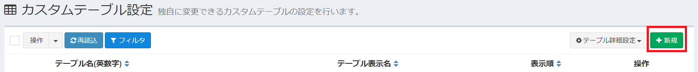  
  
- The table creation screen will be displayed. Enter the necessary items.  

## Details of setting items

#### Table name (alphanumeric) ※ required
- Represents the name of the table. (Example: user, information, estimate)
- The set alphanumeric characters are used in the URL when the table is opened. (Example: http(s)://(Exment URL)/admin/ data / user)
- Only alphanumeric characters and symbols "-" and "_" can be used.
- Table names used in other tables cannot be used.
- The table name can be no longer than 30 characters, and the table name must begin with a letter.
- This can only be set when creating a new table. Once saved, they cannot be changed.

####  Table display name ※ required
- The name to be displayed on the screen. Japanese is also available. (Examples: users, announcements, quotes)

  

#### Description
- Description of the table.

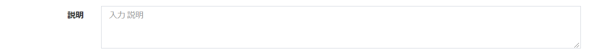
- The description entered to the right of the table display name on the data screen is displayed as shown in the following image.　　

#### Display order
- This is the display order on the custom table setting list screen.
- Please input a half-width character, or specify a number with the right and left "-" "+" buttons.

#### Color
- Set the table color. The color set here is used for suggestions when searching.

- Clicking the currently specified color displays the selection screen.

#### Icon
- Table icons set. The set icons are displayed as menu icons and search result icons.

- Clicking the currently specified icon displays the selection screen.

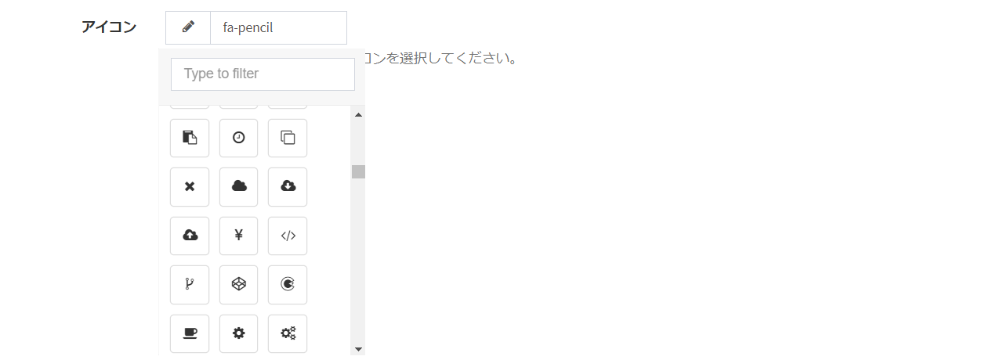

#### Searchable
- Set whether to include the table in the search target when [searching](/search.md) from the search bar . Default is YES.
Set it to NO if you want to exclude it from the search results, such as when you want to make it a hidden table.

#### Use ID for labels
- ou can add the data ID to the head of the label in the search suggestions displayed when using the search bar. See [Using on Labels](/column?id=Use-in-labels) for more information. Default is NO.

#### Only one can be registered
- If the table does not register multiple data items and allows only one data item, set it to YES. Default is NO.  

#### Use attachments
- Set to YES to allow uploading [attachments](/data_details?id=attachments) to table data . Default is YES.

#### Use comments
- Set to YES to allow [comments](/data_details?id=comments) on table data. Default is YES.

#### Use data change history
- Set to YES if you want to manage who updates what data in the table as a revision (history). Default is YES.  

#### Change history version number
- If "Use data change history" is YES, enter the number of versions that retain the change history as an integer.  
If you enter "200", the first update history information will be deleted at the 201st update. The default value is 100.

#### Editable by all users
> For an overview of table permissions, please see the [Overview of Roles / Permissions in Exment](/permission) page first.

- If set to YES, all users will be able to edit all data in the table.  
Eliminates the need to assign permissions individually. Default is NO.

#### Visible to all users
> For an overview of table permissions, please see the [Overview of Roles / Permissions in Exment](/permission) page first.

- If set to YES, all users will be able to see all data in the table. Eliminates the need to assign permissions individually. Default is NO.  
※ At the time of Exment installation, "All users can view" is initially set to YES for only the "Notification" table. This is so that all users can view the announcement information.  
On the other hand, only the administrator can edit the notification information.  

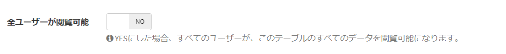

#### Available to all users
> For an overview of table permissions, please see the [Overview of Roles / Permissions in Exment](/permission) page first.

- If set to YES, all users will be able to see all data in the table.  
Eliminates the need to assign permissions individually. Default is NO.  

※ If only "Available for all users" is set to YES, the table cannot be displayed on the menu or list screen, but it can be referenced from other tables.  

Example: The "consumption tax" table does not need to be displayed on the list screen for general users, but must have "consumption tax" selected as an option. For such tables, set "Anyone can see" to YES.  

#### Add to menu
- If set to YES, add the table to the [menu](/menu.md) when saving the table. Default is NO.  

※ This item is displayed only when creating a new table. If you want to change the settings as a menu after adding it to the menu, make the settings on the menu screen.

#### Parent menu to add to
- This item is displayed when "Add to menu" is set to YES. When adding a menu, select the parent menu name.  

Example: When creating a new “Manual” table and selecting “Administrator Settings” in the parent menu, the menu for the newly created “Manual” table as shown in the image is displayed at the bottom of “Administrator Settings”. It will be created.

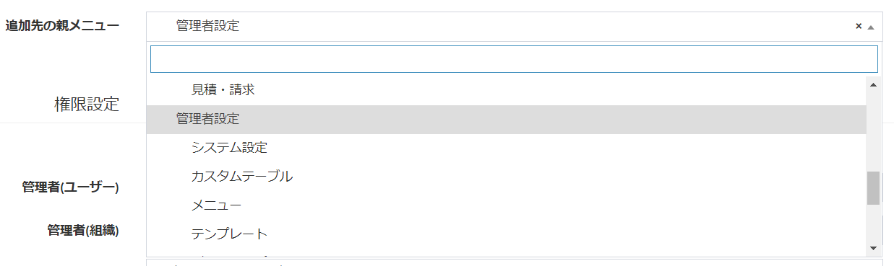
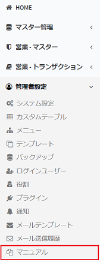

#### Add to notification
- If set to YES, a notification setting to notify the authorized user in the system when creating, updating, sharing, or commenting on data is added to the table save.  

※ This item is displayed only when creating a new table.  
If you want to change the settings as a [notification](/notify.md) after adding it to the notification, make the settings on the notification screen.

- The added user / organization can access the table with the appropriate authority.
- However, users / organizations registered in the menu "System Settings" can also access the table.
- Users / organizations for which permissions are not set in either of the above cannot access the table.

※ For details on setting permissions, see [Roles and Permissions](/permission.md).

## Save
- Click the "Send" button to save the settings. A table is created with the settings.

- If you create a new table, it will move to the [custom column list screen](/column.md) after saving .
Please continue to register custom columns.

## Edit
- Click the "Edit" button of the applicable table displayed in the custom table list.
The screen changes to the edit screen, where you can change the settings.  

## Delete
- If you want to delete the table, first go to the edit screen by the same procedure as above.

- Next, click the "Delete" link at the top right of the edit screen.

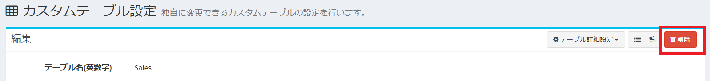  

- A confirmation screen will be displayed as shown in the image below. Enter delete me in the text area and click the confirmation button. The table is deleted.  
**※ However, tables installed in the system cannot be deleted.**

## Extended settings
You can make advanced settings using multiple columns in a table.  

- Click the "Extended setting" button of the applicable table displayed in the custom table list.  

- Move to the setting screen.

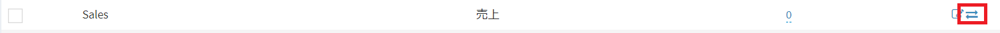  

### Composite unique key setting
By setting multiple columns as unique keys, it is possible to prevent duplicate registration due to specific combinations when registering new data.  

- Select two or three types of columns that you want to prevent duplicate registration by a specific combination.  
- When registering new data, an error will occur if the value to be registered matches the registered value for any of the setting columns.  

Example: In the case of the settings shown in the image below, using the "Next scheduled date" and "Name" as unique keys prevents the same name from being registered multiple times on the same next scheduled date.  

※ If you want to perform duplicate judgment on only one type of column and prevent duplicate registration, set the unique column to YES in the [custom column setting](/column.md).

### Compare two columns
Compares the two columns when creating and updating data. You can save only if the column values ​​match the set conditions.  
If they do not match, an error message is displayed.  
Please use the following patterns.  

- The "start date" can be saved only before the "end date".  
- The value of "X" can be saved only when it is greater than or equal to the value of "Y".  
- "Person in charge" and "Confirmer" can be saved only when they are different.  

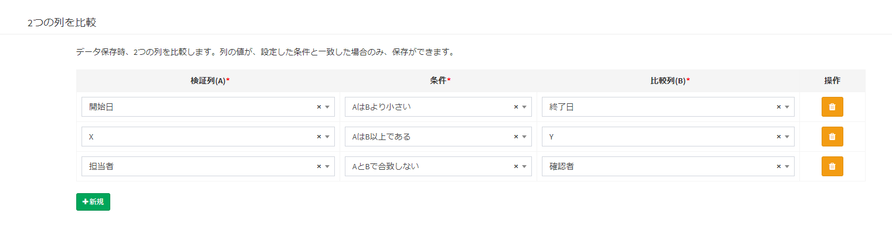

#### Handling when not entered
If one or both items are not entered, the result will differ depending on the selected conditions.  
Here, "true" is described when it can be saved normally, and "false" is described when an error occurs.  

- **Matches A and B**: True if both values ​​are blank. False if only one is not entered.  
- **A and B do not match**: True if only one of the values ​​is not entered. False if both are blank.  
- **Other**:  Always true.  This is because dates and numbers are generally incomparable when the value is empty.  
If you do not want to leave it blank, please make the required settings in the custom column settings and custom form settings.  

#### Handling by column type
- Comparison of magnitude (A is greater than B, A is less than B, A is greater than or equal to B, A is less than or equal to B) can only be made with the following column types:  

    - Integer
    - Decimal
    - Currency
    - Date
    - Time
    - Date and time

- If you try to compare with other column types, it will always be true.  

- Strictly speaking, when saving this setting, if the column types are not the same, you need to generate an error.  
(Because the magnitude relationship between "integer" and "date and time" cannot be compared)  
Currently, such verification is not performed.  
Make the appropriate selection of the two column types.  

#### Other
- If you want to compare with 3 or more columns, compare with special conditions, compare values ​​of other tables, etc., create [Plug-in validation](/plugin_quickstart_validate). Please give me.

### Heading display column setting
In the custom column settings, there is an item "Use in label".  
With this setting, you can control the wording to be displayed when displaying search bar candidates or displaying a list of options.  

For example, suppose you have a table called "Customer Information" as shown below.  
Assume that the customer information table has information such as "customer code", "customer name", "phone number", and "mail address".  

    

When you enter a search word in the search bar, search suggestions are displayed, and you want to display it as follows.  
`` (Customer code) (Customer name) ''
    
  
In that case, on the extension setting screen of the custom table, set as follows for the column you want to display as a label.  
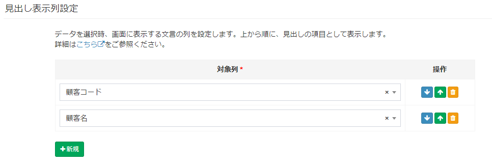  
  
By registering in this way, when entering text in the search bar at the top of the page, it will be displayed like this as a candidate.  
By registering columns in order from the top on the extended setting screen, candidate character strings are displayed in that column order.  
  

If you want to display "E-mail address", please add "E-mail address" column.  
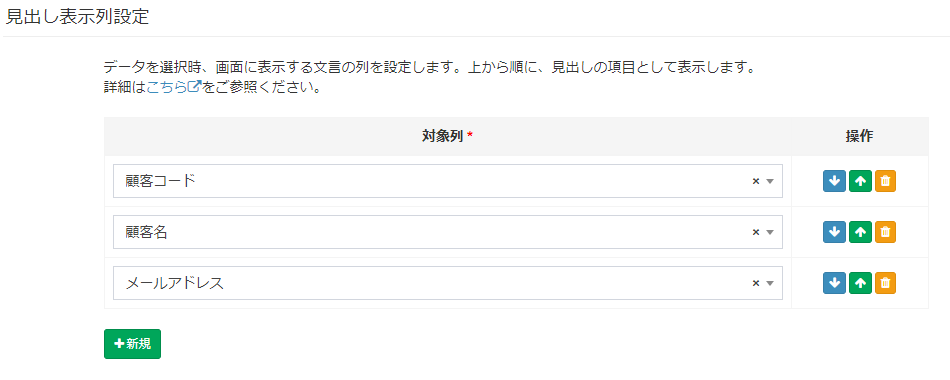  
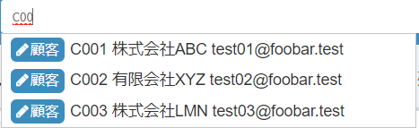  
  
In the custom table settings, there is an item "Display ID on label".
  

If this is set to YES, the word "# (id)" will be added to the beginning of the label.
  

#### Other
- If this heading display column setting is not registered, the value of the first column is displayed in the custom column setting.
- If the value of the first column is empty in the custom column settings, display the ID.
- IDs can be added at the beginning of the label. It cannot be added anywhere else.

### Data automatic sharing settings

> For data sharing settings, first check the [Overview of Roles / Permissions in Exment](/permission) page.

When saving data, you can automatically share the data with the organization or user that is set as the column value.  
Please use it for the following purposes.  

- When creating a new data "contract information", edit authority is automatically added to the user assigned to the column "main person in charge".  
- When the data "contract information" is updated, the viewing authority is automatically added to the organizations assigned to the column "related organizations".
- When creating a new data "Task Management", edit permission is automatically added to the user assigned to the column "Person in charge".

※"User" or "Organization" is required in advance for the column of the custom table.  

#### Example
If such a column setting is defined in the Customer Management table,

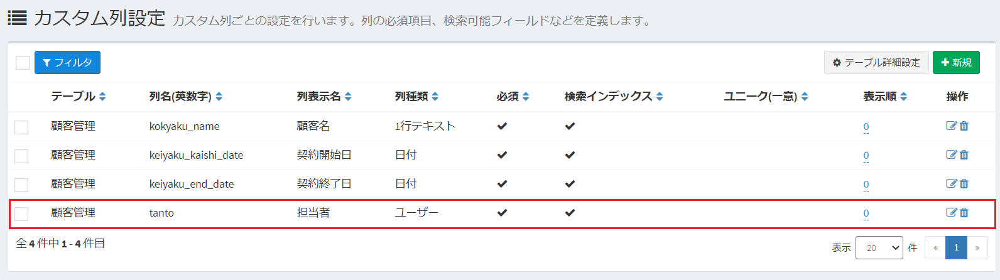

Make the setting "Add" Edit "permission to the user assigned to the column" Person in charge "at" When creating a new "."
![Custom table screen] (img/table/table_extended_share1.png)

After that, when creating new data with the person in charge as user "user1",
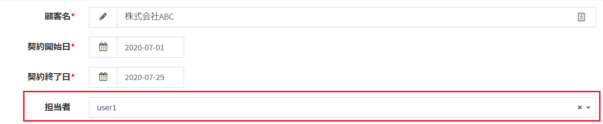

This contract information is shared with the user "user1" with edit privileges.

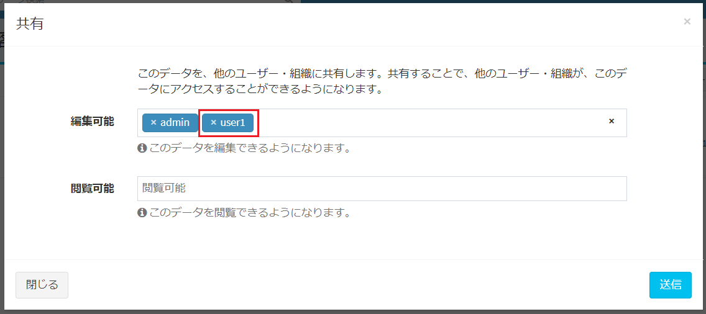

#### Setting method

- ##### Trigger
It's time to share the data.
You can select "When creating new" or "When updating".

- ##### Target column
The user or organization with which you want to share data.

- ##### Target authority
When sharing, select whether to share with edit permission or view permission.

#### Share sync settings
By default, when the trigger is "when updating", even if the value of the target user / organization is changed, the originally set shared information of the user / organization is not deleted and remains shared. ..

By changing the settings, when updating data, the users / organizations set in the column and the users / organizations other than the updated user can be deleted from the sharing settings.  

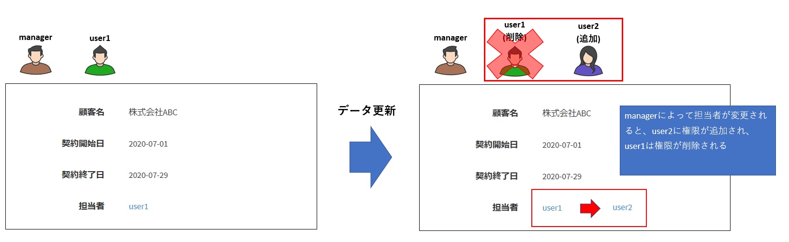

To change this setting, set the option setting "Synchronize automatic data sharing settings when updating" to YES.

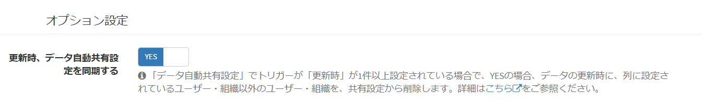

### Non-executable setting from the screen

Set when you do not want to create, edit, delete, or import / export data from the screen.  
By making this setting, the button will be hidden from the screen.  

- Enable expert mode and open the advanced settings screen.

- The "Cannot be changed from the screen" item is displayed.

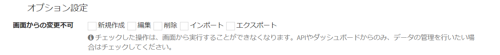

- Setting example: When "Export" is hidden

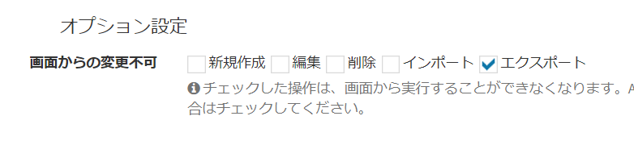

### Heading format settings
> This setting appears only if you have enabled [expert mode](/quickstart_more#expert-mode).

By using parameter variables, you can flexibly set the values ​​displayed as headings.  
When expert mode is enabled, format string input items are displayed on the extended setting screen.

  

Use [parameter variables](/params) to display the values ​​stored in the data as headings.  
Example: When displaying "User name < admin@admin.admin >" in user information.
${value:user_name}&lt;${value:email}&gt;  
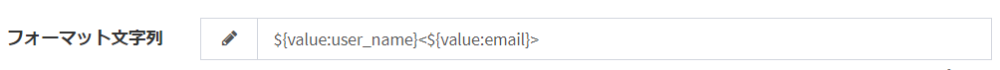  

By inputting in this way, you can set the items to be displayed as headings.
  

#### Other
- If you set this heading display format setting, "heading display column setting" will be invalid.
