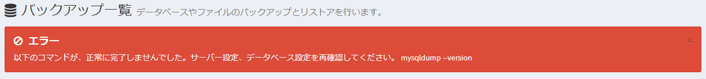

# Frequently Asked Questions, Troubleshooting
This is a collection of frequently asked questions and troubleshooting regarding installation and update of Exment.  
The contents will be updated from time to time.

## logfile
The Exment log file is located in the following path based on the Exment root project folder. If an error occurs, the log will be recorded in this file.  
/storage/logs/laravel.log


## Installation / Update

### composer require or update batch ends prematurely
When installing on Linux, when executing the composer require command or update batch, the following message may be displayed.

```
# pattern 1
Killed

# Pattern 2
mmap () failed: [12] Cannot allocate memory
PHP Fatal error: Out of memory (allocated XXXXX) (tried to allocate XXXXX bytes) in phar: ///usr/local/bin/composer/src/Composer/Console/Application.php on line 82

# Pattern 3
Fatal error: Allowed memory size of XXXXXXXX bytes exhausted
```

This is an error due to insufficient memory.  

In that case, it may be solved by implementing one of the following contents.

#### swap creation
After creating swap with the following command, install or update again.  
※Add "sudo" to the beginning of the command as appropriate according to the environment.

~~~
dd if = / dev / zero of = / swapfile bs = 2M count = 2048
chmod 600 / swapfile
mkswap / swapfile
swapon / swapfile
~~~

#### Change memory limit
Please carry out the following contents.  

--Modify memory_limit in the php.ini file.  
```
memory_limit = 000M # Make the size larger than it is now
memory_limit = -1 # or this specification. You may use unlimited memory, so set it at your own risk
```

--Set composer environment variables (add to batch in case of update issues)
COMPOSER_MEMORY_LIMIT = -1 composer update


### A composer error occurs during manual installation or update

The following errors may occur during manual installation or updating.

```
Installation failed, reverting ./composer.json to its original content.

  [RuntimeException]
  Could not load package XXX / XXX in http://repo.packagist.org: [UnexpectedValueException] Could not parse version constraint ~ 4. *: Invalid version string "~ 4. *"
```

In this case, you may be able to solve it by increasing the version of composer. Please update the composer version to the latest version with the following command.  
** * The update method seems to differ depending on the environment. Please verify your composer update with one of the following: ** **


#### (1) Execute the following command

```
composer selfupdate
```

#### (2) Execute the following command

```
composer self-update
```

#### (3) If neither of the above can be updated, follow the steps below.

- ##### composer deleted
Delete the composer that is already installed.

```
which composer
#Result example: / usr / bin / composer
### Execute the following command
rm / usr / bin / composer
```

- ##### composer reinstall
Follow the steps below to reinstall composer.
    -[Official site] (https://getcomposer.org/download/)
    -[Windows version commentary site] (https://weblabo.oscasierra.net/php-composer-windows-install/)
    -[Linux version commentary site] (https://weblabo.oscasierra.net/php-composer-centos-install/)
    -[Mac version commentary site] (https://weblabo.oscasierra.net/php-composer-macos-homebrew-install/)


### "require ext-gd" and "require ext-sodium" errors occur when running update batches or composer require commands
When executing an update batch or executing the composer require command, the following message may appear.
```
  Problem 1
    - phpoffice/phpspreadsheet[1.23.0, ..., 1.29.0] require ext-gd * -> it is missing from your system. Install or enable PHP's gd extension.
```
```
  Problem 1
    - lcobucci/jwt[5.0.0, ..., 5.3.0] require ext-sodium * -> it is missing from your system. Install or enable PHP's sodium extension.
```
In this case, please enable the php extension.
#### For Linux
~~~
# Ubuntu server
sudo apt-get install php8.2-gd

# Centos server
sudo yum install gd gd-devel php-gd
~~~

#### For Mac/Windows

##### (1) Get php.ini file path

~~~
# Run the following command: The path to the php.ini file is displayed in the "Loaded Configuration File" line.

php --ini
~~~

##### (2) Modify php.ini file

~~~
# Uncomment the below
extension=gd

# Uncomment the below
extension=sodium
~~~


### After the initial installation, when accessing the management screen, a "SQLSTATE [HY000] [202] Permission denied" error occurs.
If you want to access MySQL from Apache, you may need to configure SELinux.  

If the above phenomenon occurs, execute the command as follows.

~~~
sudo setsebool -P httpd_can_network_connect_db = 1
~~~


### When updating, an error occurs with "Migrating: 2019_08_19_000000_create_failed_jobs_table"
The following message may be output during the database change process due to the update.  
~~~
Migrating: 2019_08_19_000000_create_failed_jobs_table  
SQLSTATE[42S01]: Base table or view already exists: 1050 Table 'failed_jobs' already exists。  
~~~

If the above phenomenon occurs, delete the "2019_08_19_000000_create_failed_jobs_table" file in the "installation folder\database\migrations", and then execute the update again.


### "Killed" is displayed when executing a command such as "composer require" on the rental server.
This is a phenomenon that sometimes occurs when memory is overloaded.  
※It does not always occur  

If the above phenomenon occurs, execute the command as follows.

~~~
nice -n 20 composer .....
~~~

Run composer with "nice -n 20" at the beginning of the command.  
This lowers the priority and executes the command.  
※Even if you execute the command as above, "Killed" may be displayed again. Please note.


### To pass the composer path
In order to execute the update function from the screen added from v4.1.0, it is necessary to pass the path of composer.  
This requires that the server user running the web server knows the location of composer and can successfully run composer.  
The procedure is described below.  

#### Add setting value
- Set the path to composer in "Composer path" in [this procedure](/config).

```
# Ex：Execute the following command
which composer
#Output example : /usr/local/bin/composer

# Enter the following values ​​in .env
EXMENT_COMPOSER_PATH=/usr/local/bin/composer
```

- This will take the path to composer. You will be able to perform updates from the screen.

### Backup / restore fails
The following message may be displayed on the backup screen or command.



If you see this error, you may not have the settings required to back up and restore the Exment.  
Please check the following contents.

#### mysql-client is not installed on your web server and is not in your path
For Exment backup / restore, the following command is executed on the Web server.

- mysql command
- mysqldump command

If these commands are not installed, you need to install the mysql command and mysqldump command.  
How you install these commands depends on your environment.  
Example: [Amazon Linux 2](http://tech-wiki.pomme-verte.net/?p=793)

Also, the user who runs the Web server may not have the path to the mysql command and mysqldump command.  
In that case, please modify it so that the command can be executed with the full path by the following method.  
※For details on changing settings, click [here](/config).

- Open the env file.
- Add the following description.


```
EXMENT_MYSQL_BIN_DIR = (path to the folder where the "mysql" executable is located)
#Example
EXMENT_MYSQL_BIN_DIR = / usr / bin
```


#### Add "safe_mode = Off" in php.ini
It is necessary to turn off safe_mode for the convenience of executing the mysql command and mysqldump command from the server.  
Please carry out the following contents.  

- Open the php .ini file.
- Add the following contents.

```
safe_mode = Off
```