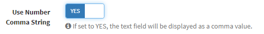
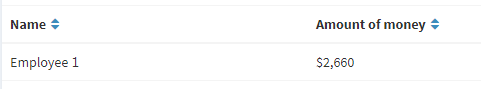

# Update procedure v1.2.6 Remove comma string
When updating to version 1.2.6, some special commands are required.  
Here are the users who need the following steps, their background, and the update procedure.  

## Case
Exment has a function to "display as a comma character string" when the column type is "integer", "decimal", or "currency".  

  

At that time, it will be displayed as a comma character string when displaying and entering data.  

  

It is displayed as a comma character string on the screen, but when saving data, it was normal to remove the comma and save.  

However, there was a bug in this process, and the data was saved with the comma character string included.  

As a result, there was a problem that the calculation could not be performed correctly at the time of aggregation.  
In the case of the example below, the total amount is calculated for each employee. However, the total amount of employee 1 is displayed as "51" regardless of "51400".  

    
    

The fix is to remove the commas in this data.  

## Case
When creating a column with the following conditions and saving data.
- Column type is either "integer", "decimal" or "currency"
- "Numeric comma character string" is set to YES in column setting
- (In the corresponding column, it is stored as a numerical value of 4 digits or more)

## How to respond
- [Normal update procedure](/update),update to v1.2.6 or higher.    

- Execute the following command. (* It may take some time depending on the number of registered data.)  

~~~
php artisan exment:patchdata rmcomma
~~~

- Now the commas in the data have been successfully removed and calculated successfully.

    
