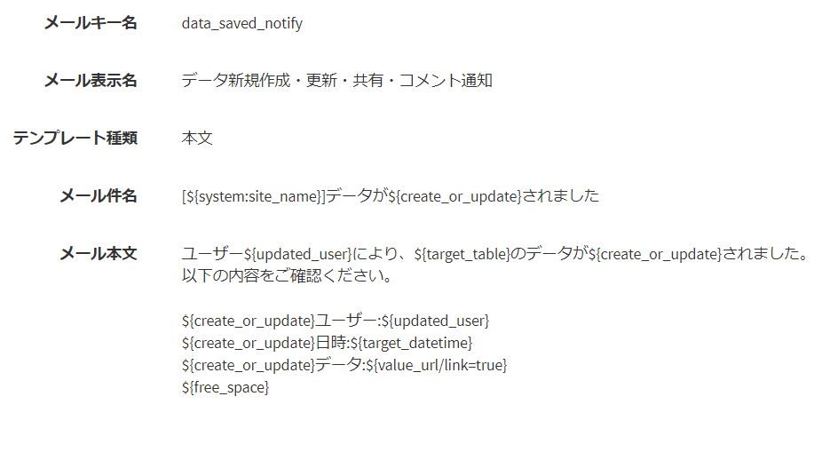
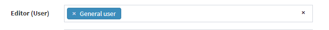

# Update procedure v2.0.X
Updating from version1.X.X to version2.0.X requires some special steps.  
The procedure for updating to version 2.0.X is described.  
※ This step is not required when installing new version 2.0.X.  Install from the usual [Installation procedure](/quickstart).  

## Introduction
**In this update, some settings may not be inherited due to the configuration change of internal data for role and authority settings.**  
Please follow these steps to change the settings manually.

## Procedure

### Before update
#### Check email template
In v2.0, some email templates have been changed.  
The content of the mail key name "data_saved_notify" in "Administrator Settings"> "Mail Template" has been corrected.  
If the administrator has made the correction manually, copy the text of the email body and keep it.    
  

#### Check custom table permissions
In v1.X, the authority settings associated with custom tables are not inherited in v2.0.  

  

If you have set permissions for custom tables, please save screenshots so that you can refer to them later.  
※The permission settings in the system settings and the permission settings in the custom data are automatically inherited when updating to v2.0.

### Update execution
#### Upgrade to v2.0.X
Update Exment to v2.0 by following [These steps](/update).

### After update
#### Role group settings
After updating to v2.0, set the [Role group](/role_group) based on the role and authority settings saved before the update.  

#### Resetting email templates
Modify again based on the contents of the mail key name "data_saved_notify" in "Administrator Settings"> "Mail Template" that was left before the version upgrade.  

### Update completed
This completes the update process.  