# Custom views
Set the view such as columns and narrowing conditions to be displayed on the [data list screen](/data_grid.md) of Exment .

## View type
Currently, there are the following view types:

### View (normal view)
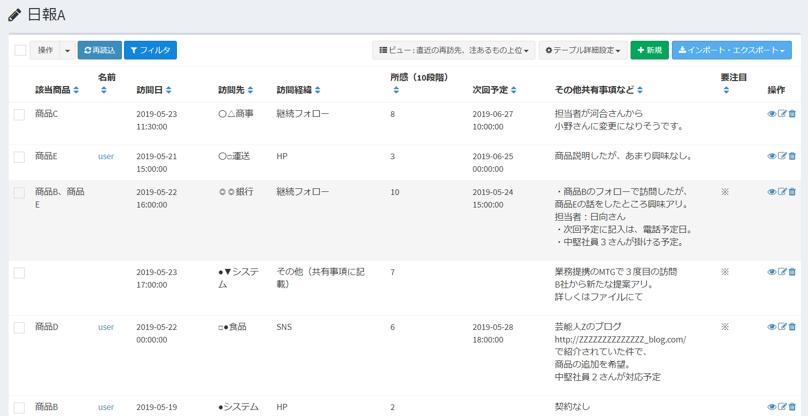
It is a data list in normal view.  
Lists registered data.

### Summary view

Group the registered data and display the total value, number, total value such as maximum value.  
On the dashboard, you can view charts.

### Calendar view

Registered data can be displayed in calendar format.

### All view
It is basically the same as the normal view, but has the following features.  
- Created automatically by the system.
- Only one is created. Users cannot create or delete new ones.
- Used when a list is displayed on the [search](/search) screen.
- Used to display the detail data from summary view.

### Condition view
[Notification](/notify) notification conditions, and if the column setting of the custom column is "selection (select from the list of values of other tables)", it is used to narrow down.  
- No display column settings are made.
- It is not displayed on the data list screen.
- Only administrators can set it. General users cannot be set.  

Three types of settings are possible.

### Display example of calendar view

## Page display
- On the custom table screen, put a check in the table you want to change, and click "View setting" of "Move page".

- A list of views set for the checked custom table is displayed.
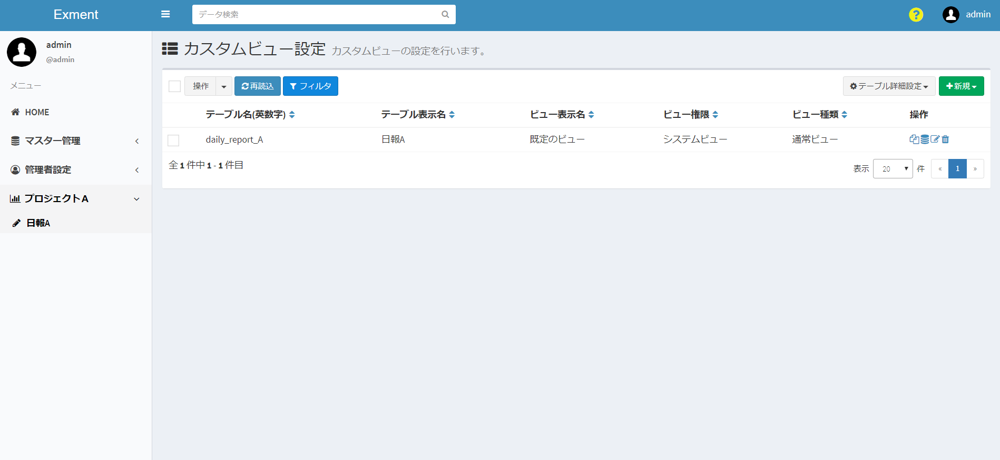

## Add new view
- On the "Custom View Settings" screen, click "New View" under "New" at the top right of the page.
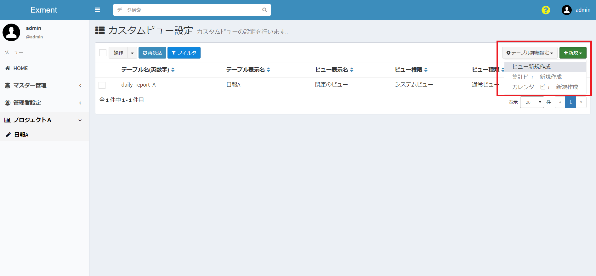

- The new view addition screen is displayed. Enter the necessary information.
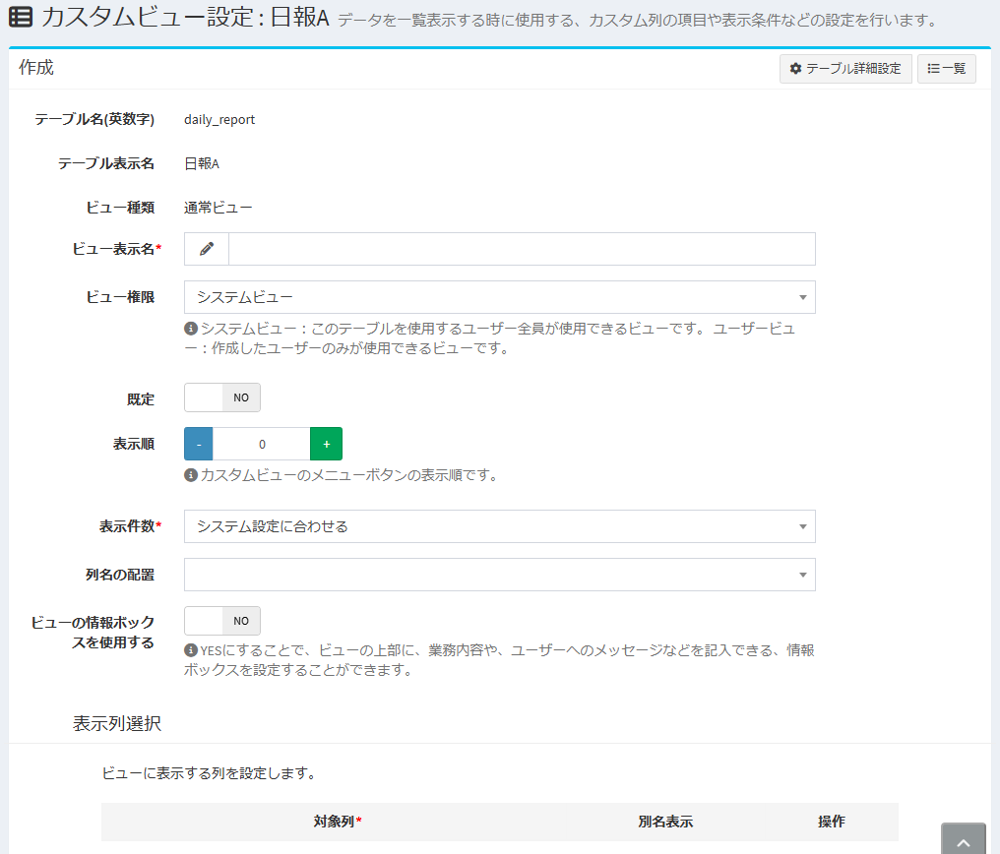

## View settings
#### View display name
Enter a name for the view.  

#### View permissions
Select either "System view" or "User view".  

"System View": Only the system administrator can make settings. The view will be available to all users who have access to the table.  
"User view": View settings that can be set by anyone other than the system administrator. The view will only be available to the user who created it.  

※ You cannot change the "system view" to the "user view" later.  
The **"User View" created by the system administrator** can be changed to the "System View" later.  
※ By [disabling the user view](/config.md?id=User-view-disabled), general users cannot create views.  

#### Displayed results
Select how many data items are displayed per page in the data list.

#### default
When creating multiple views, when a user opens the data list, the view that is set to "YES" will be displayed.  
※ The view set to "NO" can be displayed by selecting from the list of views.  
※ "Default" can be set to "YES" for only one view in one custom table.  
If "Default" is set to "YES" for two or more views, it will be changed to "NO" except for the view that was last set to "YES".  

#### Display column selection
The settings for the columns displayed in the view.  
A list of the set columns is displayed on the data list screen, etc.  
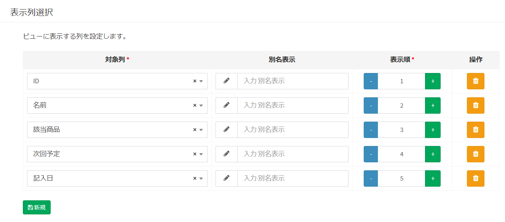

- Target column:  
The column to be displayed in the view.

- Display as:  
Displayed in the view with the set name.

- Display order:  
The order of items displayed in the view.  
The values ​​are displayed in ascending order from the left.  

- "Delete" button:  
Deletes the view display.

- "New" button:  
Adds a new display column.

#### Display condition selection
Set the conditions to be displayed in the view.  
Add a condition when you want to narrow down the displayed content, such as displaying only items within the period or displaying only the contents of a specific status.  
※ In addition to this setting, filter the data so that only the data of the authority owned by the login user is displayed. Unauthorized data will not be displayed regardless of this setting.  

- Target column:  
A column used for the narrowing condition.

- Condition:  
Select the content of the condition.  
For details, please refer to [Search conditions](/view.md?id=About-search-conditions).

- Search value:  
Enter the condition to match the content of the search condition.

- "Delete" button:  
Delete the display condition of the view.

- "New" button:  
Adds a new view display condition.

- Condition Join:  
If you select "Match All Condition", data that matches all conditions will be displayed.  
If you select "Match Any Condition", data that matches any of the conditions will be displayed.

- Condition Reverse:  
If you check "Reverse condition", data that does not match the conditions will be displayed.  
If you do not check "Reverse condition", data that matches the conditions will be displayed.  
※ Only the summary view is not eligible for the display condition reversal function.

#### About search conditions
Depending on the type of content selected in the "Target Column" ("Date", "User", etc.), the options will change.  
This manual section describes search conditions that should be noted.

##### When the target column type is "date"
- X days ago or later
- X days after date
- X days before the date
- The data registered before the date after X days is displayed in the view when it is registered with the date in the corresponding range.  
Example: When the current date is 1/15 and the search value is registered as "8"  

##### When the target column type is "User"
- The registered data that matches the logged-in user is displayed in the view if it matches the logged-in user.  
- The registered data that does not match the logged-in user is displayed in the view when it does not match the logged-in user.

## Add new summary view
- On the “Custom View Settings” screen, click “New” in “New” at the top right of the page.  
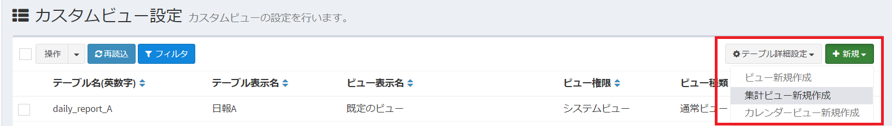

- The New Summary View screen is displayed. Enter the necessary information.  

## Aggregation view settings

#### View display name, view authority, default
The setting items are the same as [View setting items](/view.md?id=view-setting-items) above.

#### Group column selection
Performs grouping in aggregation based on the column selected as the target.  
If multiple settings are made, totaling is performed by multiple items.

- Target column:  
A column used as a reference for grouping.  

Example 1: If two columns are set as the target column, the data will be grouped over two columns and aggregated, as shown in the image.  
※ "Sales amount" is a column set as a summary column, not a group column.  

  

Example 2: If only the column of "sales month" is set as a group column, the data that was grouped including the column of "employee name" in Example 1 is integrated into a group of one column, and the aggregation is performed. It is done.  

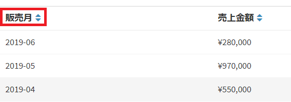  

- Display as:  
Displayed in the view with the set name.

- Column type:  
You can select from the following only when the custom column type of the target column is "Date" or "Date and time".  
"Every year" "Every month" "Every month" "Every month" "Every day" "Every day of the week"  
Grouping in the target column is performed according to the set date condition.  
※ The images in Examples 1 to 3 are displayed when the sales month column type is set to "Year / Month".  

- Sort order:  
Set the order of data display in summary view.  
Set the priority of the column to be referenced, in which column the data is sorted by the size of the value.  
The setting order includes group column selection, summary column selection, and both.  

Example 3: In Example 2 above, the display is for the case where the "sales month" column is 1 and the "sales amount" is 2 in the sort order.  If it is set to 1, as shown in the image below, it will be displayed in the order of priority with the value in the column of "sales amount".  

  

- Sorting:  
Set which of the values ​​is to be prioritized in sorting in the target column.  
Select either "Ascending order (small order)" or "Descending order (largest order)".  

Example 4: In Example 3 above, the display is for the case where "Sales amount" is sorted in descending order, but when the order is ascending, it is displayed as the following image.  

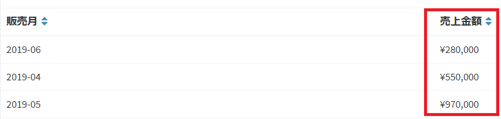  

- "Arrow buttons":  
Set the order of columns in the summary view.  
The items in the above item as the group column selection are displayed on the left in the summary view.

- "Delete" button:  
Deletes the group column of the view.

- "New" button:  
Adds a new group column for the view.

#### Calculation column selection
Aggregate by the value of the target column.  

- Target column:  
A column that summarizes values ​​as targets.

- Aggregation type:  
"Total", "Number", "Minimum value", "Maximum value" Of the four aggregation types, the set aggregation result is displayed in the target column view.

- Display as:  
Displayed in the view with the set name.

- "Delete" button:  
Delete the summary column of the view.

- "New" button:  
Adds a new summary column for the view.

#### Display condition
Set the conditions to be displayed in the view.  
Add a condition when you want to narrow down the displayed content, such as displaying only items within the period or displaying only the contents of a specific status.  
※ In addition to this setting, filter the data so that only the data of the authority owned by the login user is displayed. Unauthorized data will not be displayed regardless of this setting.  

- Target column:  
A column used for the narrowing condition.

- Search condition:  
Select the content of the condition.  
For details, please refer to [About search conditions](/view.md?id=About-search-conditions).

- Search value:  
Enter the condition to match the content of the search condition.

- "Delete" button:  
Delete the display condition of the view.

- "New" button:  
Adds a new view display condition.

## New calendar view added

- On the "Custom View Settings" screen, click "New Calendar View" under "New" at the top right of the page.

- The new calendar view screen is displayed. Enter the necessary information.

## Calendar view settings

#### View display name, view authority, default
The setting items are the same as [View setting items](/view.md?id=View-setting-items) above.

#### Display column selection
The settings for the columns displayed in the view.  
In the calendar view, you can display the date column data as a period by setting the start date and end date.  
※ For column data that you want to display on a single day, specify only the start date.  
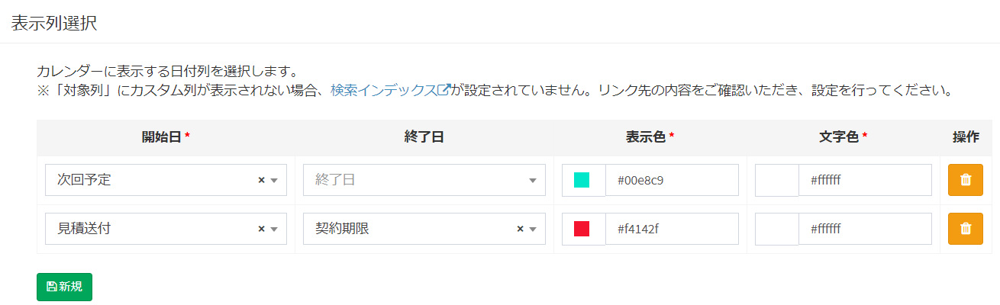

- Start date:  
Set the column that is the start date as the period.
※ If you do not set the end date, the column set as the start date will be displayed on a single day.

- End date:  
Please set the column that is the end date as the period.

- Display color:  
Set the display background color of the data displayed in the view.

- Text color:  
Set the display text color of the data displayed in the view.

- "Delete" button:  
Deletes the view display.

- "New" button:  
Adds a new display column.

#### Display condition
Set the conditions to be displayed in the view.  
Add a condition when you want to narrow down the displayed content, such as displaying only items within the period or displaying only the contents of a specific status.  
※ In addition to this setting, filter the data so that only the data of the authority owned by the login user is displayed. Unauthorized data will not be displayed regardless of this setting.

- Target column:  
A column used for the narrowing condition.

- Search condition:  
Select the content of the condition.
For details, please refer to [About search conditions](/view.md?id=About-search-conditions).

- Search value:  
Enter the condition to match the content of the search condition.

- "Delete" button:  
Delete the display condition of the view.

- "New" button:  
Adds a new view display condition.

#### Headings in calendar view
As in the image example, the heading can be displayed in the target date of the data in the calendar view.  

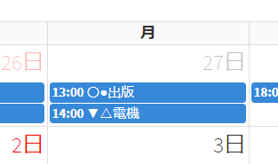
- The displayed heading is the part set as [Use in label](/column.md?id=Use-in-label) in custom column settings.

- Also, if the column corresponding to "Date and time" in the custom column type is set as the start date for display column selection, the time of the registered data will be displayed at the head of the heading.

## Save
After filling in the settings, click “Submit”.

## Edit
If you want to edit the view, click the "Edit" button in the corresponding row.
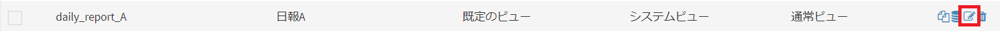

## Delete
To delete a view, click the "Delete" button in the corresponding row.
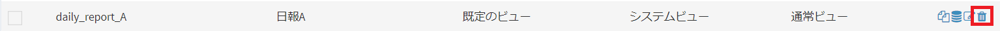

## Duplicate custom view
Click the "Duplicate this view" button to duplicate the blank view with the same settings and only the view display name.

## Data list display
Click the "Display data list in this view" button to display the data list in that view setting.
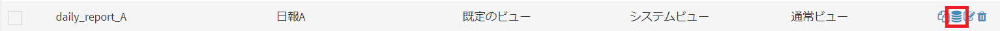