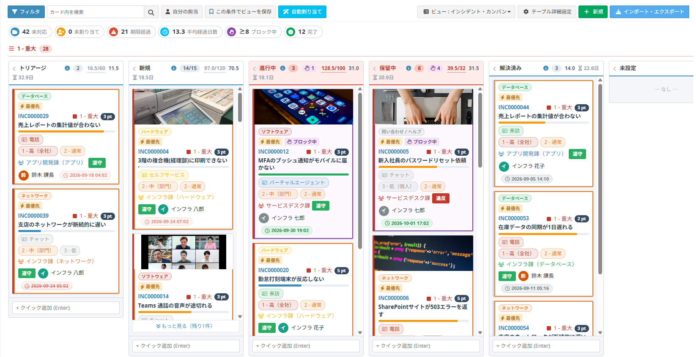
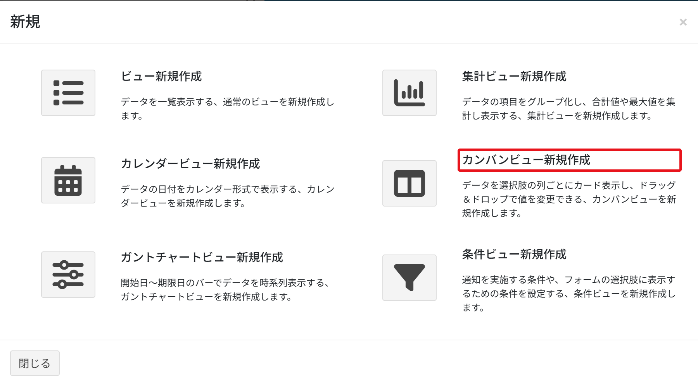
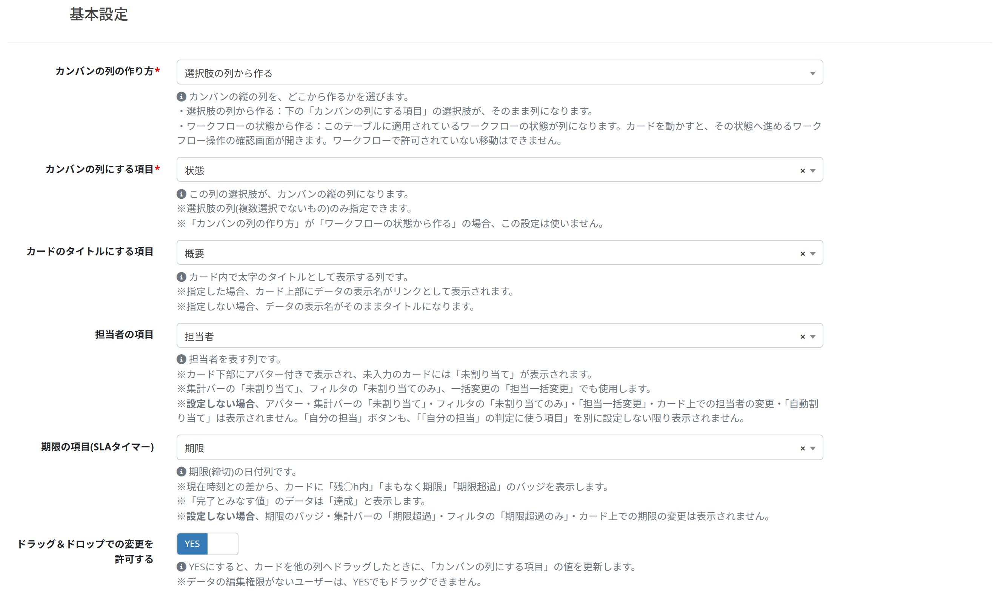
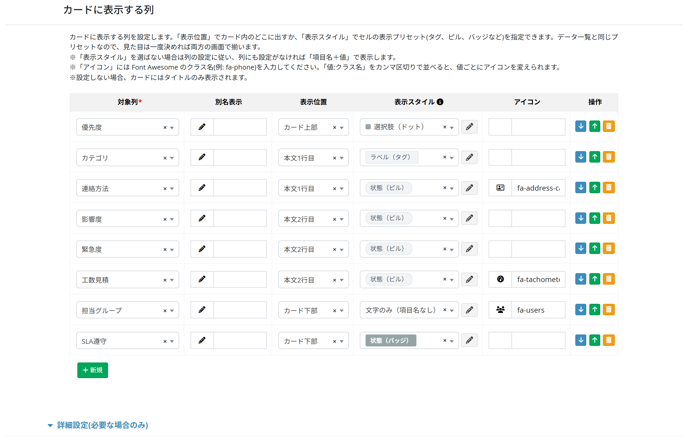
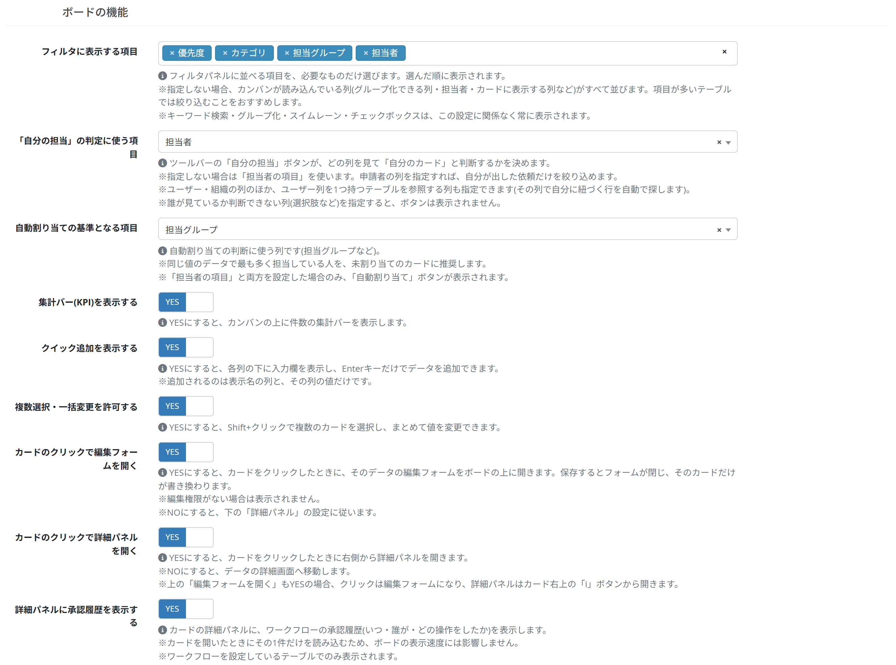
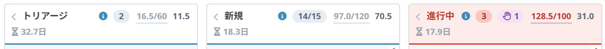
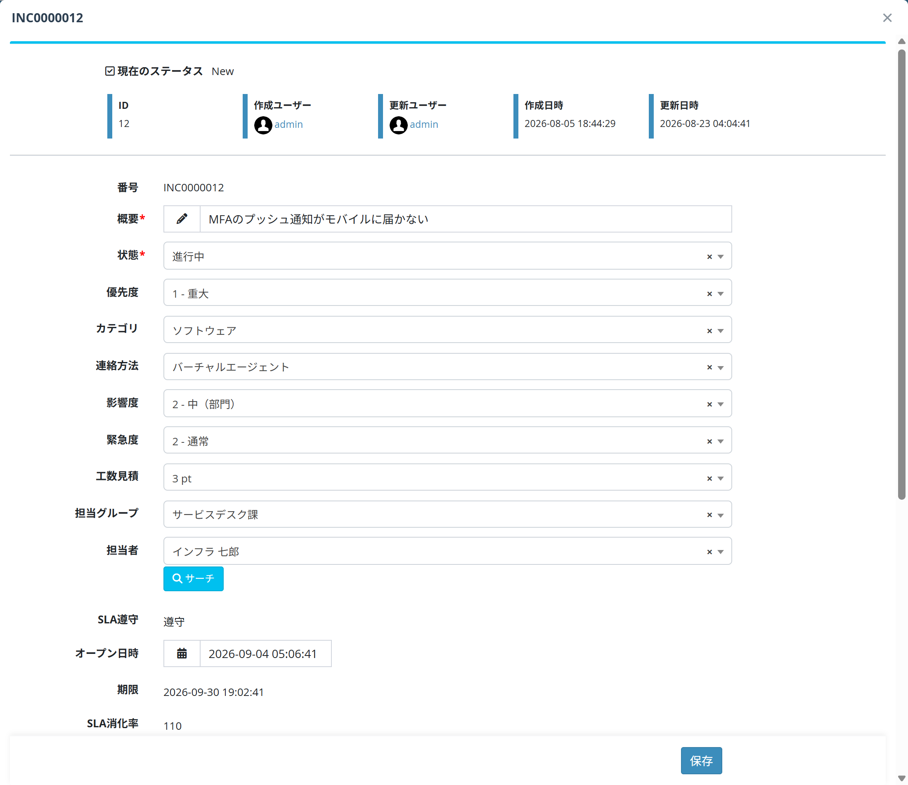
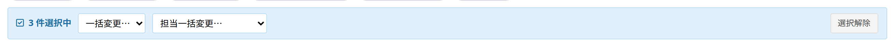
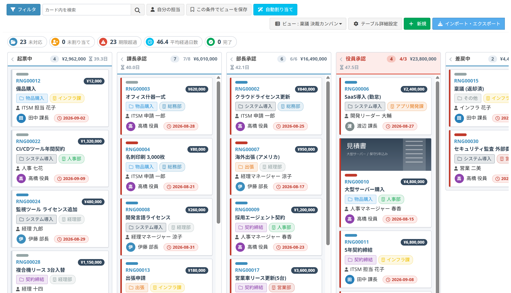

# Kanban view

Shows records as cards laid out in columns, one per state, and lets a card be dragged from one column to the next.

## What a kanban view is

A kanban board represents each piece of work as a card and puts it in the column of the stage it has reached - "open", "in progress", "done". Where work is stuck can be seen at a glance, and moving a card is all it takes to move the work on.

The Exment kanban view can:

- build the columns from a choice column (status, priority...) or from the statuses of a workflow
- update that column's value when a card is dragged
- show an assignee, deadline, labels and a progress bar on the card
- show the count, the total amount and the average age per column in the header
- open the record's edit form over the board when a card is clicked

## Adding the view

1. Open the custom view setting screen (see [Custom views](/view.md)).
2. Click [New] at the top right.
3. Choose "Create kanban view" in the dialog.

## Basic setting

#### How the board columns are made

| Option | Content |
| --- | --- |
| From the values of a select column | The choices of "Column for kanban lanes" below become the columns. |
| From the statuses of the workflow | The statuses of the workflow applied to this table become the columns. Dragging a card opens the confirmation screen of the workflow action that leads to that status. A move the workflow does not allow cannot be made. |

This field only appears when the table has a workflow.

#### Column for kanban lanes
The choices of this column become the columns of the board.  
Only single-value choice columns can be used.  
Not used when the columns are made from the workflow.

#### Column used as the card title
Drawn in bold as the title of the card.  
When set, the record label is shown as a link at the top of the card. When left empty, the record label is the title.

#### Column for the assignee
Drawn with an avatar at the foot of the card; cards with no value show "Unassigned".  
Also used by the "Unassigned" figure on the summary bar, the "Unassigned only" filter and "Bulk assign".

Leave it empty and the avatar, the "Unassigned" figure, the "Unassigned only" filter, "Bulk assign", changing the assignee from the card and "Auto assign" are all hidden.

#### Column for the deadline (SLA timer)
The deadline date column. From the difference with the current time, the card carries a "N h left", "due soon" or "overdue" badge.  
Records holding a value treated as done show "met" instead.  
Leave it empty and the deadline badge, the "overdue" figure, the "Overdue only" filter and changing the deadline from the card are all hidden.

#### Allow changing values by drag and drop
YES updates the value of "Column for kanban lanes" when a card is dropped on another column.  
A user without edit permission cannot drag, even with YES.

## Columns displayed on the card

What to put inside the card. With nothing set, the card shows only its title.

| Item | Content |
| --- | --- |
| Target column | The column to show |
| Display name | A different label for the card |
| Position | Where on the card it goes |
| Style | How it is drawn |
| Icon | A Font Awesome class name (e.g. fa-phone) |

### Position

| Option | Where |
| --- | --- |
| Card head | Above the title |
| Body line 1 | First line under the title |
| Body line 2 | Second line under the title |
| Card foot | At the bottom of the card |

### Style

Picked from the same cell appearance preset library the data list uses, so one
look is defined once and worn on both screens.

| Setting | How the card draws it |
| --- | --- |
| A preset is picked | The value is drawn in that preset's look (tag, pill, badge, dot, avatar and so on). **It wins over the column setting** |
| Left empty | The column's own preset, or its appearance setting, decides |
| Neither is set | The value is shown as "label: value" |

The per-value colours always come from the column. The preset decides the
shape only, which is what lets one preset fit every column.

Use the pencil button to create or edit a preset - see
[Cell appearance presets](/cell_style_preset.md).

> A view that used one of the board's own style names ("tag", "pill" and so
> on) in an earlier version is converted to the preset of the same look when
> you update, and is changed from this field from then on.
>
> A card row that is not a column - the workflow status, a system column, the
> parent record - takes a preset too, but not per-value colours: those are a
> column's own setting.

### Icon
A Font Awesome class name (e.g. `fa-phone`). It wins over an icon carried by the preset.  
To vary the icon per choice, write `value:class` pairs separated by commas:  
`phone:fa-phone,mail:fa-envelope,chat:fa-comments`

## Advanced setting (optional)

The board works with the defaults. Set these only when you need them.

### More on the card

#### Column for the cover image
An image column drawn as a cover at the top of the card. Records with no image are drawn without a cover; the first image is used when there are several.

#### Cover image display
"Cover" fills the frame and cuts off what does not fit. "Contain" fits the whole image and leaves margins.

#### Column for the coloured labels
A choice column drawn as coloured labels at the top of the card. Multi-select columns can be used, and every value is drawn.  
The column is also added to the filter panel.

#### Label display
"Chip" is a small label with text, "Colour bar only" is a thin bar of colour.

#### Column for the corner badge
Drawn as a small badge at the top right of the card (counts, points, numbers). Records with no value show nothing.

#### Number column drawn as a progress bar / Value that fills the progress bar
Draws a progress bar under the card title.  
0-49% is blue, 50-99% orange, 100% green.  
"Value that fills the progress bar" is the value counted as 100% (100 when left empty).

#### Column the elapsed days are counted from / Age colour steps
The date the elapsed days are counted from (the day a request came in, for instance). The left edge of the card changes colour as the days pass.  
Write three days in ascending order, separated by commas:  
`1,2,3` - yellow after 1 day, orange after 2, red after 3.  
`3,7,14` - for longer stages.

#### Warn this many hours before the deadline
A card within this many hours of its deadline is marked "due soon" (yellow).  
2 hours for a support queue, 48 (two days) where deadlines are counted in days. Two hours when left empty.

### Board columns

#### Column for swimlanes
Splits the board horizontally, one lane per value of this column. No lanes when left empty.

#### Column totalled on the lane header
Shows the total of this number column under the column header.  
Picking an amount gives a header like "Director approval ¥34,700,000" - how much money is waiting in that column, at a glance.  
Display only; it does not affect the WIP limit.

#### Show the average days spent in each lane
Shows how long, on average, the cards in that column have been sitting there - which stage is the bottleneck.  
Counted from the moment the status was reached on a workflow board, and from the last update otherwise.

#### WIP limit per column
The number of cards that may sit in a column at the same time. A column over its limit gets a red header.

| Item | Content |
| --- | --- |
| Target column | The column the limit applies to |
| Limit | How many cards may sit there |

#### Count the WIP limit in (number column)
Counts the WIP limit as the total of this number column instead of a number of cards.  
Picking a quantity gives a header like "1550/1200".  
Integer, decimal and currency columns only.

#### Moving into a full column

| Option | What happens |
| --- | --- |
| Allow it (red header only) | The move goes through; only the header turns red. |
| Ask first | A confirmation is shown; OK moves the card. |
| Do not allow it | A full column greys out while dragging and refuses the card. |

Cards treated as expedite are not held back by this, though they still count towards the total.

#### Column policy
Shows the rule of a column in its header; hovering the mark shows the text.  
Writing "every item of the test sheet must be ticked" on the "testing" column makes the rule for moving on visible to everyone.

#### Values treated as done
The board columns that mean "finished", picked from the table's choices.  
Records there stop the deadline counter and count towards "Done" on the summary bar.  
Not needed on a workflow board - a status marked completed is treated as done automatically.

#### Values treated as blocked
Values that mean "this work is stuck". Those cards get a red border and a flag, and "Blocked" is added to the summary bar and the filter.

#### Values treated as expedite
Values that mean "urgent interruption". Those cards get a strong border, and the lane pinned to the top when swimlanes use that column.  
Keep this to one or two values, or it stops meaning anything.

#### Board columns to leave out
Columns that are not drawn at all.  
Leaving out "done" and "cancelled" gives a board of the work still in progress.  
Their records are not loaded either, which alone makes a large table much faster.

### Board features

| Item | Content |
| --- | --- |
| Column the "My cards" button reads | Which column decides whether a card is "mine". The assignee column when left empty. |
| Column used by auto assign | The column auto assign judges by (an assignment group, say). The person who handles that value most often is suggested for unassigned cards. |
| Show the summary bar (KPI) | Draws a bar of figures above the board. |
| Show quick add | Puts an input at the foot of each column; Enter adds a record. |
| Allow multi select and bulk change | Shift + click selects several cards and changes them together. |
| Open the edit form when a card is clicked | Opens the record's edit form over the board. |
| Open a detail panel when a card is clicked | Opens a panel from the right. |
| Show the approval history in the detail panel | Adds the workflow approval history to the panel. |

With both "edit form" and "detail panel" set to YES, a click opens the edit form and the panel moves to the "i" button at the top right of the card.  
With both set to NO, a click goes to the record's detail screen.

### How much to load

#### Cards loaded per column
How many cards each column loads first.  
0 (empty) loads up to "Max display count" over the whole board, as before.  
Something like 50 loads 50 per column and puts a [Load more] button under each one.

Counts, totals, average age and the summary bar are read from the database, not from the cards loaded, so they stay correct.  
**This is the recommended setting once a table holds thousands of records** - it is not bound by "Max display count".

#### Max display count
The largest number of records the board will draw. A large number makes the board slow.

## Using the board

### Reading the screen

#### Toolbar

| Button | Content |
| --- | --- |
| Filter | Opens the filter panel |
| Search in cards | Filters the cards by keyword |
| My cards | Shows only the cards assigned to you |
| Save this as a view | Creates a new view from the current filter |
| Auto assign | Suggests an assignee for unassigned cards |

#### Summary bar (KPI)

Open, unassigned, overdue, average age and done.  
To narrow the board down, use the "Overdue only" / "Unassigned only" checkboxes in the filter panel.

#### Column header

From the left: the column name, the count (or "count/limit" where a WIP limit is set), the total and the average age.  
The "&lsaquo;" on the left collapses the column.

#### Card

Depending on the setting: labels, number, priority, age, title, progress bar, the chosen columns, assignee and deadline.

### Moving a card

Dragging a card to another column updates the value of "Column for kanban lanes".  
An [Undo] appears at the foot of the screen afterwards and takes the move back.

Dragging is not possible without edit permission.  
On a workflow board, the confirmation screen of the workflow action opens instead.

### Filter

[Filter] opens the filter panel.

- Narrow down by the value of each column
- "Group by" and "Column for swimlanes" can be switched here for this session
- "Overdue only", "Unassigned only" and "Assigned to me only" checkboxes

[Save this as a view] turns the current filter into a new view.

### Edit form

With "Open the edit form when a card is clicked" set to YES, clicking a card opens its edit form over the board.

- Saving closes the form and repaints **only that card**; the board is not reloaded.
- A refused value keeps the form open and writes the message beside the field.
- Esc closes the form.

### Detail panel

The "i" button at the top right of the card (or the card itself, where only the panel is enabled) opens a panel from the right.

- Shows the columns that are not on the card
- [Move to] changes the column without dragging
- [Open record] goes to the normal detail screen

On a table with a workflow, the actions that can be run and the approval history are shown.

### Multi select and bulk change

With "Allow multi select and bulk change" set to YES, **Shift + click** (or Ctrl + click) selects several cards.

- [Bulk change...] changes the column (the status) of every selected card
- [Bulk assign...] changes the assignee
- [Clear selection] drops the selection

### Quick add

With "Show quick add" set to YES, an input appears at the foot of each column.  
Type a title, press Enter, and a record is created with that column's value already set.

Only the label column and that column are filled in; everything else is edited afterwards.

## Building the columns from a workflow

Choosing "From the statuses of the workflow" turns the statuses of the workflow applied to the table into the columns.

- Dragging a card opens the confirmation screen of the workflow action leading to that status
- A move the workflow does not allow cannot be made
- A status marked completed is treated as done automatically

On an approval process this shows how many requests - and how much money - are waiting at each approver, so a stalled approval is easy to find.

## For large tables

Once a table holds several thousand records:

1. **Set "Cards loaded per column" to about 50.**  
   Each column loads a little at a time and [Load more] fetches the rest. Counts and totals are still read from the database, so they stay correct.
2. **Leave the finished columns out with "Board columns to leave out".**  
   Not loading the finished work alone makes a large difference.
3. **Narrow the view down with the display condition.**  
   Limit what is loaded at all - by period, by department.

## See also

- [Custom views](/view.md)
- [Data list tools](/data_grid_tools.md)
- [Workflow settings](/workflow_setting.md)
- [Flow designer](/workflow_design.md)
