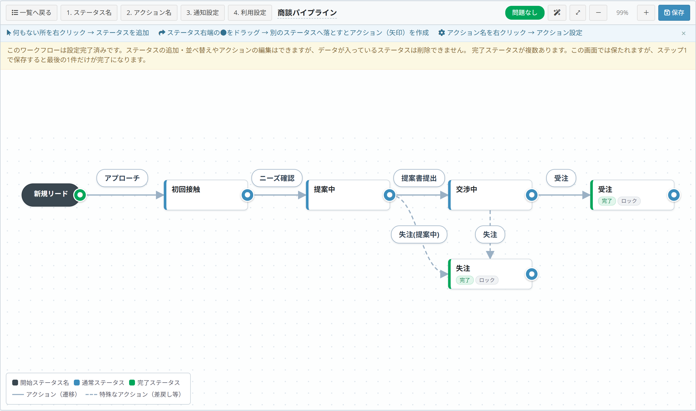
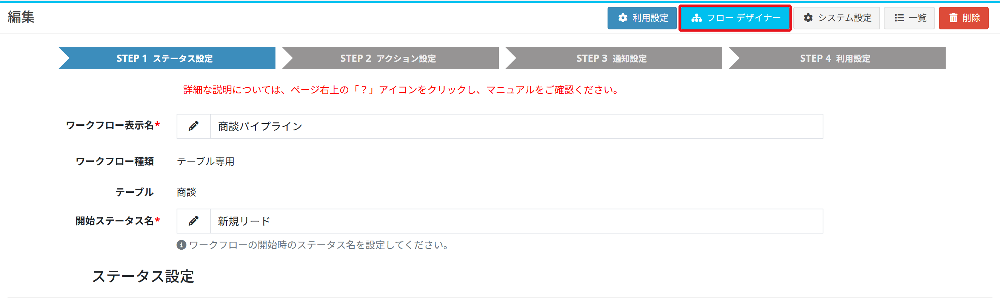
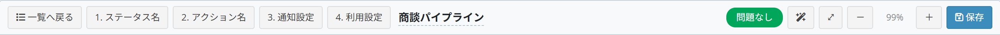
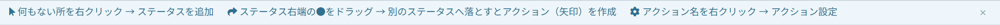
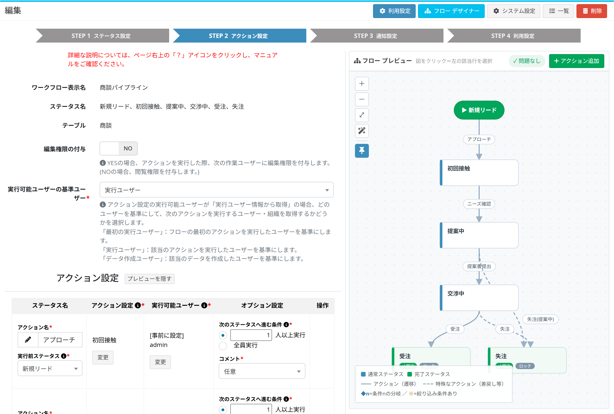

# Flow designer

Creates and edits the statuses and actions of a workflow directly on the flow chart.

## What the flow designer is

In [workflow settings](/workflow_setting.md) the statuses are entered in the step 1 table and the actions in the step 2 table.  
Tables alone make some things hard to see:

- which status leads to which
- whether a status has become a dead end
- whether the reject path is wired up correctly

The flow designer is the same setting seen **as a picture**.

- It saves to exactly the same place as step 1 and step 2, so anything drawn here appears in those tables
- Either screen can be used. Drawing the shape here and adjusting the details in the tables works fine

## Opening the screen

### Editing an existing workflow as a chart

On the workflow list, click the [Flow designer] icon on the row.

Step 1 and step 2 also carry a [Flow designer] button at the top right.

### Creating a new workflow from a chart

Click [Create with designer] at the top right of the workflow list.

## Reading the screen

### Toolbar

| Item | Content |
| --- | --- |
| Back to list | Returns to the workflow list |
| 1. Status name / 2. Action name | Go to the table screens (step 1 / step 2) |
| 3. Notify setting / 4. Usage setting | Available once the setting is completed |
| (workflow name) | The workflow being edited |
| No problem / N item(s) to check | The result of the input check. Click it to read the details |
| Auto layout | Rearranges the nodes automatically |
| ⤢ (Fit) | Scales the chart to fit the screen |
| - / + | Changes the zoom |
| Save | Saves the changes |

### Hints

The basic gestures are shown across the top of the screen at all times.

### Legend

| Drawing | Meaning |
| --- | --- |
| Black node | The start status |
| Blue node | A normal status |
| Green node | A completed status |
| Solid arrow | An action (moving to the next status) |
| Dashed arrow | A special action (reject and the like - not counted as a working user) |

The "Done" and "Locked" chips on a node mean a completed status and a status where the data cannot be edited.

## Basic operations

### Adding a status

**Right click an empty part of the chart** and choose [Add status].

| Item | Content |
| --- | --- |
| Add status | Creates a status where you right clicked |
| Auto layout | Rearranges the nodes automatically |
| Fit | Scales the chart to fit the screen |

### Creating an action (an arrow)

**Drag the dot on the right edge of a status** and drop it on another status.  
An action joining the two is created.

Dropping on an empty area offers "Create a new status and connect", which creates the status and the action in one go.

### Changing an action

**Right click the action name** and choose [Action setting].

| Item | Content |
| --- | --- |
| Action setting | Sets the name, who may run it, and the options |
| Delete action | Removes this arrow |

### Changing a status

**Right click a status** to rename it, mark it as a completed status, or delete it.

A status that already holds data cannot be deleted - it says "In use, cannot be deleted".  
The start status cannot be deleted either; only renamed.

### Tidying the chart

- Nodes can be dragged anywhere
- [Auto layout] rearranges them into a left-to-right flow
- [⤢ Fit] scales the chart to fit the screen

### Saving

Click [Save] at the top right.  
Nothing reaches the database until then; while there are unsaved changes the toolbar shows "Unsaved".

Leaving the page with unsaved changes asks for confirmation.  
If somebody else saved the same workflow first, it says the workflow has been updated on another screen - reload the page and save again.

## Items to check

The right of the toolbar always carries the result of the input check.

- Green "No problem" when there is nothing to fix
- Orange "N item(s) to check" otherwise

Clicking it lists the problems; clicking one jumps to where it is.

| Message | Meaning |
| --- | --- |
| The workflow name is empty | A name is required before saving |
| The start status name is empty | Give the start status a name |
| No action starts from "..." | Nothing leads out of the start status |
| No action reaches "..." | A status cannot be reached from anywhere |
| "..." has no action leaving it and is not a completed status | A dead end |
| The action "..." starts and ends on the same status | An arrow back to the same status is not allowed |
| The action "..." has no user who can run it | Say who may run it |
| Some action rows have no name | Every action needs a name |

## Create with designer

Opened from [Create with designer], the screen starts with a "Basic information" dialog.

| Item | Content |
| --- | --- |
| Workflow display name | The name of the workflow |
| Workflow type | "Common" or "Table only" |
| Start status name | The first status ("Draft", "Before request"...) |

Filling it in and saving puts the start status on the left of the chart.

From there, right click to add statuses and drag the dots to join them.

> **The workflow is not registered until you save.**  
> Once statuses and actions are saved, [Complete setting] in the toolbar becomes available, and step 3 (notify setting) and step 4 (usage setting) can be reached.

## The flow preview on step 2

Step 2 (action setting) also carries the chart, on the right of the table.

- Editing the table redraws the chart straight away
- Clicking an action in the chart selects its row in the table
- [Add Action] adds a row to the table
- "N item(s) to check" is the same input check as the designer

### Save the layout (the pin button)

Decides whether the positions of the nodes are remembered.

- With the pin pressed, saving the screen records the current layout, and it comes back the same way next time
- With it released, the layout is not saved and the chart is laid out automatically every time

### Hide preview

[Hide preview] takes the chart away and gives the table the full width.

## Notes

#### Editing a workflow already in use
Statuses can still be added and rearranged and actions edited on a workflow that is already running.  
However, **a status that already holds data cannot be deleted.**

#### More than one completed status
The flow designer can mark several statuses as completed ("Approved" and "Rejected", for example).  
But **saving on step 1 leaves only the last row of the table as completed.**  
To keep more than one, save from the flow designer rather than step 1.

#### Filter conditions (branches)
The filter conditions of an action are set on step 2.  
Saving from the flow designer does not remove them; they appear in the chart as "Condition 1", "Condition 2".

## See also

- [Workflow settings](/workflow_setting.md)
- [Workflow setting example](/workflow_example.md)
- [Workflow implementation](/workflow_execution.md)
- [Kanban view](/view_kanban.md)
