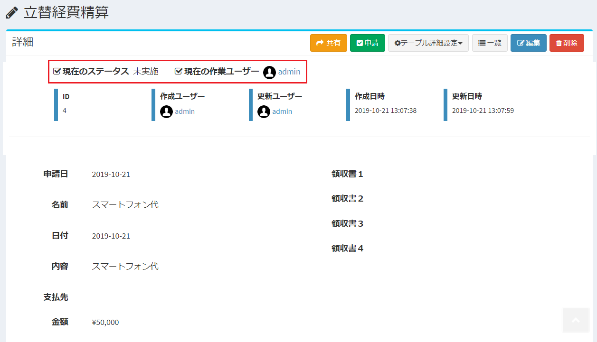
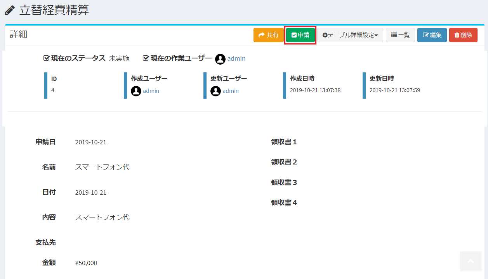
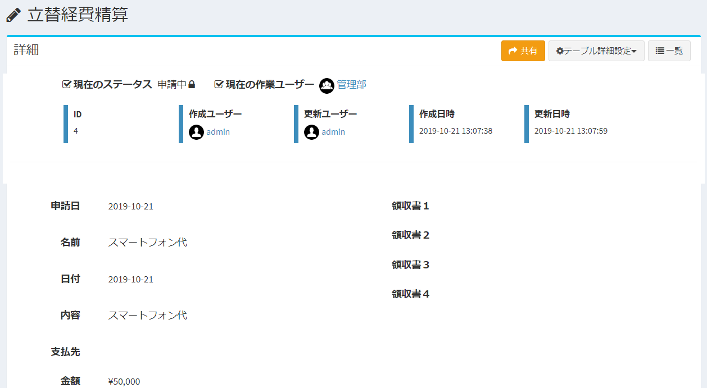

# Workflow execution
This is the procedure for each user to execute the workflow set by the administrator.  
The administrator must configure the [workflow settings](/workflow_example) in advance.

## Workflow implementation
- When each user sees the data, the current status and the next user / organization to take action are displayed.
  

- If the logged-in user has permission to perform the following actions, an action button will be displayed at the top right of the page.
  

- Click the button to display the action execution confirmation dialog.
  

   - Action name: The name of the action to be executed this time is displayed.
   - Status: Displays the status before and after performing this action.
   - Next work user: The work user / organization after this action is executed is displayed.
   - Comment: Enter a comment when the action is performed.

- If you are satisfied with the content, click "Submit" to execute the action.

- When the action is performed, the "current status" and "current working user" change.  
※ At this time, a key mark may be displayed in "Current status" depending on the workflow settings. In that case, the data is locked and cannot be edited or deleted.

