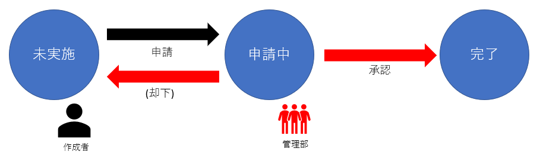
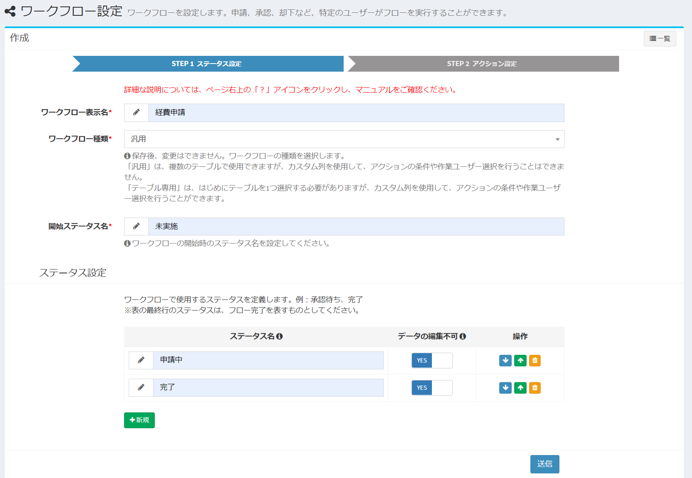
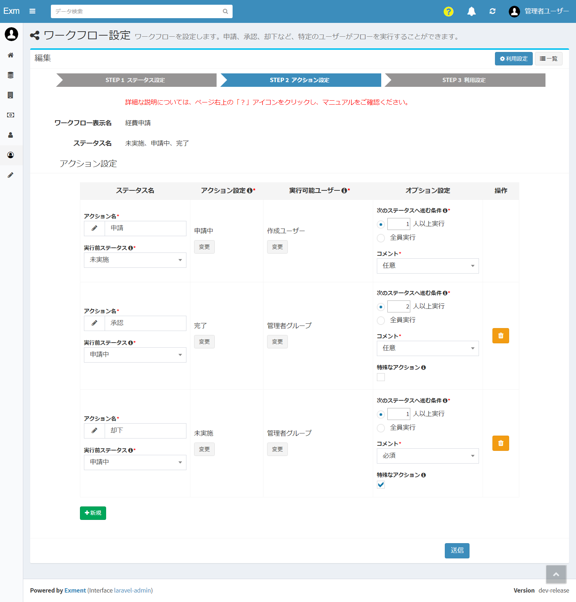
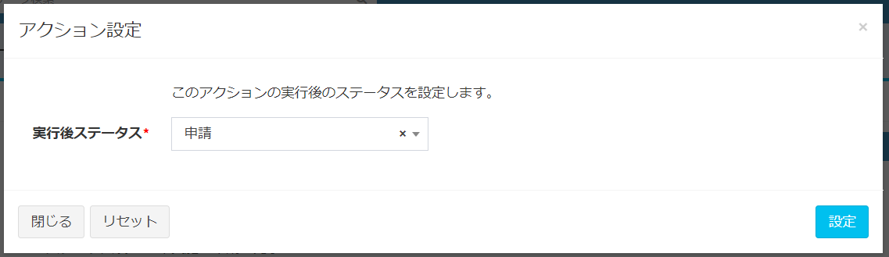
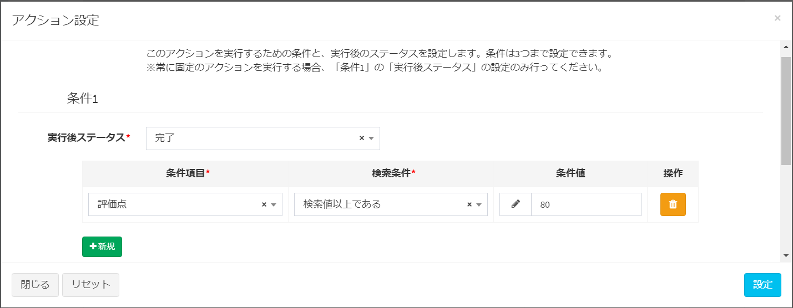
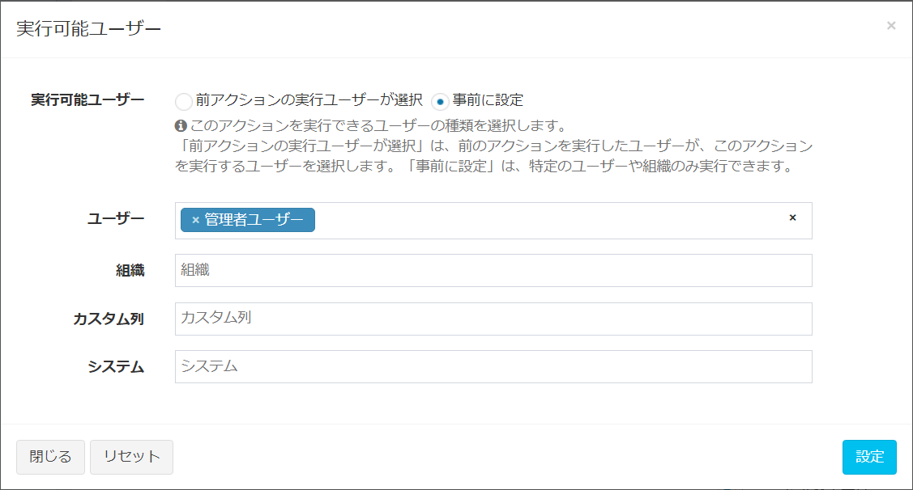
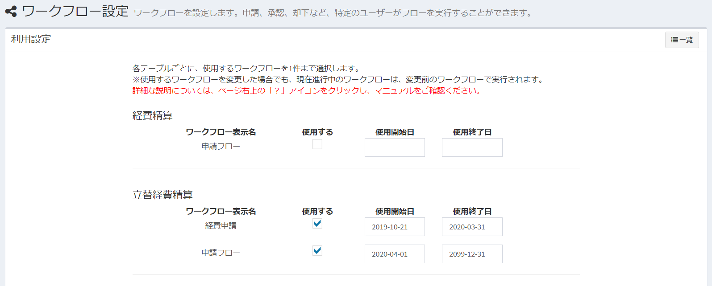

# Workflow settings
Set the workflow to be used in Exment.

## What is a workflow?
Workflow refers to "the flow of a series of business interactions".  
In many operations performed in an organization, there is a flow of “who starts how, makes decisions, processes, and completes”.  
By setting a workflow in Exment, you can execute the following business flow.  

  
- User applies for expenses to management
- The management unit approves the expense request. Or reject
- Approved expenses can no longer modify the data

## Glossary
Explains the terms used in the Exment workflow.  

  

- **Workflow** : Represents the entire business flow, such as application and approval.

- **Status** : Represents the current state of the workflow.  
Example: Not applied, waiting for approval, completed

- **Action** : What each user does and moves from a specific status to a status.  
Example: Apply, Approve, Reject, Send Back

- **Working user** : The user who should perform the following actions.

## List screen display
System administrator clicks "Administrator Settings> Workflow" from the menu.  
A list of currently saved workflows is displayed.  

## Create New

- Click the "New" button at the top right of the list screen.

- "Step1. Status setting" of the workflow creation screen is displayed. Enter the necessary items.

### Step1. Status setting
Set the status of the workflow.

  

#### Workflow display name ※ required
- Workflow name to be displayed on the screen. Japanese is also available. (Example: Approval flow)

#### Workflow type ※ required
The type of workflow to create. Select either "General" or "Table only". * Cannot be changed after creation.  

- **Generic** : Workflows can be used with multiple tables.  
Select this if you want to use only standard status actions such as "Apply", "Approve", and "Reject".  
- **Table Only** :  Available only for the table selected when creating a new one, but you can use custom columns in that table to change where the action is performed.  
Example: In the “Expense Settlement” table, if the custom column “Amount” is 100,000 yen or more, execute the “General Manager Approval” action.  
If the custom column “Amount” is less than 100,000 yen, execute the “Manager Approval” action. You can perform action isolation.

#### Start status name ※ required
- Set the status name when the workflow has not been executed yet.

#### Status settings
Define the workflow settings and the status to use.  
※ The status in the last row of the table should indicate the completion of the flow.

- **Status Name** : The name of the status.

- **Data not editable** : Set whether the data is not editable when the workflow is in this status. If you do not want it edited, set it to YES.  
Example: If the status is "Not applied", data can be edited / deleted, but if the status is "Applied" or "Completed", set to YES if you do not want to edit / delete.  

### Step2.Action setting

  

#### Action settings
Set the action to be performed in the workflow.  

- **Action name** : The name of the action.

- **Pre-execution status** : Set the status state for performing the action.  
Example: If the status before execution is "not implemented" and the status of each data is "not implemented", the action can be executed.

- **Action settings** : Set what actions can be performed. Click the “Change” button to change the settings.  
The settings vary depending on the workflow type.  
  
※ If the workflow type is "General":  
Set the status after executing this action. Choose a different action than "Pre-execution status".

  
※ If the workflow type is "Table only":  
Set the conditions for executing the action and the status after execution.  
Up to three combinations of conditions and status can be set.

- **Executable user** :  Select the user / organization that can execute this action. Click the “Change” button to change the settings.  
    - User: The specified user can execute the action.
    - Organization: Users belonging to the specified organization can execute the action.
    - Custom column: The user or organization set in the custom column of the target data can execute the action. This function is only for "Table only".
    - System> Create User: The user who created the custom data can execute the action.
  

- **Option settings > Condition to go to next status** : Set the number of people to go to the next status when this action is executed.  
※ Normally, the flow proceeds when one person executes it. However, sometimes there are cases such as "go to the next status only when 3 or more people approve" and "go to the next status only when all users of the management organization approve."  
In that case, change this setting value.  

- **Optional settings> Comments** : You can enter a comment when each user performs an action.  
You can select from "required", "optional" and "not used".

- **Option settings> Special actions** : By checking, the "Executable user" set for the action is not included in the current work user. (The current working user is a user who can execute any workflow action in the current status.)  
An action to return to the previous status, such as "Reject" or "Remand", or an action in which the administrator approves by special exception Please check it.

### Setup completed
When both status setting and action setting are performed, a "Setting completed" button is displayed at the top right of the page.

  

Click to complete the workflow settings.
※ When the setting is completed, the following contents cannot be performed.

- Delete workflow
- Add, delete, and reorder statuses

### Step3.Use settings
Set which workflow to execute in which table.
  

- For the workflow displayed for each table, the workflows that are “general” or those that have been created specifically for that table and that are “set completed” are displayed.

- When using a workflow, check the "Use" checkbox.  

- If you want to sort the workflow by a specific date, enter the date in "Start date" and "End date". At that time, please save so that there is no overlap in the date range.

This completes the workflow settings.
When actually executing the workflow, check the [workflow execution](/workflow_execution).