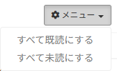
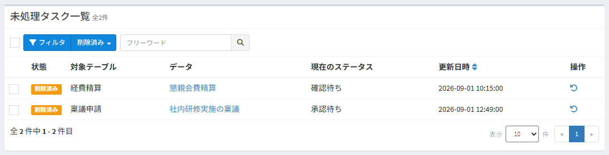

# Pending tasks

This screen lists, from every table, the workflow data (tasks) on which the logged-in user needs to execute an action.  
You can also check your pending tasks at any time from the icon at the top right of the page.

## What are pending tasks?

When you use workflows, the following often happens:

- You cannot tell which table holds the data waiting for your approval without opening the tables one by one
- A request reaches you, nobody notices it, and the process stops

The pending task list shows, in one list across all tables, **the data on which the logged-in user can execute an action now**.  
Open a task from the list to go to the data details page, where you can execute the action.

### Data shown on the list

Data that meets all of the following conditions is shown as a task.

- It belongs to a workflow that is set to "Use" and whose settings are completed
- The logged-in user, or an organization the logged-in user belongs to, is a work user of the current status
- The data details page shows the logged-in user a button of an action they can execute
  - Data that does not meet the conditions of the action settings is not shown
  - For an action whose "Condition to go to next status" is two or more people, the data is not shown once the logged-in user has executed the action
  - A special action does not make a task
- The logged-in user has permission to view the data

※ Only the tasks of the logged-in user are shown. Even a system administrator does not see the tasks of other users.  
※ Data at the start status (for example, data that has not been applied for yet) is shown as a task to the users who can execute the first action (for example, "Apply").  
※ Even after the "End date" of a workflow has passed, data already in progress is shown as a task until it is completed.

## Opening the screen

### From the icon at the top right of the page

After you log in, the pending task icon is shown at the top right of the page.  
The red number is the number of tasks you have not opened yet (unread).

Click the icon to show up to 5 tasks, the most recently updated first.

- Unread tasks are shown in bold
- Click a task to open its data details page. The task becomes read
- Click "Pending tasks" at the bottom to open the list screen
- When there is no task, "You have no pending tasks." is shown

※ The number on the icon is updated automatically every 5 minutes. When you operate on the pending task list or the icon (open a task, mark tasks as read, remove tasks from the list, and so on), it is updated immediately. Other changes, such as actions executed by other users, are reflected at a following automatic update. The interval can be changed in the [settings](/config?id=workflow).  
※ When the number of unread tasks increases, the icon shakes to let you know.

### From the URL

You can also open the screen from the following URL.

~~~
http(s)://(Exment URL)/admin/workflow_task
~~~

To add it to the menu on the left, set menu type "Custom URL" and URI "workflow_task" in [Menu](/menu).

## Screen layout

### Counts

The counts are shown to the right of the list title.

| Display | Description |
| --- | --- |
| N in total | The number of tasks on the list. While the list is narrowed down, the number of tasks that match the conditions |
| N unread | The number of tasks you have not opened yet |
| N removed | The number of tasks you removed from your list. Shown when there is at least one. Click it to show [the removed tasks](/workflow_task?id=putting-removed-tasks-back) |

### Columns

| Column | Description |
| --- | --- |
| (Check box) | Selects the tasks to operate on at once |
| State | "Unread" or "Read". The row of an unread task is shown in bold |
| Target table | The table the data belongs to |
| Data | The label of the data. Click it to open the data details page |
| Current status | The current status of the workflow. A key mark is shown when the data cannot be edited |
| Updated at | The date and time the data was updated |
| Action | The trash icon removes the task from your list. See [Removing a task from your list](/workflow_task?id=removing-a-task-from-your-list) |

- At first, the tasks are sorted by "Updated at", oldest first: the task that has been waiting longest is at the top.
- Click the icon to the right of "Updated at" to switch between newest first and oldest first.
- At the bottom of the screen, you can change the number of tasks per page (10, 20, 30, 50 or 100). The default is 20.

## Processing a task

1. Click a row of the list.
2. The data details page opens, and the task becomes read.
3. Execute the action from the action button at the top right of the page. See [Workflow implementation](/workflow_execution) for the procedure.
4. The data becomes a task of the next work user. Unless the logged-in user is a work user of the next status, it is no longer shown on the list.

## Unread / read

- A task you have not opened from the list or the icon is "Unread".
- Opening a task makes it "Read".
- A read task becomes "Unread" again when the next action is executed on the data: not only when the status changes, but also when somebody approves at a step that needs several approvals.
- Unread / read is recorded per user. It does not affect what other users see, nor the data itself.

### Marking tasks as read or unread at once

- **Mark the selected tasks as read**: select them with the check boxes, click ▼ to the right of the "N items selected" button that appears, and click "Mark selected as read".

- **Mark all as read / Mark all as unread**: select it from "Menu" at the top right. It is executed when you click "Confirm" in the confirmation dialog.

※ While the list is narrowed down, only the tasks that match the conditions are marked.

## Narrowing down tasks

### Free word

Enter text in the box to the right of the "Filter" button and click the search icon.  
The tasks whose label (the columns set in [Heading display column setting](/table?id=heading-display-column-setting)) contains the text are shown.  
You can also search by the ID of the data (for example "#15" or "15").

### Filter

Click the "Filter" button to open the condition fields. Enter the conditions and click "Search".

| Item | Description |
| --- | --- |
| State | Select "All", "Unread" or "Read" |
| Target table | Shows only the tasks of the selected table |
| Current status | Shows only the tasks at the selected status. When several workflows have a status of the same name, they are shown as one choice |
| Updated at | Shows only the tasks updated within the selected period |

- Click "Reset" to clear the filter conditions. The free word, the sort order and the number of tasks per page are kept.
- While conditions are set, the condition fields are shown open.
- The conditions are part of the URL. Bookmark a narrowed-down list to open it with the same conditions next time.

## Removing a task from your list

A task that you do not need to keep on your list, for example because somebody else took it over or you handled it another way, can be removed from your own list.

- **Remove one task**: click the trash icon at the right end of the row, and click "Confirm" in the confirmation dialog.
- **Remove several tasks**: select them with the check boxes, click ▼ to the right of the "N items selected" button, and click "Batch delete".

- **The data itself is not deleted.** The task only disappears from your own pending task list. The lists of other users are not affected.
- When the next action is executed on the data and the logged-in user is a work user at that point, the task is shown on the list again as "Unread".
- Data on which an action was executed after the list was displayed is not removed. Reload the list and check the latest state. The number of tasks that were not removed is shown in a message.
- There is no "remove all" function, so that you never lose sight of all your tasks by mistake.

## Putting removed tasks back

Select "Removed" from ▼ to the right of the "Filter" button to show the tasks you removed from your list.  
You can also show them from the "N removed" link next to the counts.

- Click the put-back icon at the right end of a row to put the task back on your list.
- To put several tasks back, select them with the check boxes, click ▼ to the right of the "N items selected" button, and click "Put selected back on your task list".
- A task put back on the list becomes "Unread".
- To return to the normal list, select "Cancel" from ▼.

※ Data that has already been processed and is no longer a task of the logged-in user is not shown under "Removed" either.

## Notifying the other members of the organization

When one member of an organization executes an action whose "Executable user" is that organization and the status changes, the other members of the organization are notified by an [in-system alert](/notify).  
The members can tell that somebody has already handled the task assigned to their organization, and nobody checks the same task twice.

- Subject: A member of your organization processed a workflow
- Body: (User who executed the action) changed the status of "(Table name): (Label of the data)" to "(Status after the action)".

The notification is sent under the following conditions.

- The notification goes to the members of the organizations that are work users of the action and who can view the data of the table. The user who executed the action is not notified.
- When the work users are users only, no notification is sent.
- For an action whose "Condition to go to next status" is two or more people, the notification is sent only when the status changes (when the last person executes the action).
- When the organization function is not used, no notification is sent.
- This notification is sent separately from the notification settings of the workflow. To stop it, set "EXMENT_SAME_ORG_WORKFLOW_NOTIFY" to false in the [settings](/config?id=workflow).

## Settings

The following settings can be changed in the ".env" file. See the [settings list](/config?id=workflow) for details.

| Setting key | Default value | Description |
| --- | --- | --- |
| EXMENT_WORKFLOW_TASK_NAVBAR | true | If false, the pending task icon at the top right of the page is not shown |
| EXMENT_WORKFLOW_TASK_NAVBAR_INTERVAL | 300 | The interval (seconds) at which the number on the icon is updated automatically |
| EXMENT_SAME_ORG_WORKFLOW_NOTIFY | true | If false, the other members of the organization are not notified |
